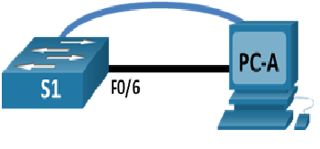
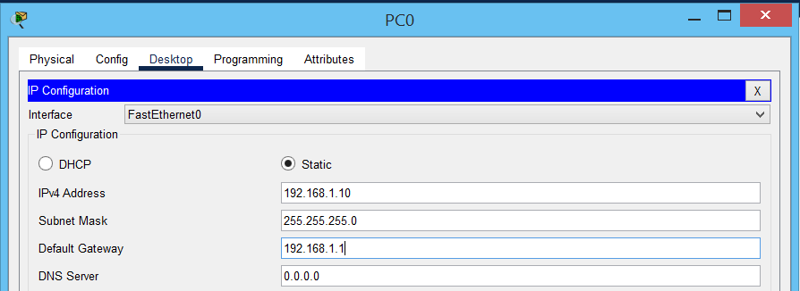

# Лабораторная работа. Базовая настройка коммутатора.

### Топология.


### Таблица адресации
```
 S1  -  VLAN1  -  192.168.1.2/24
PC-A -   NIC   -  192.168.1.10/24
```
# Часть 1. Создание сети и проверка настроек коммутатора по умолчанию.
### Шаг 1  Создайте сеть согласно топологии.
  Выполнено создание сети согласно топпологии. Установлено консольное подключение к коммутатору с помощью программы эмуляции терминала.
  
  Консольное подключение используется при начальной настройке коммутатора не имеющего сетевого доступа.Только после начальной настройки коммутатора мы можем использовать удаленное подключение Telnet, SSH. 
### Шаг 2  Проверьте настройки коммутатора по умолчанию. 
a. Просмотр show runnin-cinfig. Для полноты сбросим к заводским настройкам, если есть vlan.dat удалим его и перезагрузим коммутатор. Используем команды:
```
Switch# show flash
Switch# delete vlan.dat
Switch#erase startup-config
Switch#reload
```
b. Изучите текущий файл running configuration.
  
Имеем: 24 интерфейса FastEthernet, 2 интерфейса GigabitEthernet;
   
Диапазон значений, отображаемых в vty-линиях: 0-4, 5-15.
   
с. Изучите файл загрузочной конфигурации startup configuration

```
Switch#sh startup-config
startup-config is not present
```

Данное сообщение говорит о том, что еще не производилась запись конфига в  startup-config.
   
d. Изучите характеристики SVI для VLAN 1.
```
Switch#sh int vlan 1
```

ip для VLAN 1 еще не назначен.

mac vlan 1 :  0010.11e9.703b.

интерфейс отключен:  Vlan1 is administratively down, line protocol is down.

e. Изучите IP-свойства интерфейса SVI сети VLAN 1.

```
Switch#sh ip int vlan 1
```

Интерфейс down: Vlan1 is administratively down, line protocol is down
  Internet protocol processing disabled

f. Выполнено подклюение PC0 к порту коммутатора FastEthernet0/6. Смотрим порт:

После согласования параметров порт в UP

FastEthernet0/6 is up, line protocol is up (connected)
Full-duplex, 100Mb/s
и дополнительно много других параметров.

g. Изучите сведения о версии ОС Cisco IOS на коммутаторе.

```
Switch#sh ver
Switch#sh flash:
```

Cisco IOS  :  C2960 Software (C2960-LANBASEK9-M), Version 15.0(2)SE4
    
файл образа :  System image file is "flash:c2960-lanbasek9-mz.150-2.SE4.bin"

h. Изучите свойства по умолчанию интерфейса FastEthernet, который используется компьютером PC-A.
    
```
Switch#sh int fast 0/6
```
    
по умолчанию интерфейс в down : FastEthernet0/6 is down, line protocol is down (disabled)

включить интерфейс: Switch(config-if)# no shutdown 

mac 0001.4333.4506

Full-duplex, 100Mb/s

i. Изучите флеш-память.
    
```
Switch#flash:
Switch#sh dir
```
    
файл образа :  System image file is "flash:c2960-lanbasek9-mz.150-2.SE4.bin"

# Часть 2. Настройка базовых параметров сетевых устройств
### Шаг 1. Настройте базовые параметры коммутатора

1. Назнааем имя коммутатора:

```
Switch(config)#hostname S1
```

2. Отключим разрешение имен:

```
S1(config)#no ip domain-lookup 
S1(config)#
```

3. Устанавливаем пароль на консоль:

```
S1(config)#line con 0
S1(config-line)#passw class
S1(config-line)#loggin syn
S1(config-line)#login
```
4. Устанавливаем пароль на линии vty 0 4:

Команда login запрашивает пароль при подключении.

```
S1(config)#line vty 0 4
S1(config-line)#password cisco
S1(config-line)#login
S1(config-line)#transport input telnet
```
5. Настраиваем пароль на привелигированный режим (шифрованный), и добавим команду для кодирования паролей для консоли и vty 0 4:

```
S1(config)#enable secret cisco
S1(config)#service password-encryption
```

6. Настраиваем vlan 1 для управления коммутаторм:

```
S1(config)#interface vlan 1
S1(config-if)#ip address 192.168.1.2 255.255.255.0
S1(config-if)no shut
```

7. Настроим шлюз по умолчанию для возможности удаленного к коммутатру из других сетей (опционально, при наличии маршрутизатора)

```
S1(config)#ip default-gateway 192.68.1.1
```

8. Настроим баннер:

```
S1(config)#banner motd "Unauthorized access is strictly prohibited."
```

### Шаг 2. Настройте IP-адрес на компьютере PC-A.

Выполнена настройка ip адресации на PC-A согласно методички. В PT вкладка desctop-ip configuration

Выполнена базовая настройка коммутатора согласно методички. В данном случае настроен шлюз по умолчанию 192.168.1.1 для доступа в другие сети (предполагая, что в будущем будет расширение сети, установлен маршрутизатор ). Для данной схемы шлюз по умолчанию можно не указывать.




# Часть 3. Проверка сетевых подключений
### Шаг 1. Отобразите конфигурацию коммутатора.

```
S1#
%SYS-5-CONFIG_I: Configured from console by console

S1# sh run
Building configuration...

Current configuration : 1390 bytes
!
version 15.0
no service timestamps log datetime msec
no service timestamps debug datetime msec
service password-encryption
!
hostname S1
!
enable secret 5 $1$mERr$hx5rVt7rPNoS4wqbXKX7m0
!
!
!
no ip domain-lookup
!
!
!
spanning-tree mode pvst
spanning-tree extend system-id
!
interface FastEthernet0/1
!
interface FastEthernet0/2
!
interface FastEthernet0/3
!
interface FastEthernet0/4
!
interface FastEthernet0/5
!
interface FastEthernet0/6
!
interface FastEthernet0/7
!
interface FastEthernet0/8
!
interface FastEthernet0/9
!
interface FastEthernet0/10
!
interface FastEthernet0/11
!
interface FastEthernet0/12
!
interface FastEthernet0/13
!
interface FastEthernet0/14
!
interface FastEthernet0/15
!
interface FastEthernet0/16
!
interface FastEthernet0/17
!
interface FastEthernet0/18
!
interface FastEthernet0/19
!
interface FastEthernet0/20
!
interface FastEthernet0/21
!
interface FastEthernet0/22
!
interface FastEthernet0/23
!
interface FastEthernet0/24
!
interface GigabitEthernet0/1
!
interface GigabitEthernet0/2
!
interface Vlan1
 ip address 192.168.1.2 255.255.255.0
!
ip default-gateway 192.68.1.1
!
banner motd ^CUnauthorized access is strictly prohibited.^C
!
!
!
line con 0
 password 7 0822404F1A0A
 logging synchronous
 login
!
line vty 0 4
 password 7 0822455D0A16
 login
 transport input telnet
line vty 5 15
 login
!
!
!
end


S1#
```
Выполнена проверка параметров Vlan. Полоса пропускания BW 100000 Kbit.

# Шаг 2. Протестируйте сквозное соединение, отправив эхо-запрос.

```
проверка доступности коммутатора
C:\>ping 192.168.1.2

Pinging 192.168.1.2 with 32 bytes of data:

Reply from 192.168.1.2: bytes=32 time<1ms TTL=255
Reply from 192.168.1.2: bytes=32 time<1ms TTL=255
Reply from 192.168.1.2: bytes=32 time<1ms TTL=255
Reply from 192.168.1.2: bytes=32 time=11ms TTL=255

Ping statistics for 192.168.1.2:
    Packets: Sent = 4, Received = 4, Lost = 0 (0% loss),
Approximate round trip times in milli-seconds:
    Minimum = 0ms, Maximum = 11ms, Average = 2ms

Проверка доступности ПК с коммутатора:

S1# ping 192.168.1.10

Type escape sequence to abort.
Sending 5, 100-byte ICMP Echos to 192.168.1.10, timeout is 2 seconds:
!!!!!
Success rate is 80 percent (4/5), round-trip min/avg/max = 0/4/16 ms
```

# Шаг 3. Проверьте удаленное управление коммутатором S1

С помощью Telnet выполнено удаленное подключение к коммутатору по адресу 192.168.1.2. В PT вкладка Desctop-Command Prompt ( командная строка: подключение telnet 192.168.1.2), либо же вкладка Desctop - Telnet/SSH (можно подключаться как по Telnet так и по SSH, если есть дополнительные настройки SSH на коммутаторе). Desctop - Telnet/SSH эмулирует подключение таких программ как: Putty, Terra Term и др. В данном случае было использовано удаленное подключение к коммутатору в терминале командной строки:

```
C:\>telnet 192.168.1.2
Trying 192.168.1.2 ...OpenUnauthorized access is strictly prohibited.


User Access Verification

Password: 
S1>en
Password: 
S1#
```

Для удаленного доступа необходима настройка пароля на vty линиях.

Чтобы пароли не отправлялись в незашифрованном виде необходима настройка SSH соединения.
