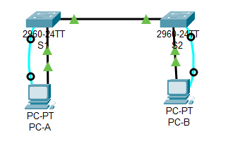
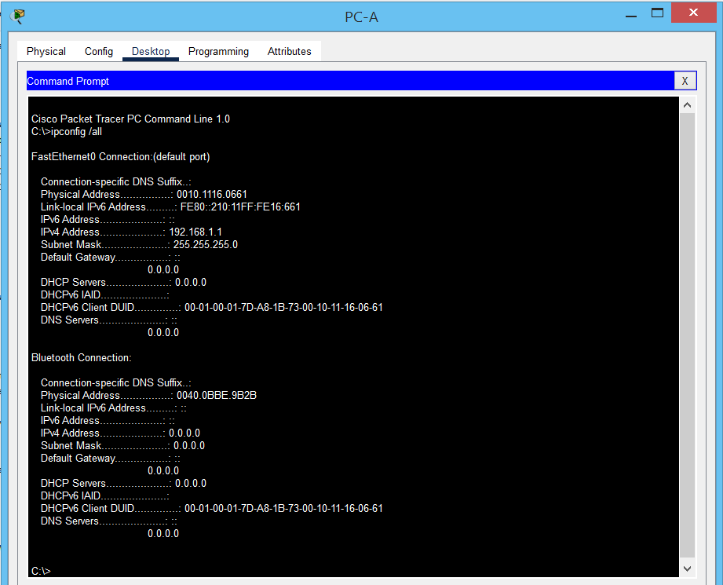
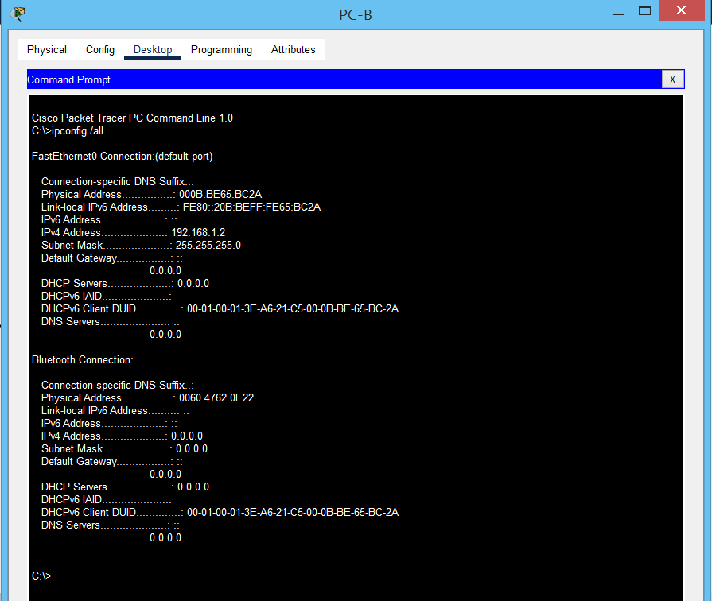

# Лабораторная работа. Просмотр таблицы MAC-адресов коммутатора 

### Топология.


### Таблица адресации
| Устройство | Интерфейс    | IP-адрес           | Маска подсети |
|-----------:|:-------------|-------------------:|:--------------|
| S1         | VLAN 1       | 192.168.1.11       | 255.255.255.0 | 
| S2         | VLAN 1       | 192.168.1.12       | 255.255.255.0 | 
| PC-A       | NIC          | 192.168.1.1        | 255.255.255.0 | 
| PC-B       | NIC          | 192.168.1.2        | 255.255.255.0 | 


# Часть 1. Создание и настройка сети
Согласно топологии в PТ создана сеть. Выполнены базовые настройки коммутаторов и ПК (аналогично настройкам, выполненнным в лабораторной работе №1).



# Часть 2. Изучение таблицы МАС-адресов коммутатора
Как только между сетевыми устройствами начинается передача данных, коммутатор выясняет МАС-адреса и строит таблицу.
### Шаг 1. Запишите МАС-адреса сетевых устройств.

a. На PC-A и PC-B коммандной строке ввели команду ipconfig /all.





Из вывода команды видно: 

физические адреса адаптера Ethernet.

MAC-адрес компьютера PC-A:0010.1116.0661

MAC-адрес компьютера PC-B:000B.BE65.BC2A

b.	Подключились к коммутаторам S1 и S2 через консоль и ввели команду show interface F0/1 на каждом коммутаторе.

```
S1#sh in fast 0/1
FastEthernet0/1 is up, line protocol is up (connected)
  Hardware is Lance, address is 000c.cf6d.9c01 (bia 000c.cf6d.9c01)
```

```
S2#sh int fast 0/1
FastEthernet0/1 is up, line protocol is up (connected)
  Hardware is Lance, address is 0006.2ad2.a747 (bia 0006.2ad2.a747)
```
Из ввывода команд видно: 

МАС-адрес коммутатора S1 Fast Ethernet 0/1: 000c.cf6d.9c01

МАС-адрес коммутатора S2 Fast Ethernet 0/1: 0006.2ad2.a747

### Шаг 2. Просмотр таблицы МАС-адресов коммутатора.
Подключились к коммутатору S2 через консоль и вошли в привилегированный режим EXEC, ввели команду show mac address-table :

```
S2>en
Password: 
S2#sh mac address-table 
          Mac Address Table
-------------------------------------------

Vlan    Mac Address       Type        Ports
----    -----------       --------    -----

   1    000c.cf6d.9c01    DYNAMIC     Fa0/1
```

Из данной команды видно, что таблица mac адресов еще не заполнена, т.к в сети еще не было сетевой активности PC-A и PC-B. Имеется только одна запись с mac 000c.cf6d.9c01 и это порт Fa0/1 - S1

Отравим эхо запросы с PC-B на PC-A команда ping 192.168.1.1. Таблица mac адресов S2 в этом случае будет иметь вид:

```
S2#sh mac address-table 
          Mac Address Table
-------------------------------------------

Vlan    Mac Address       Type        Ports
----    -----------       --------    -----

   1    000b.be65.bc2a    DYNAMIC     Fa0/18
   1    000c.cf6d.9c01    DYNAMIC     Fa0/1
   1    0010.1116.0661    DYNAMIC     Fa0/1
S2#
```

Здесь мы видим: на порту Fa0/18 mac 000b.be65.bc2a - это mac PC-B, и mac PC-A 0010.1116.0661, изучен через порт Fa0/1.

Чтобы определить, каким устройствам принадлежат mac-адреса, можно использовать выходные данные команды sh mac address-table. Таблица может включать информацию о mac-адресах, которые были изучены динамически посредством изучения адреса источника или вручную, настроенных статических mac-адресов. Выходные данные показывают нам mac адрес устроства и порт, через который данный mac был изучен.

### Шаг 3. Очистите таблицу МАС-адресов коммутатора S2 и снова отобразите таблицу МАС-адресов.

Для очистки таблицы mac адресов выполним:

```
S2#clear mac address-table 
S2#sh mac address-table 
          Mac Address Table
-------------------------------------------

Vlan    Mac Address       Type        Ports
----    -----------       --------    -----

S2#
```

череза 10 сек посмотрим состояние таблицы mac адресов:

```
S2#sh mac address-table 
          Mac Address Table
-------------------------------------------

Vlan    Mac Address       Type        Ports
----    -----------       --------    -----

   1    000c.cf6d.9c01    DYNAMIC     Fa0/1
S2#
```

mac 000c.cf6d.9c01 - это mac порта Fa0/1 на S1. 

### Шаг 4. С компьютера PC-B отправьте эхо-запросы устройствам в сети и просмотрите таблицу МАС-адресов коммутатора.

a. В коммандной строке PC-B посмотрим arp таблицу.
```
C:\>arp -a
  Internet Address      Physical Address      Type
  192.168.1.1           0010.1116.0661        dynamic

C:\>
```
протокол arp разрешил ip 192.168.1.1 с mac 0010.1116.0661 

b. C PC-B отправим эхо запросы на PC-A, ip S1 и S2. Далее посмотрим arp PC-B.

```
C:\>ping 192.168.1.1

Pinging 192.168.1.1 with 32 bytes of data:

Reply from 192.168.1.1: bytes=32 time<1ms TTL=128
Reply from 192.168.1.1: bytes=32 time<1ms TTL=128
Reply from 192.168.1.1: bytes=32 time<1ms TTL=128
Reply from 192.168.1.1: bytes=32 time<1ms TTL=128

Ping statistics for 192.168.1.1:
    Packets: Sent = 4, Received = 4, Lost = 0 (0% loss),
Approximate round trip times in milli-seconds:
    Minimum = 0ms, Maximum = 0ms, Average = 0ms

C:\>ping 192.168.1.11

Pinging 192.168.1.11 with 32 bytes of data:

Reply from 192.168.1.11: bytes=32 time<1ms TTL=255
Reply from 192.168.1.11: bytes=32 time<1ms TTL=255
Reply from 192.168.1.11: bytes=32 time<1ms TTL=255
Reply from 192.168.1.11: bytes=32 time<1ms TTL=255

Ping statistics for 192.168.1.11:
    Packets: Sent = 4, Received = 4, Lost = 0 (0% loss),
Approximate round trip times in milli-seconds:
    Minimum = 0ms, Maximum = 0ms, Average = 0ms

C:\>ping 192.168.1.12

Pinging 192.168.1.12 with 32 bytes of data:

Request timed out.
Reply from 192.168.1.12: bytes=32 time<1ms TTL=255
Reply from 192.168.1.12: bytes=32 time<1ms TTL=255
Reply from 192.168.1.12: bytes=32 time<1ms TTL=255

Ping statistics for 192.168.1.12:
    Packets: Sent = 4, Received = 3, Lost = 1 (25% loss),
Approximate round trip times in milli-seconds:
    Minimum = 0ms, Maximum = 0ms, Average = 0ms

C:\>arp -a
  Internet Address      Physical Address      Type
  192.168.1.1           0010.1116.0661        dynamic
  192.168.1.11          0030.a353.8c5e        dynamic
  192.168.1.12          000c.cfce.98b3        dynamic

C:\>
```

Здесь появились записи о ip коммутаторов (192.168.1.11 - 0030.a353.8c5e и 192.168.1.12 - 000c.cfce.98b3).

Далее посмотрим таблицу mac адресов S2:

```
S2#sh mac address-table 
          Mac Address Table
-------------------------------------------

Vlan    Mac Address       Type        Ports
----    -----------       --------    -----

   1    000b.be65.bc2a    DYNAMIC     Fa0/18          mac PC-B
   1    000c.cf6d.9c01    DYNAMIC     Fa0/1           mac Fa0/1 S1
   1    0010.1116.0661    DYNAMIC     Fa0/1           mac PC-A
   1    0030.a353.8c5e    DYNAMIC     Fa0/1           mac vlan 1 S1
S2#
```

При увеличении парка компьтеров могут возникнуть некоторые проблемы при работе сети. т.к мы имеем один широковещательный домен. Чтобы этого избежать рекомендуют сегментировать сеть.
