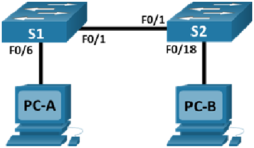

# Лабораторная работа. Просмотр таблицы MAC-адресов коммутатора 

### Топология.


### Таблица адресации
| Устройство | Интерфейс    | IP-адрес           | Маска подсети |
|-----------:|:-------------|-------------------:|:--------------|
| S1         | VLAN 1       | 192.168.1.11       | 255.255.255.0 | 
| S2         | VLAN 1       | 192.168.1.12       | 255.255.255.0 | 
| PC-A       | NIC          | 192.168.1.1        | 255.255.255.0 | 
| PC-B       | NIC          | 192.168.1.2        | 255.255.255.0 | 

```

```
# Часть 1. Создание и настройка сети
Согласно топологии в PТ создана сеть. Выполнены базовые настройки коммутаторов и ПК (аналогично настройкам, выполненнным в лабораторной работе №1).


# Часть 2. Изучение таблицы МАС-адресов коммутатора
Как только между сетевыми устройствами начинается передача данных, коммутатор выясняет МАС-адреса и строит таблицу.

a.	Откройте командную строку на PC-A и PC-B и введите команду ipconfig /all.
Открытие окна командной строки Windows
Вопрос:
Назовите физические адреса адаптера Ethernet.
MAC-адрес компьютера PC-A:
MAC-адрес компьютера PC-B:


### Шаг 1. Запишите МАС-адреса сетевых устройств.
