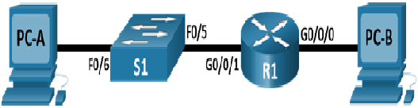
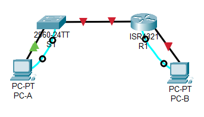
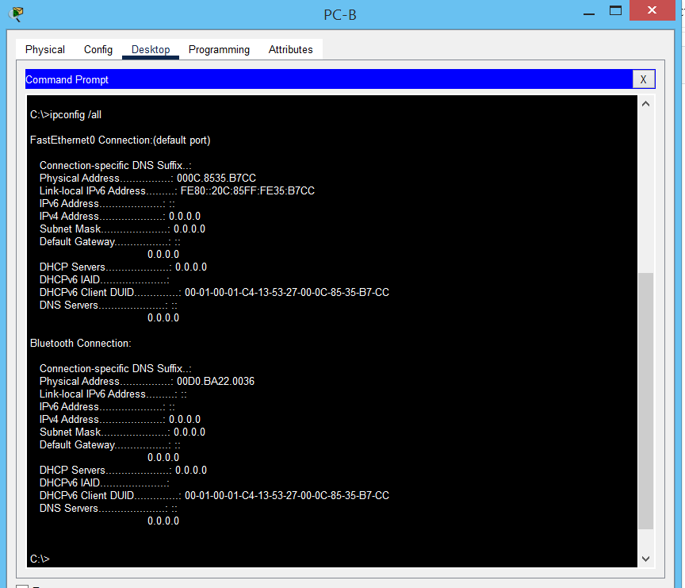
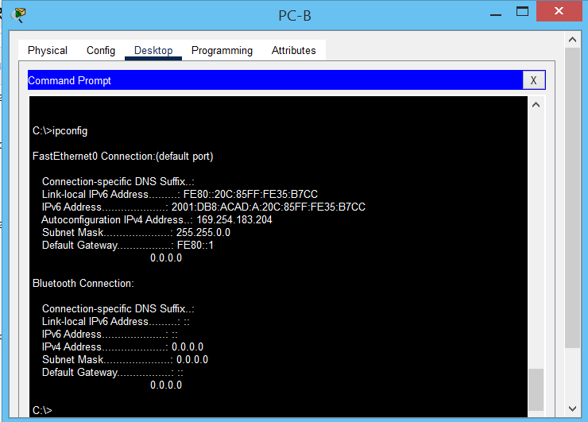
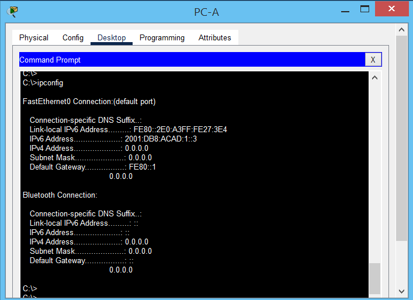
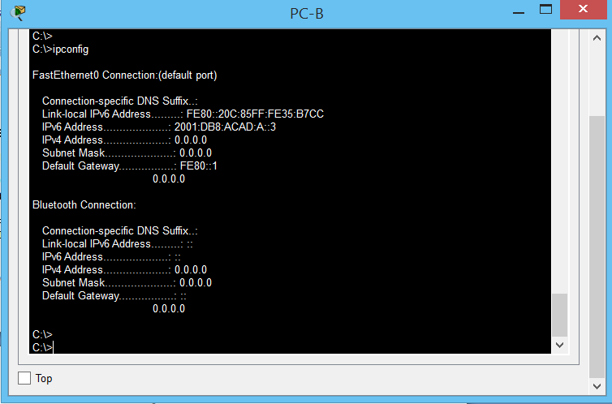

# Лабораторная работа. Настройка IPv6-адресов на сетевых устройствах 

### Топология



### Таблица адресации

| Устройство  | Интерфейс | IPv6-адрес          | Link local IPv6-адрес  | Длина префикса    | Шлюз по умолчанию |
|-------------|-----------|---------------------|------------------------|-------------------|-------------------|
| R1          | G0/0/0    | 2001:db8:acad:a::1  | fe80::1                | 64                | —                 |
| R1          | G0/0/1    | 2001:db8:acad:1::1  | fe80::1                | 64                | —                 |
| S1          | VLAN 1    | 2001:db8:acad:1::b  | fe80::b                | 64                | —                 |
| PC-A        | NIC       | 2001:db8:acad:1::3  | SLACC                  | 64                | fe80::1           |
| PC-B        | NIC       | 2001:db8:acad:a::3  | SLACC                  | 64                | fe80::1           |


### Часть 1. Настройка топологии и конфигурация основных параметров маршрутизатора и коммутатора

В CPT создана лаборатория:



### Шаг 1.  Настройте маршрутизатор.

Назначьте имя хоста и настройте основные параметры устройства.

```
Router#write erase 
Router#conf t
Router(config)#hostname R1
R1(config)#enable secret cisco
R1(config)#line vty 0 4
R1(config-line)#password cisco
R1(config-line)#transport input telnet 
R1(config-line)#login 
R1(config)#line console 0
R1(config-line)#password cisco
R1(config-line)#login
R1(config)#no ip domain-lookup 
R1(config)#service password-encryption 
R1#wr
```

### Шаг 2. Настройте коммутатор.

Назначьте имя хоста и настройте основные параметры устройства.

```
Switch#write erase
Switch#conf t
Switch(config)#hostname S1
S1(config)#enable secret cisco
S1(config)#line vty 0 4
S1(config-line)#password cisco
S1(config-line)#transport input telnet
S1(config-line)#login
S1(config)#line con 0
S1(config-line)#password cisco
S1(config-line)#login
S1(config)#service password-encryption 
S1(config)#no ip domain-lookup 
S1(config)#do wr
```

### Часть 2. Ручная настройка IPv6-адресов

### Шаг 1. Назначьте IPv6-адреса интерфейсам Ethernet на R1.

Выполним команды:

```
R1#conf t
R1(config)#int g 0/0/0
R1(config-if)#ipv6 add
R1(config-if)#ipv6 address 2001:db8:acad:a::1/64 
R1(config-if)#no sh
%LINK-5-CHANGED: Interface GigabitEthernet0/0/0, changed state to up
%LINEPROTO-5-UPDOWN: Line protocol on Interface GigabitEthernet0/0/0, changed state to up
R1(config-if)#exit
R1(config)#int g 0/0/1
R1(config-if)#ipv6 address 2001:db8:acad:1::1/64 
R1(config-if)#no sh
%LINK-5-CHANGED: Interface GigabitEthernet0/0/1, changed state to up
%LINEPROTO-5-UPDOWN: Line protocol on Interface GigabitEthernet0/0/1, changed state to up
R1(config-if)#
```

Проверим корректность введенных данных:

```
R1#sh ipv6 int br
GigabitEthernet0/0/0       [up/up]
    FE80::201:97FF:FEE6:3A01
    2001:DB8:ACAD:A::1
GigabitEthernet0/0/1       [up/up]
    FE80::201:97FF:FEE6:3A02
    2001:DB8:ACAD:1::1
Vlan1                      [administratively down/down]
    unassigned
R1#
```

Так же, автоматиески создался link-local адрес, начинается на FE80. Отображаемый локальный адрес канала основан на адресации EUI-64, которая автоматически использует MAC-адрес интерфейса для создания 128-битного локального IPv6-адреса канала.

Назначим вручную  link-local адреса на интерфесах R1. Пакеты с локальным адресом канала никогда не выходят за пределы локальной сети, а значит, для обоих интерфейсов можно указывать один и тот же локальный адрес канала.

```
R1#conf t
R1(config)#int g 0/0/0
R1(config-if)#ipv6 address fe80::1 link-local 
R1(config-if)#ex
R1(config)#int g 0/0/1
R1(config-if)#ipv6 address fe80::1 link-local 
R1(config-if)#
```

Убедимся, что адрес link-local изменился:

```
R1#sh ipv6 int brief 
GigabitEthernet0/0/0       [up/up]
    FE80::1
    2001:DB8:ACAD:A::1
GigabitEthernet0/0/1       [up/up]
    FE80::1
    2001:DB8:ACAD:1::1
Vlan1                      [administratively down/down]
    unassigned
R1#
```

Так же, можно увидеть, какие группы многоадресной рассылки назначены интерфейсу. Рассмотрим на примере G0/0/0:

```
R1# sh ipv6 int g 0/0/0
GigabitEthernet0/0/0 is up, line protocol is up
  IPv6 is enabled, link-local address is FE80::1
  No Virtual link-local address(es):
  Global unicast address(es):
    2001:DB8:ACAD:A::1, subnet is 2001:DB8:ACAD:A::/64
  Joined group address(es):
    FF02::1
    FF02::1:FF00:1
  MTU is 1500 bytes
  ICMP error messages limited to one every 100 milliseconds
  ICMP redirects are enabled
  ICMP unreachables are sent
  ND DAD is enabled, number of DAD attempts: 1
  ND reachable time is 30000 milliseconds
R1#
```
Joined group address(es) - группы многоадрессной рассылки: FF02::1 FF02::1:FF00:1

### Шаг 2. Активируйте IPv6-маршрутизацию на R1.

На ПК PC-B введем команду ipconfig /all:



Здесь видно, что нидивидуальный ipv6 адрес еще не назначен, есть только link-local адрес.

Активируем IPv6-маршрутизацию на R1 с помощью команды IPv6 unicast-routing:

```
R1#conf t
R1(config)#ipv6 unicast-routing 
R1(config)#
```

На PC-B в сетевых настройках установим ipv6 configuration - Automatic



C помощью функции SLAAC мы получили ipv6 адрес и шлюз по умолчанию. 

### Шаг 3. Назначьте IPv6-адреса интерфейсу управления (SVI) на S1.

Чтобы установить шаблон dual-ipv4-and-ipv6 в качестве шаблона SDM по умолчанию, выполним следующие действия:

```
S1#conf t
S1(config)# sdm prefer dual-ipv4-and-ipv6 default
S1(config)# end
S1# reload
```

Назначим ipv6 адрес и link-local адрес на SVI: 

```
S1#conf t
Enter configuration commands, one per line.  End with CNTL/Z.
S1(config)#int vlan 1
S1(config-if)#ipv6 address 2001:db8:acad:1::b/64
S1(config-if)#ipv6 address fe80::b link-local
S1(config-if)#no shutdown 
```

Проверим правильность введнных адресов:

```
S1#sh ipv6 int vlan 1
Vlan1 is up, line protocol is up
  IPv6 is enabled, link-local address is FE80::B
  No Virtual link-local address(es):
  Global unicast address(es):
    2001:DB8:ACAD:1::B, subnet is 2001:DB8:ACAD:1::/64
  Joined group address(es):
    FF02::1
    FF02::1:FF00:B
  MTU is 1500 bytes
  ICMP error messages limited to one every 100 milliseconds
  ICMP redirects are enabled
  ICMP unreachables are sent
  Output features: Check hwidb
  ND DAD is enabled, number of DAD attempts: 1
  ND reachable time is 30000 milliseconds
S1#
```

### Шаг 4. Назначьте компьютерам статические IPv6-адреса.

На PC-A и PC-B в сетевых натройках установили статические ipv6 адреса,согласно таблицы топологии:

PC-A



PC-B



Таким образом мы имеем на адреса: статический и link-local. 

### Часть 3. Проверка сквозного подключения

С PC-A отправьте эхо-запрос на FE80::1. Это локальный адрес канала, назначенный G0/1 на R1.

```
C:\>ping  fe80::1

Pinging fe80::1 with 32 bytes of data:

Reply from FE80::1: bytes=32 time<1ms TTL=255
Reply from FE80::1: bytes=32 time<1ms TTL=255
Reply from FE80::1: bytes=32 time<1ms TTL=255
Reply from FE80::1: bytes=32 time<1ms TTL=255

Ping statistics for FE80::1:
    Packets: Sent = 4, Received = 4, Lost = 0 (0% loss),
Approximate round trip times in milli-seconds:
    Minimum = 0ms, Maximum = 0ms, Average = 0ms

C:\>
```

Отправьте эхо-запрос на интерфейс управления S1 с PC-A.

```
C:\>ping  2001:db8:acad:1::b

Pinging 2001:db8:acad:1::b with 32 bytes of data:

Reply from 2001:DB8:ACAD:1::B: bytes=32 time<1ms TTL=255
Reply from 2001:DB8:ACAD:1::B: bytes=32 time<1ms TTL=255
Reply from 2001:DB8:ACAD:1::B: bytes=32 time<1ms TTL=255
Reply from 2001:DB8:ACAD:1::B: bytes=32 time<1ms TTL=255

Ping statistics for 2001:DB8:ACAD:1::B:
    Packets: Sent = 4, Received = 4, Lost = 0 (0% loss),
Approximate round trip times in milli-seconds:
    Minimum = 0ms, Maximum = 0ms, Average = 0ms

C:\>
```

Введите команду tracert на PC-A, чтобы проверить наличие сквозного подключения к PC-B.

```
C:\>tracert 2001:db8:acad:a::3

Tracing route to 2001:db8:acad:a::3 over a maximum of 30 hops: 

  1   0 ms      0 ms      0 ms      2001:DB8:ACAD:1::1
  2   0 ms      0 ms      0 ms      2001:DB8:ACAD:A::3

Trace complete.

C:\>
```

С PC-B отправьте эхо-запрос на PC-A.

```
C:\>ping 2001:db8:acad:1::3

Pinging 2001:db8:acad:1::3 with 32 bytes of data:

Reply from 2001:DB8:ACAD:1::3: bytes=32 time<1ms TTL=127
Reply from 2001:DB8:ACAD:1::3: bytes=32 time<1ms TTL=127
Reply from 2001:DB8:ACAD:1::3: bytes=32 time<1ms TTL=127
Reply from 2001:DB8:ACAD:1::3: bytes=32 time<1ms TTL=127

Ping statistics for 2001:DB8:ACAD:1::3:
    Packets: Sent = 4, Received = 4, Lost = 0 (0% loss),
Approximate round trip times in milli-seconds:
    Minimum = 0ms, Maximum = 0ms, Average = 0ms

C:\>
```

С PC-B отправьте эхо-запрос на локальный адрес канала G0/0/0 на R1.

```
C:\>ping fe80::1

Pinging fe80::1 with 32 bytes of data:

Reply from FE80::1: bytes=32 time<1ms TTL=255
Reply from FE80::1: bytes=32 time<1ms TTL=255
Reply from FE80::1: bytes=32 time<1ms TTL=255
Reply from FE80::1: bytes=32 time<1ms TTL=255

Ping statistics for FE80::1:
    Packets: Sent = 4, Received = 4, Lost = 0 (0% loss),
Approximate round trip times in milli-seconds:
    Minimum = 0ms, Maximum = 0ms, Average = 0ms

C:\>
```

Обоим интерфейсам Ethernet на R1 можно назначить один и тот же локальный адрес канала — FE80::1, т.к данный адрес не маршрутизируется, т.е никогда не выходят за пределы сети.
Идентификатор подсети в адресе 2001:db8:acad::aaaa:1234/64  -  2001:db8:acad:0000.
