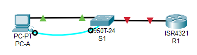
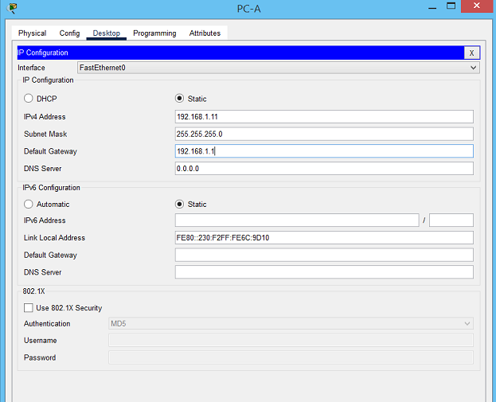

# Лабораторная работа. Доступ к сетевым устройствам по протоколу SSH 

### Топология


### Таблица адресации

| Устройство  | Интерфейс | IP  -адрес          | Маска подсети  | Шлюз по умолчанию |
|-------------|-----------|---------------------|----------------|-------------------|
| R1          | G0/0/0    | 192.168.1.1         | 255.255.255.0  | -                 | 
| S1          | VLAN 1    | 192.168.1.11        | 255.255.255.0  | 192.168.1.1       | 
| PC-A        | NIC       | 192.168.1.3         | 255.255.255.0  | 192.168.1.1       | 

### Часть 1. Настройка основных параметров устройств

В CPT создана лаборатория:



### Шаг 1.  Настройте маршрутизатор.

```
Router#write erase 
Router#conf t
Router(config)#hostname R1
R1(config)#no ip domain-lookup 
R1(config)#enable secret class
R1(config)#line vty 0 4
R1(config-line)#password cisco
R1(config-line)#transport input telnet 
R1(config-line)#login 
R1(config)#line console 0
R1(config-line)#password cisco
R1(config-line)#login
R1(config)#service password-encryption 
R1(config)#banner motd "Attention"
R1(config)#int g 0/0/1
R1(config-if)#ip address 192.168.1.1 255.255.255.0
R1(config-if)#no shutdown 
R1#wr
```

### Шаг 2. Настройте компьютер PC-A.




### Шаг 3. Проверьте подключение к сети..
```
C:\>ping 192.168.1.1

Pinging 192.168.1.1 with 32 bytes of data:

Reply from 192.168.1.1: bytes=32 time=8ms TTL=255
Reply from 192.168.1.1: bytes=32 time<1ms TTL=255
Reply from 192.168.1.1: bytes=32 time<1ms TTL=255
Reply from 192.168.1.1: bytes=32 time<1ms TTL=255

Ping statistics for 192.168.1.1:
    Packets: Sent = 4, Received = 4, Lost = 0 (0% loss),
Approximate round trip times in milli-seconds:
    Minimum = 0ms, Maximum = 8ms, Average = 2ms

C:\>
```

### Часть 2. Настройка маршрутизатора для доступа по протоколу SSH


### Шаг 1. Настройте аутентификацию устройств.

При генерации ключа шифрования в качестве его части используются имя устройства и домен. Имя устроства уже задано, т.о необходимо указать домен:

```
R1(config)#ip domain-name alex.com
```

###  Шаг 2. Создайте ключ шифрования с указанием его длины.

```
R1(config)#crypto key generate rsa 
The name for the keys will be: R1.alex.com
Choose the size of the key modulus in the range of 360 to 4096 for your
  General Purpose Keys. Choosing a key modulus greater than 512 may take
  a few minutes.

How many bits in the modulus [512]: 2048
% Generating 2048 bit RSA keys, keys will be non-exportable...[OK]

R1(config)#
```

### Шаг 3. Создайте имя пользователя в локальной базе учетных записей.

```
R1(config)#username admin privilege 15 secret Adm1nP@55
```

Назначьте имя хоста и настройте основные параметры устройства.

```
Switch#write erase
Switch#conf t
Switch(config)#hostname S1
S1(config)#enable secret cisco
S1(config)#line vty 0 4
S1(config-line)#password cisco
S1(config-line)#transport input telnet
S1(config-line)#login
S1(config)#line con 0
S1(config-line)#password cisco
S1(config-line)#login
S1(config)#service password-encryption 
S1(config)#no ip domain-lookup 
S1(config)#do wr
```

### Часть 2. Ручная настройка IPv6-адресов

### Шаг 1. Назначьте IPv6-адреса интерфейсам Ethernet на R1.
