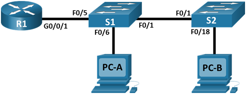
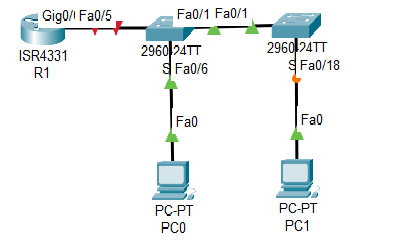

# Лабораторная работа - Внедрение маршрутизации между виртуальными локальными сетями 

### Топология



### Таблица адресации

| Устройство  | Интерфейс   | IP  -адрес          | Маска подсети  | Шлюз по умолчанию |
|-------------|-------------|---------------------|----------------|-------------------|
| R1          | G0/0/1.10   | 192.168.10.1        | 255.255.255.0  | -                 | 
| R1          | G0/0/1.20   | 192.168.20.1        | 255.255.255.0  | -                 | 
| R1          | G0/0/1.30   | 192.168.30.1        | 255.255.255.0  | -                 | 
| R1          | G0/0/1.1000 | -                   | -              | -                 | 
| S1          | VLAN 10     | 192.168.10.11       | 255.255.255.0  | 192.168.10.1      | 
| S2          | VLAN 20     | 192.168.10.12       | 255.255.255.0  | 192.168.10.1      | 
|PC-A         | NIC         | 192.168.20.3        | 255.255.255.0  | 192.168.20.1      |
|PC-B         | NIC         | 192.168.30.3        | 255.255.255.0  | 192.168.30.1      |

### Таблица VLAN

| VLAN        |    Имя       | Назначенный интерфейс      | 
|-------------|--------------|----------------------------|
| 10          | Управление   | S1: VLAN 10 , S2: VLAN 10  | 
| R1          | Sales        | S1: F0/6                   |  
| R1          | Operations   | S2: F0/18                    |  
| 999         | Parking_Lot  | С1: F0/2-4, F0/7-24, G0/1-2
                               С2: F0/2-17, F0/19-24, G0/1-2
               |  

### Часть 1. Настройка основных параметров устройств

В CPT создана лаборатория:



### Шаг 1.  Настройка маршрутизатора.

```
Router#write erase
Router#reload
Router#conf t
Router(config)#hostname R1
R1(config)#no ip domain-lookup 
R1(config)#enable secret class
R1(config)#line console 0
R1(config-line)#password cisco
R1(config-line)#login
R1(config)#service password-encryption 
R1(config)#banner motd "Attention"
R1(config)#int g 0/0/1
R1(config-if)#ip address 192.168.1.1 255.255.255.0
R1(config-if)#no shutdown 
R1#wr
