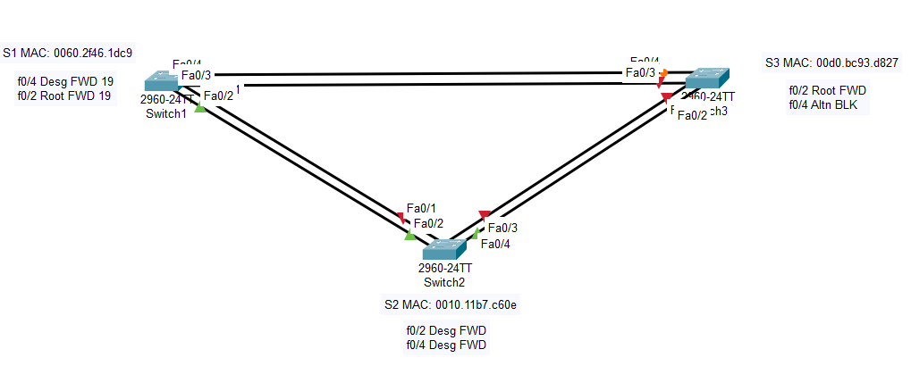

# Лабораторная работа - Развертывание коммутируемой сети с резервными каналами 

### Топология


### Таблица адресации

| Устройство  | Интерфейс   | IP  -адрес   | Маска подсети  | 
|-------------|-------------|--------------|----------------|
| S1          | VLAN 1      | 192.168.1.1  | 255.255.255.0  | 
| S2          | VLAN 1      | 192.168.1.2  | 255.255.255.0  |  
| S3          | VLAN 1      | 192.168.1.3  | 255.255.255.0  |

### Часть 1. Настройка основных параметров устройств

В CPT создана лаборатория:


### Шаг 1. Базовая настройка коммутаторов.

S1

```
Switch#conf t
Switch#erase startup-config 
Switch#delete vlan.dat
Switch#reload

Switch#conf t
Switch(config)#hostname S1
S1(config)#no ip domain-lookup 
S1(config)#username admin privilege 15 secret cisco
S1(config)#line con 0
S1(config-line)#login local
S1(config-line)#logging synchronous
S1(config)#ip domain name alex.com
S1(config)#crypto key generate rsa 
The name for the keys will be: S1.alex.com
Choose the size of the key modulus in the range of 360 to 4096 for your
  General Purpose Keys. Choosing a key modulus greater than 512 may take
  a few minutes.

How many bits in the modulus [512]: 2048
% Generating 2048 bit RSA keys, keys will be non-exportable...[OK]
S1(config)#ip ssh version 2
S1(config)#ip ssh authentication-retries 3
S1(config)#line vty 0 4
S1(config-line)#login local 
S1(config-line)#transport input ssh 
S1(config-line)#exec-timeout 20 0
S1(config)#banner motd "Attention"
S1(config)#int vlan 1
S1(config-if)#ip address 192.168.1.1 255.255.255.0
S1(config-if)#no shutdown 
S1#copy run start

```

S2, S3 - Аналогичная настройка, исключением является настройка ip адреса vlan 1 согласно таблицы адресации.

### Шаг 2:	Проверьте связь.

эхо-запрос от коммутатора S1 на коммутатор S2:

```
S1#ping 192.168.1.2

Type escape sequence to abort.
Sending 5, 100-byte ICMP Echos to 192.168.1.2, timeout is 2 seconds:
!!!!!
Success rate is 100 percent (5/5), round-trip min/avg/max = 0/1/9 ms
```

эхо-запрос от коммутатора S1 на коммутатор S3:

```
S1#ping 192.168.1.3

Type escape sequence to abort.
Sending 5, 100-byte ICMP Echos to 192.168.1.3, timeout is 2 seconds:
!!!!!
Success rate is 100 percent (5/5), round-trip min/avg/max = 0/0/0 ms
```

эхо-запрос от коммутатора S2 на коммутатор S3:

```
S2#ping 192.168.1.3

Type escape sequence to abort.
Sending 5, 100-byte ICMP Echos to 192.168.1.3, timeout is 2 seconds:
!!!!!
Success rate is 100 percent (5/5), round-trip min/avg/max = 5/5/5 ms
```

### Часть 2:	Определение корневого моста.

### Шаг 1:	Отключите все порты на коммутаторах.

```
S1(config)#int range f 0/1 - 4
S1(config-if-range)#shutdown 

S2(config)#int range f0/1 - 4
S2(config-if-range)#shutdown 

S3(config)#int range f0/1 - 4 
S3(config-if-range)#shutdown 
```

### Шаг 2:	Настройте подключенные порты в качестве транковых.

```
S1(config)#int range f 0/1 - 4
S1(config-if-range)#switchport mode trunk 

S2(config)#int range f 0/1 - 4
S2(config-if-range)#switchport mode trunk 

S3(config)#int range f 0/1 - 4
S3(config-if-range)#switchport mode trunk 
```

### Шаг 3:	Включите порты F0/2 и F0/4 на всех коммутаторах.

```
S1(config)#int range f0/2 , f 0/4
S1(config-if-range)#no sh

S2(config)#int range f0/2, f0/4
S2(config-if-range)#no sh

S3(config)#int range f0/2, f0/4
S3(config-if-range)#no sh
```

### Шаг 4:	Отобразите данные протокола spanning-tree.

Введем команду show spanning-tree на всех трех коммутаторах. Приоритет идентификатора моста рассчитывается путем сложения значений приоритета и расширенного идентификатора системы. Расширенным идентификатором системы всегда является номер сети VLAN. В примере ниже все три коммутатора имеют равные значения приоритета идентификатора моста (32769 = 32768 + 1, где приоритет по умолчанию = 32768, номер сети VLAN = 1); следовательно, коммутатор с самым низким значением MAC-адреса становится корневым мостом.

S1: 

```
S1# sh spanning-tree 
VLAN0001
  Spanning tree enabled protocol ieee
  Root ID    Priority    32769
             Address     0010.11B7.C60E
             Cost        19
             Port        2(FastEthernet0/2)
             Hello Time  2 sec  Max Age 20 sec  Forward Delay 15 sec

  Bridge ID  Priority    32769  (priority 32768 sys-id-ext 1)
             Address     0060.2F46.1DC9
             Hello Time  2 sec  Max Age 20 sec  Forward Delay 15 sec
             Aging Time  20

Interface        Role Sts Cost      Prio.Nbr Type
---------------- ---- --- --------- -------- --------------------------------
Fa0/4            Desg FWD 19        128.4    P2p
Fa0/2            Root FWD 19        128.2    P2p

S1#
```

S2: 

```
S2#sh spanning-tree 
VLAN0001
  Spanning tree enabled protocol ieee
  Root ID    Priority    32769
             Address     0010.11B7.C60E
             This bridge is the root
             Hello Time  2 sec  Max Age 20 sec  Forward Delay 15 sec

  Bridge ID  Priority    32769  (priority 32768 sys-id-ext 1)
             Address     0010.11B7.C60E
             Hello Time  2 sec  Max Age 20 sec  Forward Delay 15 sec
             Aging Time  20

Interface        Role Sts Cost      Prio.Nbr Type
---------------- ---- --- --------- -------- --------------------------------
Fa0/2            Desg FWD 19        128.2    P2p
Fa0/4            Desg FWD 19        128.4    P2p

S2#
```

S3:

```
S3#sh spanning-tree 
VLAN0001
  Spanning tree enabled protocol ieee
  Root ID    Priority    32769
             Address     0010.11B7.C60E
             Cost        19
             Port        2(FastEthernet0/2)
             Hello Time  2 sec  Max Age 20 sec  Forward Delay 15 sec

  Bridge ID  Priority    32769  (priority 32768 sys-id-ext 1)
             Address     00D0.BC93.D827
             Hello Time  2 sec  Max Age 20 sec  Forward Delay 15 sec
             Aging Time  20

Interface        Role Sts Cost      Prio.Nbr Type
---------------- ---- --- --------- -------- --------------------------------
Fa0/2            Root FWD 19        128.2    P2p
Fa0/4            Altn BLK 19        128.4    P2p

S3#
```

В схему ниже запишем роль и состояние (Sts) активных портов на каждом коммутаторе в топологии.


