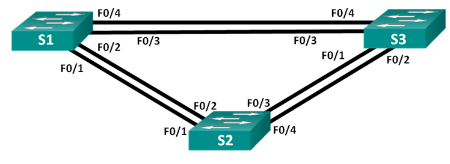
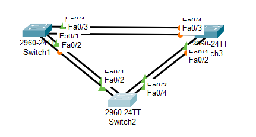

# Лабораторная работа - Развертывание коммутируемой сети с резервными каналами 

### Топология



### Таблица адресации

| Устройство  | Интерфейс   | IP  -адрес   | Маска подсети  | 
|-------------|-------------|--------------|----------------|
| S1          | VLAN 1      | 192.168.1.1  | 255.255.255.0  | 
| S2          | VLAN 1      | 192.168.1.2  | 255.255.255.0  |  
| S3          | VLAN 1      | 192.168.1.3  | 255.255.255.0  |

### Часть 1. Настройка основных параметров устройств

В CPT создана лаборатория:



### Шаг 1. Базовая настройка коммутаторов.

S1

```
Switch#conf t
Switch#erase startup-config 
Switch#delete vlan.dat
Switch#reload

Switch#conf t
Switch(config)#hostname S1
S1(config)#no ip domain-lookup 
S1(config)#username admin privilege 15 secret cisco
S1(config)#line con 0
S1(config-line)#login local
S1(config-line)#logging synchronous
S1(config)#ip domain name alex.com
S1(config)#crypto key generate rsa 
The name for the keys will be: S1.alex.com
Choose the size of the key modulus in the range of 360 to 4096 for your
  General Purpose Keys. Choosing a key modulus greater than 512 may take
  a few minutes.

How many bits in the modulus [512]: 2048
% Generating 2048 bit RSA keys, keys will be non-exportable...[OK]
S1(config)#ip ssh version 2
S1(config)#ip ssh authentication-retries 3
S1(config)#line vty 0 4
S1(config-line)#login local 
S1(config-line)#transport input ssh 
S1(config-line)#exec-timeout 20 0
S1(config)#banner motd "Attention"
S1(config)#int vlan 1
S1(config-if)#ip address 192.168.1.1 255.255.255.0
S1(config-if)#no shutdown 
S1#copy run start

```

S2, S3 - Аналогичная настройка, исключением является настройка ip адреса vlan 1 согласно таблицы адресации.

### Шаг 2:	Проверьте связь.

эхо-запрос от коммутатора S1 на коммутатор S2:


S1#ping 192.168.1.2

Type escape sequence to abort.
Sending 5, 100-byte ICMP Echos to 192.168.1.2, timeout is 2 seconds:
!!!!!
Success rate is 100 percent (5/5), round-trip min/avg/max = 0/1/9 ms

эхо-запрос от коммутатора S1 на коммутатор S3:

S1#ping 192.168.1.3

Type escape sequence to abort.
Sending 5, 100-byte ICMP Echos to 192.168.1.3, timeout is 2 seconds:
!!!!!
Success rate is 100 percent (5/5), round-trip min/avg/max = 0/0/0 ms

эхо-запрос от коммутатора S2 на коммутатор S3:

S2#ping 192.168.1.3

Type escape sequence to abort.
Sending 5, 100-byte ICMP Echos to 192.168.1.3, timeout is 2 seconds:
!!!!!
Success rate is 100 percent (5/5), round-trip min/avg/max = 5/5/5 ms

### Шаг 2. Базовая настройка маршрутизатора.
