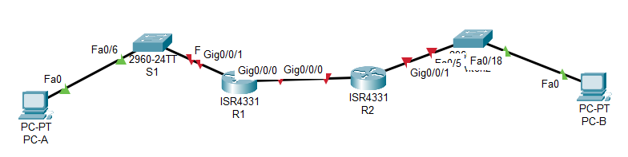

# Лабораторная работа - Реализация DHCPv4  

### Топология


### Часть 1. Создание сети и настройка основных параметров устройства

### Шаг 1. Создание схемы адресации.

Разделим подсети сети 192.168.1.0/24 в соответствии со следующими требованиями:

a.	Одна подсеть «Подсеть A», поддерживающая 58 хостов (клиентская VLAN на R1).
Подсеть A - 192.168.1.0 255.255.255.192
Запишем первый IP-адрес в таблице адресации для R1 G0/0/1.100 - 192.168.1.1 . 

b.	Одна подсеть «Подсеть B», поддерживающая 28 хостов (управляющая VLAN на R1). 
Подсеть B: 192.168.1.64 255.255.255.224
Запишем первый IP-адрес в таблице адресации для R1 G0/0/1.200 - 192.168.1.65. Запишем второй IP-адрес в таблице адресов для S1 VLAN 200 - 192.168.1.66 и шлюз по умолчанию - 192.168.1.65.

c.	Одна подсеть «Подсеть C», поддерживающая 12 узлов (клиентская сеть на R2).
Подсеть C: 192.168.1.96 255.255.255.240
Запишем первый IP-адрес в таблице адресации для R2 G0/0/1 - 192.168.1.97.

Занесем все данные в талицу.


### Таблица адресации

| Устройство  | Интерфейс   | IP  -адрес          | Маска подсети  | Шлюз по умолчанию |
|-------------|-------------|---------------------|----------------|-------------------|
| R1          | G0/0/0      | 10.0.0.1            | 255.255.255.252| -                 | 
| R1          | G0/0/1.100  | 192.168.1.1         | 255.255.255.192| -                 | 
| R1          | G0/0/1.200  | 192.168.1.65        | 255.255.255.224| -                 | 
| R1          | G0/0/1.1000 | -                   | -              | -                 | 
| R2          | G0/0/0      | 10.0.0.2            | 255.255.255.252| -                 | 
| R2          | G0/0/1      | 192.168.1.97        | 255.255.255.240| -                 | 
| S1          | VLAN 200    | 192.168.1.66        | 255.255.255.224| 192.168.1.65      | 
| S2          | VLAN 1      | 192.168.1.98        | 255.255.255.240| 192.168.1.97      | 
|PC-A         | NIC         | DHCP                |  DHCP          |  DHCP             |
|PC-B         | NIC         | DHCP                |  DHCP          |  DHCP             |


### Таблица VLAN

| VLAN        |    Имя       | Назначенный интерфейс         | 
|-------------|--------------|-------------------------------|
| 1           | -            | S2: F0/18                     |  
| 100         | users        | S1: F0/6                      |  
| 200         | management   | S1: VLAN 200                  |
| 999         | Parking_Lot  | S1: F0/1-4, F0/7-24, G0/1-2   |  
| 1000        | native       | -                             | 


В CPT создана лаборатория:



### Шаг 1. Настройка маршрутизации между сетями VLAN на маршрутизаторе R1

Согласно схемы адресации, настроим на интрерфейсе G0/0/1 маршрутизатора R1 подинтерфейсы для каждой VLAN:

```
R1(config)#int g0/0/1.100
R1(config-subif)#description users
R1(config-subif)#encapsulation dot1Q 100
R1(config-subif)#ip address 192.168.1.1 255.255.255.192
R1(config-subif)#int g0/0/1.200
R1(config-subif)#description management
R1(config-subif)#encapsulation dot1Q 200
R1(config-subif)#ip address 192.168.1.65 255.255.255.224
R1(config-subif)#int g0/0/1.1000
R1(config-subif)#description native
R1(config-subif)#encapsulation dot1Q 1000
R1(config-subif)#int g0/0/1
R1(config-if)#no shutdown
```

### Шаг 2. Настройка интерфейса g0/0/0 маршрутизатора R1 согласно таблицы адресации и статической маршрутизации в сеть 192.168.1.96, находящуюся за R2.

```
R1(config)#int g 0/0/0
R1(config-if)#ip address 10.0.0.1 255.255.255.252
R1(config-if)#no shutdown 
R1(config)#ip route 192.168.1.96 255.255.255.240 10.0.0.2
```

### Шаг 3. Настройка адресации на интерфейсах G0/0/0 и G0/0/1 маршрутизатора R2 согласно таблицы адресации и статической маршрутизации в сети 192.168.1.0 и 192.168.1.64, находящихся за R1. 

```
R2(config)#int g 0/0/0
R2(config-if)#ip address 10.0.0.2 255.255.255.252
R2(config-if)#no shutdown 
R2(config-if)#int g 0/0/1
R2(config-if)#ip address 192.168.1.97 255.255.255.240
R2(config-if)#no shutdown 
R2(config)#ip route 192.168.1.0 255.255.255.192 10.0.0.1
R2(config)#ip route 192.168.1.64 255.255.255.224 10.0.0.1
```

проверим ip связанность между маршрутизаторами:

```
R1#ping 10.0.0.2

Type escape sequence to abort.
Sending 5, 100-byte ICMP Echos to 10.0.0.2, timeout is 2 seconds:
!!!!!
Success rate is 100 percent (5/5), round-trip min/avg/max = 0/0/1 ms
```

### Шаг 4. Настройка коммутаторв S1.

Создадим vlan:

```
S1(config-if)#vlan 100
S1(config-vlan)#name users
S1(config-vlan)#vlan 200
S1(config-vlan)#name management
S1(config-vlan)#vlan 999
S1(config-vlan)#name parking_lot
S1(config-vlan)#vlan 1000
S1(config-vlan)#name native
```

настроим svi управления и шлюз по умолчанию:

```
S1(config)#int vlan 200
S1(config-if)#ip address 192.168.1.66 255.255.255.224
S1(config)#ip default-gateway 192.168.1.65
```

настроим транковый порт в сторону маршрутизатора R1:

```
S1(config)#int f 0/5
S1(config-if)#switchport mode trunk 
S1(config-if)#switchport trunk native vlan 1000
S1(config-if)#switchport trunk allowed vlan 100,200,1000
```

Назначим все неиспользуемые порты S1 в VLAN Parking_Lot и административно деактивируем их.

```
S1(config)#int range f 0/1-4 , f0/7-24 , g0/1-2
S1(config-if-range)#switchport mode access 
S1(config-if-range)#switchport access vlan 999
S1(config-if-range)#switchport nonegotiate 
S1(config-if-range)#shutdown 
```

назначим порт коммутатора f 0/6 в vlan 100 (users vlan) 

```
S1(config)#int f 0/6
S1(config-if)#switchport mode access 
S1(config-if)#switchport access vlan 100
```

если бы РС-А был подключен к сети с помощью DHCP, то мы бы полуили адрес из сети 169.254.0.0/16, т.к DHCP сервер у нас еще не настроен.

### Шаг 4. Настройка коммутаторв S2.

```
S2(config)#int vlan 1
S2(config-if)#ip address 192.168.1.98 255.255.255.240
S2(config)#ip default-gateway 192.168.1.97
S2(config)#int range f 0/1-4, f 0/6-17, f 0/19-24, g 0/1-2
S2(config-if-range)#shutdown 
S2(config)#int f 0/18
S2(config-if)#switchport mode access
```

### Часть 2.	Настройка и проверка двух серверов DHCPv4 на R1.

Необходимо настроить и проверить сервер DHCPv4 на R1. Сервер DHCPv4 будет обслуживать две подсети, Подсеть A - 192.168.1.0 255.255.255.192 и Подсеть C: 192.168.1.96 255.255.255.240.

Исключим первые пять используемых адресов из каждого пула адресов, создадим пул DHCP, укажим сеть, поддерживающую этот DHCP-сервер, в качестве имени домена укажим test.ru, настроим соответствующий шлюз по умолчанию для каждого пула DHCP, настроим время аренды на 2 дня 12 часов и 30 минут

```
R1(config)#ip dhcp excluded-address 192.168.1.1 192.168.1.5
R1(config)#ip dhcp pool R1_DHCP_CLIENT
R1(dhcp-config)#network 192.168.1.0 255.255.255.192
R1(dhcp-config)#domain-name test.ru
R1(dhcp-config)#default-router 192.168.1.1
R1(dhcp-config)#lease 2:12:30

R1(config)#ip dhcp excluded-address 192.168.1.97 192.168.1.101
R1(config)#ip dhcp pool R2_DHCP_CLIENT
R1(dhcp-config)#network 192.168.1.96 255.255.255.240
R1(dhcp-config)#domain-name test.ru
R1(dhcp-config)#default-router 192.168.1.97
R1(dhcp-config)#lease 2:12:30
```

### Часть 3.	Настройка и проверка DHCP-ретрансляции на R2

Выполним настройку R2 в качестве агента DHCP-ретрансляции для локальной сети на G0/0/1

```
R2(config)#int g0/0/1
R2(config-if)#ip helper-address 10.0.0.1
```

### Часть 4.	Проверка выдачи ip адресов для двух сетей.

установим в настройка PC-A и PC-B автоматиеское получение ip адреса

PC-A:

```
C:\>ipconfig /all

FastEthernet0 Connection:(default port)

   Connection-specific DNS Suffix..: test.ru
   Physical Address................: 0010.114A.B9B6
   Link-local IPv6 Address.........: FE80::210:11FF:FE4A:B9B6
   IPv6 Address....................: ::
   IPv4 Address....................: 192.168.1.6
   Subnet Mask.....................: 255.255.255.192
   Default Gateway.................: ::
                                     192.168.1.1
   DHCP Servers....................: 192.168.1.1
   DHCPv6 IAID.....................: 
   DHCPv6 Client DUID..............: 00-01-00-01-6D-B0-28-E0-00-10-11-4A-B9-B6
   DNS Servers.....................: ::
                                     0.0.0.0
```

PC-B:

```
C:\>ipconfig /all

FastEthernet0 Connection:(default port)

   Connection-specific DNS Suffix..: test.ru
   Physical Address................: 0000.0C93.96AA
   Link-local IPv6 Address.........: FE80::200:CFF:FE93:96AA
   IPv6 Address....................: ::
   IPv4 Address....................: 192.168.1.102
   Subnet Mask.....................: 255.255.255.240
   Default Gateway.................: ::
                                     192.168.1.97
   DHCP Servers....................: 10.0.0.1
   DHCPv6 IAID.....................: 
   DHCPv6 Client DUID..............: 00-01-00-01-24-AA-C2-BC-00-00-0C-93-96-AA
   DNS Servers.....................: ::
                                     0.0.0.0
```
проверим ip связанность:

```
C:\> ping 192.168.1.6

Pinging 192.168.1.6 with 32 bytes of data:

Request timed out.
Reply from 192.168.1.6: bytes=32 time<1ms TTL=126
Reply from 192.168.1.6: bytes=32 time<1ms TTL=126
Reply from 192.168.1.6: bytes=32 time<1ms TTL=126

Ping statistics for 192.168.1.6:
    Packets: Sent = 4, Received = 3, Lost = 1 (25% loss),
Approximate round trip times in milli-seconds:
    Minimum = 0ms, Maximum = 0ms, Average = 0ms
```

посмотрим сведения о пулах:

```
R1#sh ip dhcp pool 

Pool R1_DHCP_CLIENT :
 Utilization mark (high/low)    : 100 / 0
 Subnet size (first/next)       : 0 / 0 
 Total addresses                : 62
 Leased addresses               : 1
 Excluded addresses             : 2
 Pending event                  : none

 1 subnet is currently in the pool
 Current index        IP address range                    Leased/Excluded/Total
 192.168.1.1          192.168.1.1      - 192.168.1.62      1    / 2     / 62

Pool R2_DHCP_CLIENT :
 Utilization mark (high/low)    : 100 / 0
 Subnet size (first/next)       : 0 / 0 
 Total addresses                : 14
 Leased addresses               : 1
 Excluded addresses             : 2
 Pending event                  : none

 1 subnet is currently in the pool
 Current index        IP address range                    Leased/Excluded/Total
 192.168.1.97         192.168.1.97     - 192.168.1.110     1    / 2     / 14
R1#
```

посмотрим назанченные ip адреса:

```
R1#sh ip dhcp binding 
IP address       Client-ID/              Lease expiration        Type
                 Hardware address
192.168.1.6      0010.114A.B9B6           --                     Automatic
192.168.1.102    0000.0C93.96AA           --                     Automatic
R1#
```
