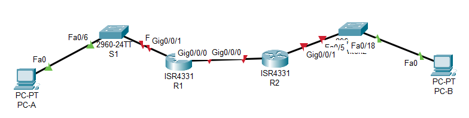

# Лабораторная работа - Реализация DHCPv4  

### Топология

### Таблица адресации

| Устройство  | Интерфейс   | IP  -адрес   | Маска подсети  | 
|-------------|-------------|--------------|----------------|
| S1          | VLAN 1      | 192.168.1.1  | 255.255.255.0  | 
| S2          | VLAN 1      | 192.168.1.2  | 255.255.255.0  |  
| S3          | VLAN 1      | 192.168.1.3  | 255.255.255.0  |

### Часть 1. Настройка основных параметров устройств

В CPT создана лаборатория:

### Шаг 1. Создание схемы адресации.
Шаг 1.	Создание схемы адресации
Подсеть сети 192.168.1.0/24 в соответствии со следующими требованиями:
a.	Одна подсеть «Подсеть A», поддерживающая 58 хостов (клиентская VLAN на R1).
Подсеть A
Запишите первый IP-адрес в таблице адресации для R1 G0/0/1.100 . 
b.	Одна подсеть «Подсеть B», поддерживающая 28 хостов (управляющая VLAN на R1). 
Подсеть B:

