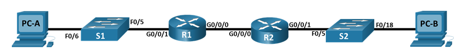

# Лабраторная работа - Настройка DHCPv6 

### Топология

### Часть 1. Создание сети и настройка основных параметров устройства

### Шаг 1. Создание схемы адресации.

### Таблица адресации

| Устройство  | Интерфейс   | IPv6  -адрес          |
|-------------|-------------|-----------------------|
| R1          | G0/0/0      | 2001:db8:acad:2::1/64 | 
| R1          | G0/0/0      | fe80::1               | 
| R1          | G0/0/1      | 2001:db8:acad:1::1/64 | 
| R1          | G0/0/0      | fe80::1               | 
| R2          | G0/0/0      | 2001:db8:acad:2::2/64 | 
| R2          | G0/0/1      | fe80::2               | 
| R2          | G0/0/1      | 2001:db8:acad:3::1/64 | 
| R2          | G0/0/1      | fe80::1               | 
| R2          | NIC         | DHCP                  | 
|PC-B         | NIC         | DHCP                  | 

Динамическое назначение глобальных индивидуальных IPv6-адресов можно настроить тремя способами:
•	Автоматическая конфигурация адреса без сохранения состояния (Stateless Address Autoconfiguration, SLAAC)
•	DHCPv6 без отслеживания состояния
•	Адресация DHCPv6 с учетом состояний.

