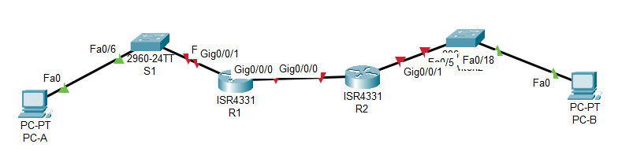

# Лабраторная работа - Настройка DHCPv6 

### Топология

### Часть 1. Создание сети и настройка основных параметров устройства

### Таблица адресации

| Устройство  | Интерфейс   | IPv6  -адрес          |
|-------------|-------------|-----------------------|
| R1          | G0/0/0      | 2001:db8:acad:2::1/64 | 
| R1          | G0/0/0      | fe80::1               | 
| R1          | G0/0/1      | 2001:db8:acad:1::1/64 | 
| R1          | G0/0/0      | fe80::1               | 
| R2          | G0/0/0      | 2001:db8:acad:2::2/64 | 
| R2          | G0/0/1      | fe80::2               | 
| R2          | G0/0/1      | 2001:db8:acad:3::1/64 | 
| R2          | G0/0/1      | fe80::1               | 
|PC-A         | NIC         | DHCP                  | 
|PC-B         | NIC         | DHCP                  | 

### Часть 1. Создание сети и настройка основных параметров устройства

Динамическое назначение глобальных индивидуальных IPv6-адресов можно настроить тремя способами:
•	Автоматическая конфигурация адреса без сохранения состояния (Stateless Address Autoconfiguration, SLAAC)
•	DHCPv6 без отслеживания состояния
•	Адресация DHCPv6 с учетом состояний

### Шаг 1. Настройка интерфейсов и маршрутизации для обоих маршрутизаторов.

Настроим интерфейсы маршрутизатора R1 и R2 согласно таблицы адресации:

R1:

R1(config)#int g0/0/0
R1(config-if)#ipv6 address 2001:db8:acad:2::1/64
R1(config-if)#ipv6 address  fe80::1 link-local 

R1(config-if)#int g0/0/1
R1(config-if)#ipv6 address 2001:db8:acad:1::1/64
R1(config-if)#ipv6 address  fe80::1 link-local 

R2:

R2(config)#int g0/0/0
R2(config-if)#ipv6 address 2001:db8:acad:2::2/64
R2(config-if)#ipv6 address fe80::2 link-local 

R2(config-if)#int g0/0/1
R2(config-if)#ipv6 address 2001:db8:acad:3::1/64
R2(config-if)#ipv6 address fe80::1 link-local 
R2(config-if)#

