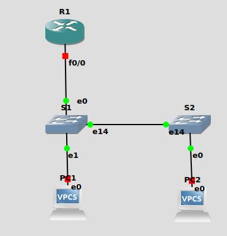

# Лабораторная работа - Конфигурация безопасности коммутатора 

### Топология



### Таблица адресации

| Устройство  | Интерфейс   | IP  -адрес          | Маска подсети  | Шлюз по умолчанию |
|-------------|-------------|---------------------|----------------|-------------------|
| R1          | F0/0.10     | 192.168.10.1        | 255.255.255.0  | -                 | 
| R1          | F0/0.20     | 192.168.20.1        | 255.255.255.0  | -                 | 
| R1          | F0/0.333    | -                   | -              | -                 | 
| R1          | Loopback 0  | 10.10.1.1           | -              | -                 | 
| S1          | VLAN 10     | 192.168.10.201      | 255.255.255.0  | 192.168.10.1      | 
| S2          | VLAN 10     | 192.168.10.202      | 255.255.255.0  | 192.168.10.1      | 
|PC1          | NIC         | dhcp                | -              | -                 |
|PC2          | NIC         | dhcp                | -              | -                 |

### Таблица VLAN

| VLAN        |    Имя       | Назначенный интерфейс         | 
|-------------|--------------|-------------------------------|
| 10          | Управление   | S1: VLAN 10 , S2: VLAN 10     | 
| 20          | Students     | S1: E0/0, S2:E0/1             |  
| 333         | native       | -                             |
| 999         | Parking_Lot  | все не активные access порты  |  


### Шаг 1. Настройка коммутаторов S1 и S2.

На коммутаторе S1 и S2 настроим: 

1. vlan (пользовательский и управления), native vlan, svi 

2. Настроим шлюз по умолчанию 

3. Переведем магистральные порты в режим транка, настроим native vlan 333 

4. На всех access портах оключим DTP 

5. Неиспользуемые порты административно отключим и назначим их в 999 vlan 

5. Порты коммутатора, куда подключены ПК, назначим в пользовательский vlan 20.

```
S1(config)#no ip domain-lookup
S1(config)#vlan 10
S1(config-vlan)#name management
S1(config-vlan)#vlan 20            
S1(config-vlan)#name students
S1(config)#vlan 333
S1(config-vlan)#name native
S1(config-vlan)#vlan 999   
S1(config-vlan)#name parking_lot
S1(config)#int vlan 10       
S1(config-if)#ip address 192.168.10.201 255.255.255.0
S1(config-if)#no shutdown 
S1(config)#ip default-gateway 192.168.10.1
S1(config)#int g 3/2
S1(config)#description to_S1
S1(config-if)#switchport trunk encapsulation dot1q 
S1(config-if)#switchport mode trunk 
S1(config-if)#switchport trunk native vlan 333
S1(config-if)#switchport trunk allowed vlan 10,20,333
S1(config)#int g 0/0
S1(config)#description to_R1
S1(config-if)#switchport trunk encapsulation dot1q
S1(config-if)#switchport mode trunk 
S1(config-if)#switchport trunk native vlan 333
S1(config-if)#switchport trunk allowed vlan 10,20,333
S1(config)#int g 0/1
S1(config-if)#switchport mode access 
S1(config-if)#switchport access vlan 20
S1(config)#int range g 0/2-3,g 1/0-3,g 2/0-3,g 3/0-1
S1(config-if-range)#switchport mode access 
S1(config-if-range)#switchport access vlan 999
S1(config-if-range)#switchport nonegotiate
S1(config-if-range)#shutdown 


S1#sh interfaces status 

Port      Name               Status       Vlan       Duplex  Speed Type 
Gi0/0     to_R1              connected    trunk        auto   auto RJ45
Gi0/1                        connected    20           auto   auto RJ45
Gi0/2                        disabled     999          auto   auto RJ45
Gi0/3                        disabled     999          auto   auto RJ45
Gi1/0                        disabled     999          auto   auto RJ45
Gi1/1                        disabled     999          auto   auto RJ45
Gi1/2                        disabled     999          auto   auto RJ45
Gi1/3                        disabled     999          auto   auto RJ45
Gi2/0                        disabled     999          auto   auto RJ45
Gi2/1                        disabled     999          auto   auto RJ45
Gi2/2                        disabled     999          auto   auto RJ45
Gi2/3                        disabled     999          auto   auto RJ45
Gi3/0                        disabled     999          auto   auto RJ45
Gi3/1                        disabled     999          auto   auto RJ45
Gi3/2     to_S2              connected    trunk        auto   auto RJ45
S1# 


S1#sh int trunk 

Port        Mode             Encapsulation  Status        Native vlan
Gi0/0       on               802.1q         trunking      333
Gi3/2       on               802.1q         trunking      333

Port        Vlans allowed on trunk
Gi0/0       10,20,333
Gi3/2       10,20,333

Port        Vlans allowed and active in management domain
Gi0/0       10,20,333
Gi3/2       10,20,333

Port        Vlans in spanning tree forwarding state and not pruned
Gi0/0       10,20,333
Gi3/2       10,20,333
S1#
```

``` 
S1# sh int g0/1 switchport | i Negotiation
Negotiation of Trunking: Off
```

Аналогичная настройка для S2: 
исключение:

```
S2(config)#int vlan 10
S2(config-if)#ip address 192.168.10.202 255.255.255.0
```

### Шаг 2. Настройка маршрутизатора R1.

1. Настроим саб интерфейсы 

2. Настроим dhcp пул для абонентов vlan 20 

3. Укажем доверенный порт, за которым находится dhcp сервер 

```
R1(config)#ip dhcp excluded-address 192.168.20.1 
R1(config)#ip dhcp pool students
R1(dhcp-config)#network 192.168.20.0 255.255.255.0    
R1(dhcp-config)#default-router 192.168.20.1  
R1(dhcp-config)#domain-name test.ru
R1(config)#int f 0/0.10
R1(config-subif)#encapsulation dot1Q 10
R1(config-subif)#ip address 192.168.10.1 255.255.255.0
R1(config-subif)#int f 0/0.20                         
R1(config-subif)#encapsulation dot1Q 20               
R1(config-subif)#ip address 192.168.20.1 255.255.255.0
R1(config-subif)#ip dhcp relay information trusted 
R1(config-subif)#int f 0/0.333                                 
R1(config-subif)#encapsulation dot1Q 333 native 
```

### Шаг 3. Документирование и реализация функций безопасности порта

Изучим параметры, связанные с механизмом Port-Security, установленные в конфигурации по умолчанию для пользовательского порта g 0/1 на S1:

```
S1#sh port-security interface g 0/1
```

|Функция                                       |    Настройка по умолчанию | 
|----------------------------------------------|---------------------------|
|  Защита портов                               | Disabled                  | 
|  Максимальное количество записей MAC-адресов | 1                         | 
|  Режим проверки на нарушение безопасности    | Shutdown                  | 
|  Aging Time                                  | 0 mins                    |
|  Aging Type                                  | Absolute                  | 
|  Secure Static Address Aging                 | Disabled                  | 
|  Sticky MAC Address                          | 0                         |

На S1 включим защиту порта g0/1 со следующими настройками:
    
• Максимальное количество записей MAC-адресов: 3
    
• Режим безопасности: restrict
    
• Aging time: 60 мин.
    
• Aging type: неактивный

```
 S1(config)# int g0/1
 S1(config-if)# switchport port-security aging time 60
 S1(config-if)# switchport port-security aging type inactivity
 S1(config-if)# switchport port-security violation restrict
 S1(config-if)# switchport port-security maximum 3
 S1(config-if)# switchport port-security
```
```
 S1#sh port-security int g0/1
 Port Security              : Enabled
 Port Status                : Secure-up
 Violation Mode             : Restrict
 Aging Time                 : 60 mins
 Aging Type                 : Inactivity
 SecureStatic Address Aging : Disabled
 Maximum MAC Addresses      : 3
 Total MAC Addresses        : 1
 Configured MAC Addresses   : 0
 Sticky MAC Addresses       : 0
 Last Source Address:Vlan   : 0050.0000.0400:20
 Security Violation Count   : 0
```
```
 S1# sh port-security address
            Secure Mac Address Table
 -----------------------------------------------------------------------------
 Vlan    Mac Address       Type                          Ports   Remaining Age
                                                                    (mins)
 ----    -----------       ----                          -----   -------------
   20    0050.0000.0400    SecureDynamic                 Gi0/1       60 (I)
 -----------------------------------------------------------------------------
 Total Addresses in System (excluding one mac per port)     : 0
 Max Addresses limit in System (excluding one mac per port) : 
```
Включим безопасность порта для g0/0 на S2. Настроим порт доступа таким образом, чтобы он автоматически добавлял адреса МАС, изученные на этом порту, в текущую конфигурацию.

Так же настроим следующие параметры безопасности порта g0/0 на S2:
    
• Максимальное количество записей MAC-адресов: 2
    
• Тип безопасности: Protect
    
• Aging time: 60 мин.

```
 S2(config)# int g0/0
 S2(config-if)# switchport port-security aging time 60
 S2(config-if)# switchport port-security violation protect
 S2(config-if)# switchport port-security maximum 2
 S2(config-if)# switchport port-security mac-address sticky
 S2(config-if)# switchport port-security
```
```
 S2# sh port-security int g0/0
 Port Security              : Enabled
 Port Status                : Secure-up
 Violation Mode             : Protect
 Aging Time                 : 60 mins
 Aging Type                 : Absolute
 SecureStatic Address Aging : Disabled
 Maximum MAC Addresses      : 2
 Total MAC Addresses        : 1
 Configured MAC Addresses   : 0
 Sticky MAC Addresses       : 1
 Last Source Address:Vlan   : 0050.0000.0500:20
 Security Violation Count   : 0
```
```
S2# sh port-security address
            Secure Mac Address Table
 -----------------------------------------------------------------------------
 Vlan    Mac Address       Type                          Ports   Remaining Age
                                                                    (mins)
 ----    -----------       ----                          -----   -------------
   20    0050.0000.0500    SecureSticky                  Gi0/0         -
 -----------------------------------------------------------------------------
 Total Addresses in System (excluding one mac per port)     : 0
 Max Addresses limit in System (excluding one mac per port) : 4096
```
### Шаг 4. Реализуем безопасность DHCP snooping.

Настроим DHCP snooping в VLAN 20 и укажем магистральный порт g 3/2 на S2 как доверенный.

```
S2(config)#ip dhcp snooping 
S2(config)#ip dhcp snooping vlan 20
S2(config)#int g 3/2                              
S2(config-if)#ip dhcp snooping trust 
```

Ограничим ненадежный порт g0/0 на S2 пятью DHCP-пакетами в секунду.

```
S2(config)#int  g0/0
S2(config-if)#ip dhcp snooping limit rate 5
```

Проверим DHCP Snooping на S2:

```
S2#sh ip dhcp snooping 
Switch DHCP snooping is enabled
Switch DHCP gleaning is disabled
DHCP snooping is configured on following VLANs:
20
DHCP snooping is operational on following VLANs:
20
DHCP snooping is configured on the following L3 Interfaces:

Insertion of option 82 is enabled
   circuit-id default format: vlan-mod-port
   remote-id: 0c3d.1fa0.0000 (MAC)
Option 82 on untrusted port is not allowed
Verification of hwaddr field is enabled
Verification of giaddr field is enabled
DHCP snooping trust/rate is configured on the following Interfaces:

Interface                  Trusted    Allow option    Rate limit (pps)
-----------------------    -------    ------------    ----------------   
GigabitEthernet0/0         no         no              5         
  Custom circuit-ids:
GigabitEthernet3/2         yes        yes             unlimited
  Custom circuit-ids:
S2#
```

Проверим привязку отслеживания DHCP:

```
S2#sh ip dhcp snooping binding 
MacAddress          IpAddress        Lease(sec)  Type           VLAN  Interface
------------------  ---------------  ----------  -------------  ----  --------------------
00:50:00:00:05:00   192.168.20.3     86389       dhcp-snooping   20    GigabitEthernet0/0
Total number of bindings: 1
S2#
```

### Шаг 5. Реализация PortFast и BPDU Guard

В целях защиты протокота STP от вмешательства настроим механизмы защиты PortFast и BPDU Guard. PortFast необходимо включать только на портах доступа:

```
S1(config)#int range g 0/1-3,g 1/0-3,g 2/0-3,g 3/0-1 
S1(config-if-range)#spanning-tree portfast 
```

Включим BPDU Guard на порту g0/1:

```
S1(config-if)#spanning-tree bpduguard enable 
```
```
S1#sh spanning-tree interface g0/1 detail 
 Port 2 (GigabitEthernet0/1) of VLAN0020 is designated forwarding 
   Port path cost 4, Port priority 128, Port Identifier 128.2.
   Designated root has priority 32788, address 0c3a.95ed.0000
   Designated bridge has priority 32788, address 0c3a.95ed.0000
   Designated port id is 128.2, designated path cost 0
   Timers: message age 0, forward delay 0, hold 0
   Number of transitions to forwarding state: 1
   The port is in the portfast mode
   Link type is shared by default
   Bpdu guard is enabled
   BPDU: sent 4833, received 0
S1#
```
Аналогичная настройка на S2.

Проверим связность устройств:

```
PC1> ping 192.168.20.3

84 bytes from 192.168.20.3 icmp_seq=1 ttl=64 time=7.523 ms
84 bytes from 192.168.20.3 icmp_seq=2 ttl=64 time=3.760 ms
84 bytes from 192.168.20.3 icmp_seq=3 ttl=64 time=3.713 ms
84 bytes from 192.168.20.3 icmp_seq=4 ttl=64 time=5.891 ms
84 bytes from 192.168.20.3 icmp_seq=5 ttl=64 time=8.231 ms

PC1> 
```
```
PC1> ping 192.168.10.1

84 bytes from 192.168.10.1 icmp_seq=1 ttl=255 time=12.673 ms
84 bytes from 192.168.10.1 icmp_seq=2 ttl=255 time=9.727 ms
84 bytes from 192.168.10.1 icmp_seq=3 ttl=255 time=7.419 ms
84 bytes from 192.168.10.1 icmp_seq=4 ttl=255 time=7.612 ms
84 bytes from 192.168.10.1 icmp_seq=5 ttl=255 time=5.213 ms

PC1> 
```


Для статически заданных MAC-адресов, по умолчанию нет времени устаревания. Режим sticky фактически является статическим закреплением динамически выученного MAC-адреса. Таким образом тоже не использует время устаревания адреса. 

В режиме абсолютного времени устаревания, выученный адрес на порту будет сброшен принудительно по прошествии заданного времени. В случае же учета активности на порту, таймер устаревания будет установливаться на начальное значение при наличии активности на порту и сброс адреса будет возможен только тогда, когда не будет никакой активности на порту за промежуток времени, равный установленному значению.
