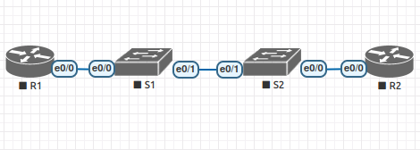

# Настройка протокола OSPFv2 для одной области

### Топология

### Таблица адресации

| Устройство  | Интерфейс   | IP  -адрес          | Маска подсети  | Шлюз по умолчанию |
|-------------|-------------|---------------------|----------------|-------------------|
| R1          | F0/0.10     | 192.168.10.1        | 255.255.255.0  | -                 | 
| R1          | F0/0.20     | 192.168.20.1        | 255.255.255.0  | -                 | 
| R1          | F0/0.333    | -                   | -              | -                 | 
| R1          | Loopback 0  | 10.10.1.1           | -              | -                 | 
| S1          | VLAN 10     | 192.168.10.201      | 255.255.255.0  | 192.168.10.1      | 
| S2          | VLAN 10     | 192.168.10.202      | 255.255.255.0  | 192.168.10.1      | 
|PC1          | NIC         | dhcp                | -              | -                 |
|PC2          | NIC         | dhcp                | -              | -                 |

### Таблица VLAN

| VLAN        |    Имя       | Назначенный интерфейс         | 
|-------------|--------------|-------------------------------|
| 10          | Управление   | S1: VLAN 10 , S2: VLAN 10     | 
| 20          | Students     | S1: E0/0, S2:E0/1             |  
| 333         | native       | -                             |
| 999         | Parking_Lot  | все не активные access порты  |  

### Шаг 1. Настройка коммутаторов S1 и S2.
