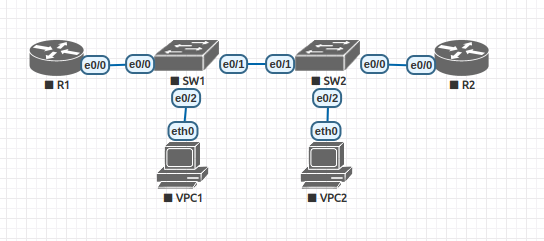

# Настройка и проверка расширенных списков контроля доступа

### Топология



### Таблица адресации

| Устройство  | Интерфейс   | IP  -адрес          | Маска подсети  | Шлюз по умолчанию |
|-------------|-------------|---------------------|----------------|-------------------|
| R1          | e 0/0.20     | 10.20.0.1          | 255.255.255.0  | -                 | 
| R1          | e 0/0.30     | 10.30.0.1          | 255.255.255.0  | -                 | 
| R1          | e 0/0.40     | 10.40.0.1          | 255.255.255.0  | -                 | 
| R1          | e 0/0.1000   | -                  | -              | -                 | 
| R1          | Loopback 0   | 172.16.1.1         | 255.255.255.0  | -                 | 
| R2          | e 0/0        | 10.20.0.4          | 255.255.255.0  | -                 |
| SW1         | VLAN 20      | 10.20.0.2          | 255.255.255.0  | 10.20.0.1         | 
| SW2         | VLAN 20      | 10.20.0.3          | 255.255.255.0  | 10.20.0.1         | 
|VPC1         | NIC          | 10.30.0.10         | 255.255.255.0  | 10.30.0.1         |
|VPC2         | NIC          | 10.40.0.10         | 255.255.255.0  | 10.40.0.1         |

### Таблица VLAN

| VLAN        |    Имя       | Назначенный интерфейс         | 
|-------------|--------------|-------------------------------|
| 20          | Управление   | VLAN 20                       | 
| 30          | OPERATIONS   | SW1: e0/2                     | 
| 40          | SALES        | SW2: e0/2                     |
| 999         | Parking_Lot  | все не активные access порты  |  
| 1000        | native       | -                             |

---

### Шаг 1. 1. Создание сети и настройка основных параметров устройства

* Создана топология сети в EVE-NG.
* Выполнена базовая настройка маршрутизаторов и коммутаторов по шаблону.
* Выполним настройку VLAN и SVI на коммутаторах согласно таблице VLAN и таблице адресации:

```
SW1(config)#vlan 20
SW1(config-vlan)#name mng
SW1(config-vlan)#vlan 30
SW1(config-vlan)#name operations
SW1(config-vlan)#vlan 40
SW1(config-vlan)#name SALES
SW1(config-vlan)#vlan 999   
SW1(config-vlan)#name PL
SW1(config-vlan)#vlan 1000
SW1(config-vlan)#name native
SW1(config-vlan)#int vlan 20
SW1(config-if)#ip address 10.20.0.2 255.255.255.0
SW1(config)#ip default-gateway 10.20.0.1
SW1(config)#int e 0/2
SW1(config-if)#switchport mode access 
SW1(config-if)#switchport access vlan 30
SW1(config-if)#no shutdown 
SW1(config)#int e 0/3
SW1(config-if)#switchport mode access 
SW1(config-if)#switchport access vlan 999
SW1(config-if)#shutdown 


SW1#sh ip int brief 
Interface              IP-Address      OK? Method Status                Protocol
Ethernet0/0            unassigned      YES unset  up                    up      
Ethernet0/1            unassigned      YES unset  up                    up      
Ethernet0/2            unassigned      YES unset  up                    up      
Ethernet0/3            unassigned      YES unset  administratively down down    
Vlan20                 10.20.0.2       YES manual down                  down 

SW1#sh vlan

VLAN Name                             Status    Ports
---- -------------------------------- --------- -------------------------------
1    default                          active    Et0/0, Et0/1
20   mng                              active    
30   operations                       active    Et0/2
40   SALES                            active    
999  PL                               active    Et0/3

SW1#sh ip redirects 
Default gateway is 10.20.0.1
```

```
SW2#sh ip int brief 
Interface              IP-Address      OK? Method Status                Protocol
Ethernet0/0            unassigned      YES unset  up                    up      
Ethernet0/1            unassigned      YES unset  up                    up      
Ethernet0/2            unassigned      YES unset  up                    up      
Ethernet0/3            unassigned      YES unset  administratively down down    
Vlan20                 10.20.0.3       YES manual down                  down    
SW2#

SW2#sh vlan

VLAN Name                             Status    Ports
---- -------------------------------- --------- -------------------------------
1    default                          active    Et0/0, Et0/1
20   mng                              active    
30   operations                       active    
40   sales                            active    Et0/2
999  PL                               active    Et0/3

SW2#sh ip redirects 
Default gateway is 10.20.0.1
```
