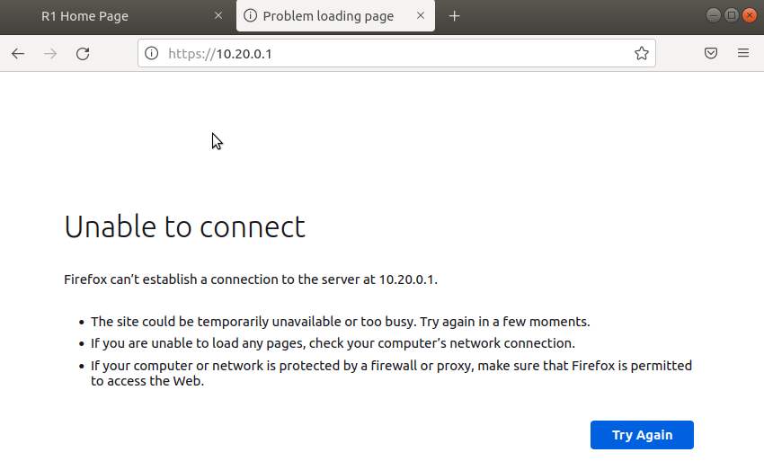

# Настройка и проверка расширенных списков контроля доступа

### Топология


### Таблица адресации

| Устройство  | Интерфейс    | IP  -адрес          | Маска подсети  | Шлюз по умолчанию |
|-------------|--------------|---------------------|----------------|-------------------|
| R1          | e 0/0.20     | 10.20.0.1          | 255.255.255.0  | -                 | 
| R1          | e 0/0.30     | 10.30.0.1          | 255.255.255.0  | -                 | 
| R1          | e 0/0.40     | 10.40.0.1          | 255.255.255.0  | -                 | 
| R1          | e 0/0.1000   | -                  | -              | -                 | 
| R1          | Loopback 0   | 172.16.1.1         | 255.255.255.0  | -                 | 
| R2          | e 0/0        | 10.20.0.4          | 255.255.255.0  | -                 |
| SW1         | VLAN 20      | 10.20.0.2          | 255.255.255.0  | 10.20.0.1         | 
| SW2         | VLAN 20      | 10.20.0.3          | 255.255.255.0  | 10.20.0.1         | 
| Linux1      | NIC          | 10.30.0.10         | 255.255.255.0  | 10.30.0.1         |
| Linux2      | NIC          | 10.40.0.10         | 255.255.255.0  | 10.40.0.1         |

### Таблица VLAN

| VLAN        |    Имя       | Назначенный интерфейс         | 
|-------------|--------------|-------------------------------|
| 20          | Управление   | VLAN 20                       | 
| 30          | OPERATIONS   | SW1: e0/2                     | 
| 40          | SALES        | SW2: e0/2                     |
| 999         | Parking_Lot  | все не активные access порты  |  
| 1000        | native       | -                             |

---

### Шаг 1. Создание сети и настройка основных параметров устройства

* Создана топология сети в EVE-NG.
* Выполнена базовая настройка маршрутизаторов и коммутаторов по шаблону.
* Выполним настройку VLAN и SVI на коммутаторах согласно таблице VLAN и таблице адресации:

```
SW1(config)#vlan 20
SW1(config-vlan)#name mng
SW1(config-vlan)#vlan 30
SW1(config-vlan)#name operations
SW1(config-vlan)#vlan 40
SW1(config-vlan)#name SALES
SW1(config-vlan)#vlan 999   
SW1(config-vlan)#name PL
SW1(config-vlan)#vlan 1000
SW1(config-vlan)#name native
SW1(config-vlan)#int vlan 20
SW1(config-if)#ip address 10.20.0.2 255.255.255.0
SW1(config)#ip default-gateway 10.20.0.1
SW1(config)#int e 0/2
SW1(config-if)#switchport mode access 
SW1(config-if)#switchport access vlan 30
SW1(config-if)#no shutdown 
SW1(config)#int e 0/3
SW1(config-if)#switchport mode access 
SW1(config-if)#switchport access vlan 999
SW1(config-if)#shutdown 


SW1#sh ip int brief 
Interface              IP-Address      OK? Method Status                Protocol
Ethernet0/0            unassigned      YES unset  up                    up      
Ethernet0/1            unassigned      YES unset  up                    up      
Ethernet0/2            unassigned      YES unset  up                    up      
Ethernet0/3            unassigned      YES unset  administratively down down    
Vlan20                 10.20.0.2       YES manual down                  down 

SW1#sh vlan

VLAN Name                             Status    Ports
---- -------------------------------- --------- -------------------------------
1    default                          active    Et0/0, Et0/1
20   mng                              active    
30   operations                       active    Et0/2
40   SALES                            active    
999  PL                               active    Et0/3

SW1#sh ip redirects 
Default gateway is 10.20.0.1
```

```
SW2#sh ip int brief 
Interface              IP-Address      OK? Method Status                Protocol
Ethernet0/0            unassigned      YES unset  up                    up      
Ethernet0/1            unassigned      YES unset  up                    up      
Ethernet0/2            unassigned      YES unset  up                    up      
Ethernet0/3            unassigned      YES unset  administratively down down    
Vlan20                 10.20.0.3       YES manual down                  down    
SW2#

SW2#sh vlan

VLAN Name                             Status    Ports
---- -------------------------------- --------- -------------------------------
1    default                          active    Et0/0, Et0/1
20   mng                              active    
30   operations                       active    
40   sales                            active    Et0/2
999  PL                               active    Et0/3

SW2#sh ip redirects 
Default gateway is 10.20.0.1
```
* Настроим на коммутаторах магистральные каналы, разрешим vlan 20,30,40,1000, и назнаим native vlan:

```
SW1(config)# int r e 0/0-1
SW1(config-if-range)#switchport trunk encapsulation dot1q 
SW1(config-if-range)#switchport mode trunk 
SW1(config-if-range)#no shutdown 
SW1(config-if-range)#switchport trunk allowed vlan 20,30,40,1000
SW1(config-if-range)#switchport trunk native vlan 1000

SW1#sh interfaces trunk 

Port        Mode             Encapsulation  Status        Native vlan
Et0/0       on               802.1q         trunking      1000
Et0/1       on               802.1q         trunking      1000

Port        Vlans allowed on trunk
Et0/0       20,30,40,1000
Et0/1       20,30,40,1000

Port        Vlans allowed and active in management domain
Et0/0       20,30,40,1000
Et0/1       20,30,40,1000

Port        Vlans in spanning tree forwarding state and not pruned
Et0/0       20,30,40,1000
Et0/1       20,30,40,1000
SW1#

SW2#sh interfaces trunk 

Port        Mode             Encapsulation  Status        Native vlan
Et0/0       on               802.1q         trunking      1000
Et0/1       on               802.1q         trunking      1000

Port        Vlans allowed on trunk
Et0/0       20,30,40,1000
Et0/1       20,30,40,1000

Port        Vlans allowed and active in management domain
Et0/0       20,30,40,1000
Et0/1       20,30,40,1000

Port        Vlans in spanning tree forwarding state and not pruned
Et0/0       20,30,40,1000
Et0/1       20,30,40,1000
SW2#
```

* Настроим саб интерфейсы на R1:

```
R1(config)#int loop 0
R1(config-if)#ip address 172.16.1.1 255.255.255.0
R1(config-if)#int e 0/0.20
R1(config-subif)#description mng 
R1(config-subif)#encapsulation dot1Q 20
R1(config-subif)#ip address 10.20.0.1 255.255.255.0
R1(config-subif)#int e 0/0.30                       
R1(config-subif)#description operations            
R1(config-subif)#encapsulation dot1Q 30            
R1(config-subif)#ip address 10.30.0.1 255.255.255.0
R1(config-subif)#int e 0/0.40                      
R1(config-subif)#description sales                 
R1(config-subif)#encapsulation dot1Q 40            
R1(config-subif)#ip address 10.40.0.1 255.255.255.0
R1(config-subif)#int e 0/0.1000                    
R1(config-subif)#description native                
R1(config-subif)#encapsulation dot1Q 1000 
R1(config)#int e 0/0
R1(config-if)#no sh

R1#sh ip int brief 
Interface                  IP-Address      OK? Method Status                Protocol
Ethernet0/0                unassigned      YES unset  up                    up      
Ethernet0/0.20             10.20.0.1       YES manual up                    up      
Ethernet0/0.30             10.30.0.1       YES manual up                    up      
Ethernet0/0.40             10.40.0.1       YES manual up                    up      
Ethernet0/0.1000           unassigned      YES unset  up                    up      
Ethernet0/1                unassigned      YES unset  administratively down down    
Ethernet0/2                unassigned      YES unset  administratively down down    
Ethernet0/3                unassigned      YES unset  administratively down down    
Loopback0                  172.16.1.1      YES manual up                    up      
R1#
```

* Настроим саб интерфейсы на R2, и опишем маршрут по умолчанию (на R1):

```
R2(config)#int e 0/0.20
R2(config-subif)#encapsulation dot1Q 20
R2(config-subif)#ip address 10.20.0.4 255.255.255.0
R2(config-subif)#int e 0/0.1000
R2(config-subif)#encapsulation dot1Q 1000          
R2(config-subif)#int e 0/0
R2(config-if)#no shutdown 
R2(config)#ip route 0.0.0.0 0.0.0.0 10.20.0.1

R2#sh ip int brief 
Interface                  IP-Address      OK? Method Status                Protocol
Ethernet0/0                unassigned      YES unset  up                    up      
Ethernet0/0.20             10.20.0.4       YES manual up                    up      
Ethernet0/0.1000           unassigned      YES unset  up                    up      
Ethernet0/1                unassigned      YES unset  administratively down down    
Ethernet0/2                unassigned      YES unset  administratively down down    
Ethernet0/3                unassigned      YES unset  administratively down down    

R2#R2#sh ip route static 
Gateway of last resort is 10.20.0.1 to network 0.0.0.0

S*    0.0.0.0/0 [1/0] via 10.20.0.1
R2#
```

* Выполним настройку доступа по прооколу SSH на всех сетевых устройствах.

```
R1(config)#username alex privilege 15 secret alex
R1(config)#ip domain-name alex
R1(config)#crypto key generate rsa general-keys modulus 2048
R1(config)#ip ssh version 2
R1(config)#line vty 0 4
R1(config-line)#transport input ssh
R1(config-line)#login local
```

Аналогиная настройка SSH и на других сетевых устройствах.


* Включим защищенные веб-службы с проверкой подлинности на R1.

```
R1(config)#ip http secure-server 
% Generating 1024 bit RSA keys, keys will be non-exportable...
[OK] (elapsed time was 0 seconds)
Failed to generate persistent self-signed certificate.
    Secure server will use temporary self-signed certificate.

R1(config)#ip http authentication local 
```

* Настроим ip На ПК по таблице адресации и выполним тесты: 

| От     | Протокол | Назначение  | 
|--------|----------|-------------|
| Linux1 | Ping     | 10.40.0.10  | 
| Linux1 | Ping     | 10.20.0.1   |  
| Linux2 | Ping     | 10.30.0.10  |  
| Linux2 | Ping     | 10.20.0.1   | 
| Linux2 | Ping     | 172.16.1.1  | 
| Linux2 | HTTPS    | 10.20.0.1   | 
| Linux2 | HTTPS    | 172.16.1.1  |  
| Linux2 | SSH      | 10.20.0.1   | 
| Linux2 | SSH      | 172.16.1.1  | 

* Linux1:


* Linux2


Все тесты пройдены успешно

### 2. Настройка и проверка списков расширенного контроля доступа

**Политика 1**. Сеть Sales не может использовать SSH в сети MGMT (но в  другие сети SSH разрешен).

```
remark block_ssh_for_sale_in_mgt
deny   tcp 10.40.0.0 0.0.0.255 10.20.0.0 0.0.0.255 eq 22
```

**Политика 2**. Сеть Sales не имеет доступа к IP-адресам в сети MGMT с помощью любого веб-протокола (HTTP/HTTPS). Сеть Sales также не имеет доступа к интерфейсам R1 с помощью любого веб-протокола. Разрешён весь другой веб-трафик (обратите внимание — Сеть Sales  может получить доступ к интерфейсу Loopback 1 на R1).

```
remark block_web_for_sales
deny   tcp 10.40.0.0 0.0.0.255 10.20.0.0 0.0.0.255 eq www
deny   tcp 10.40.0.0 0.0.0.255 10.20.0.0 0.0.0.255 eq 443

remark block_web_for_sales_to_R1_int
deny   tcp 10.40.0.0 0.0.0.255 host 10.30.0.1 eq www
deny   tcp 10.40.0.0 0.0.0.255 host 10.30.0.1 eq 443
deny   tcp 10.40.0.0 0.0.0.255 host 10.40.0.1 eq 443
deny   tcp 10.40.0.0 0.0.0.255 host 10.40.0.1 eq www
```
**Политика 3**. Сеть Sales не может отправлять эхо-запросы ICMP в сети Operations или MGMT. Разрешены эхо-запросы ICMP к другим адресатам.

```
remark block_icmp_for_sales_to_mng_and_operations
deny   icmp 10.40.0.0 0.0.0.255 10.20.0.0 0.0.0.255 echo
deny   icmp 10.40.0.0 0.0.0.255 10.30.0.0 0.0.0.255 echo
permit ip any any
```
Данные политики применяются на e0/0.40 in


**Политика 4**. Cеть Operations  не может отправлять ICMP эхозапросы в сеть Sales. Разрешены эхо-запросы ICMP к другим адресатам.

```
remark block_icmp_for_operations_to_sales
deny    icmp 10.30.0.0 0.0.0.255 10.40.0.0 0.0.0.255 echo
permit  ip any any
```
Данные политики применяются на e0/0.30 in


Выполним следующие тесты и убедимся, что политики реализованы правильно и результаты тестов соответствуют ожидаемым.


| От     | Протокол | Назначение  | Результат |
|--------|----------|-------------|-----------|
| Linux1 | Ping     | 10.40.0.10  | сбой      |
| Linux1 | Ping     | 10.20.0.1   | успех     |
| Linux2 | Ping     | 10.30.0.10  | сбой      |
| Linux2 | Ping     | 10.20.0.1   | сбой      |
| Linux2 | Ping     | 172.16.1.1  | успех     |
| Linux2 | HTTPS    | 10.20.0.1   | сбой      |
| Linux2 | HTTPS    | 172.16.1.1  | успех     |
| Linux2 | SSH      | 10.20.0.1   | сбой      |
| Linux2 | SSH      | 172.16.1.1  | успех     |

* Linux1:


* Linux2:




```
R1#sh access-lists 
Extended IP access list Operatios
    10 deny icmp 10.30.0.0 0.0.0.255 10.40.0.0 0.0.0.255 echo (6 matches)
    20 permit ip any any (10 matches)
Extended IP access list Sales
    10 deny tcp 10.40.0.0 0.0.0.255 10.20.0.0 0.0.0.255 eq 22 (4 matches)
    20 deny tcp 10.40.0.0 0.0.0.255 10.20.0.0 0.0.0.255 eq www (1 match)
    30 deny tcp 10.40.0.0 0.0.0.255 10.20.0.0 0.0.0.255 eq 443 (13 matches)
    40 deny tcp 10.40.0.0 0.0.0.255 host 10.30.0.1 eq www (1 match)
    50 deny tcp 10.40.0.0 0.0.0.255 host 10.30.0.1 eq 443 (6 matches)
    60 deny tcp 10.40.0.0 0.0.0.255 host 10.40.0.1 eq 443 (6 matches)
    70 deny tcp 10.40.0.0 0.0.0.255 host 10.40.0.1 eq www (1 match)
    80 deny icmp 10.40.0.0 0.0.0.255 10.20.0.0 0.0.0.255 echo (10 matches)
    90 deny icmp 10.40.0.0 0.0.0.255 10.30.0.0 0.0.0.255 echo (3 matches)
    100 permit ip any any (80 matches)
R1#

```
