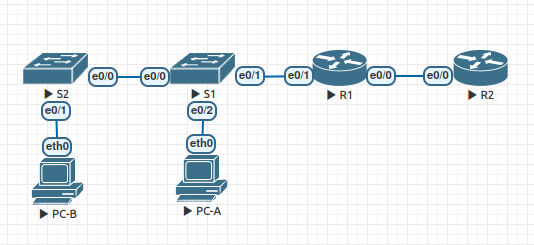

# Настройка NAT для IPv4

### Топология



### Таблица адресации

| Устройство  | Интерфейс    | IP  -адрес         | Маска подсети   |
|-------------|--------------|--------------------|-----------------|
| R1          | e 0/0        | 209.165.200.230    | 255.255.255.248 | 
| R1          | e 0/1        | 192.168.1.1        | 255.255.255.0   | 
| R2          | e 0/0        | 209.165.200.225    | 255.255.255.248 | 
| R2          | Lo 1         | 209.165.200.1      | 255.255.255.224 | 
| S1          | VLAN 1       | 192.168.1.11       | 255.255.255.0   | 
| S2          | VLAN 1       | 192.168.1.12       | 255.255.255.0   | 
| PC-A        | NIC          | 192.168.1.2        | 255.255.255.0   | 
| PC-B        | NIC          | 192.168.1.3        | 255.255.255.0   | 

Интернет-провайдер выделил компании общедоступное пространство IP-адресов 209.165.200.224/29. Эта сеть используется для обращения к каналу между маршрутизатором ISP (R2) и шлюзом компании (R1). Первый адрес (209.165.200.225) назначается интерфейсу e 0/0 на R2, а последний адрес (209.165.200.230) назначается интерфейсу e 0/0 на R1. Остальные адреса (209.165.200.226-209.165.200.229) будут использоваться для предоставления доступа в Интернет хостам компании. Маршрут по умолчанию используется от R1 до R2. Подключение интернет-провайдера к Интернету смоделировано loopback-адресом на маршрутизаторе интернет-провайдера.

#### Задачи

1. Создание сети и настройка основных параметров устройства
2. Настройка и проверка NAT для IPv4
3. Настройка и проверка PAT для IPv4
4. Настройка и проверка статического NAT для IPv4

---

### 1. Создание сети и настройка основных параметров устройства

* Создана топология сети в EVE-NG.
* Выполним настройку интерфейсов активного оборудования согласно талицы ip адресации.

```
S1#sh ip int brief 
Interface              IP-Address      OK? Method Status                Protocol
Ethernet0/0            unassigned      YES unset  up                    up      
Ethernet0/1            unassigned      YES unset  up                    up      
Ethernet0/2            unassigned      YES unset  up                    up      
Ethernet0/3            unassigned      YES unset  up                    up      
Vlan1                  192.168.1.11    YES manual up                    up      
S1#
S1#sh ip redirects 
Default gateway is 192.168.1.1


S2#sh ip int brief 
Interface              IP-Address      OK? Method Status                Protocol
Ethernet0/0            unassigned      YES unset  up                    up      
Ethernet0/1            unassigned      YES unset  up                    up      
Ethernet0/2            unassigned      YES unset  up                    up      
Ethernet0/3            unassigned      YES unset  up                    up      
Vlan1                  192.168.1.12    YES manual up                    up      
S2#
S2#sh ip redirects 
Default gateway is 192.168.1.1

R1#sh ip int brief 
Interface                  IP-Address      OK? Method Status                Protocol
Ethernet0/0                209.165.200.230 YES manual up                    up      
Ethernet0/1                192.168.1.1     YES manual up                    up      
Ethernet0/2                unassigned      YES unset  administratively down down    
Ethernet0/3                unassigned      YES unset  administratively down down    
R1#

R1#sh ip route static 
S*    0.0.0.0/0 [1/0] via 209.165.200.225

R2#sh ip int brief 
Interface                  IP-Address      OK? Method Status                Protocol
Ethernet0/0                209.165.200.225 YES manual up                    up      
Ethernet0/1                unassigned      YES unset  administratively down down    
Ethernet0/2                unassigned      YES unset  administratively down down    
Ethernet0/3                unassigned      YES unset  administratively down down    
Loopback1                  209.165.200.1   YES manual up                    up      
R2#

```

### 2. Настройка и проверка NAT для IPv4

* Настроим NAT на R1, используя пул из трех адресов 209.165.200.226-209.165.200.228.

1. Настроим список доступа, определяющий какие адреса будут транслироваться. В данном случае все устройства в локальной сети R1 имеют право на трансляцию.

```
R1(config)#ip access-list standard LAN_TO_NAT
R1(config-std-nacl)#permit 192.168.1.0 0.0.0.255
```

2. Создадим пул NAT адресов:

```
R1(config)# ip nat pool PUBLIC_ACCESS 209.165.200.226 209.165.200.228 netmask 255.255.255.248
```

3. Настроим трансляцию адресов, связав ранее созданные ACL и пул адресов с процессом преобразования адресов:

	```
R1(config)#ip nat inside source list LAN_TO_NAT pool PUBLIC_ACCESS 
	```

4. Зададим внутренний и внешний интерфейсы:

	```
	R1(config)# int e0/1
	R1(config-if)# ip nat inside
	R1(config-if)# int e0/0
	R1(config-if)# ip nat outside
	```


