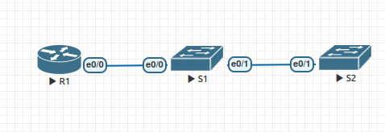

# Настройка протоколов CDP, LLDP и NTP

### Топология



### Таблица адресации

| Устройство  | Интерфейс    | IP  -адрес         | Маска подсети  | Шлюз по умолчанию |
|-------------|--------------|--------------------|----------------|-------------------|
| R1          | Loopback 0   | 172.16.1.1         | 255.255.255.0  | -                 | 
| R1          | e 0/0        | 10.22.0.1          | 255.255.255.0  | -                 | 
| S1          | SVI VLAN 1   | 10.22.0.2          | 255.255.255.0  | 10.22.0.1         | 
| S2          | SVI VLAN 1   | 10.22.0.3          | 255.255.255.0  | 10.22.0.1         | 


### Задачи
1. Создание сети и настройка основных параметров устройства
2. Обнаружение сетевых ресурсов с помощью протокола CDP
3. Обнаружение сетевых ресурсов с помощью протокола LLDP
4. Настройка и проверка NTP

---

### 1. Создание сети и настройка основных параметров устройства

* Создана топология сети в EVE-NG.
* Выполнена базовая настройка маршрутизаторов и коммутаторов по шаблону.
* Выполним настройку маршрутизатора R1 согласно таблицы дресации:

```
R1#sh ip int brief 
Interface                  IP-Address      OK? Method Status                Protocol
Ethernet0/0                10.22.0.1       YES manual up                    up      
Ethernet0/1                unassigned      YES unset  administratively down down    
Ethernet0/2                unassigned      YES unset  administratively down down    
Ethernet0/3                unassigned      YES unset  administratively down down    
Loopback0                  172.16.1.1      YES manual up                    up      
R1#
```

* На данном этапе, пока не будем настраивать интерфейсы SVI,только отключим неиспользуемые интерфейсы.

### 2. Обнаружение сетевых ресурсов с помощью протокола CDP

На устройствах Cisco протокол CDP включен по умолчанию. Воспользуемся CDP, чтобы обнаружить порты, к которым подключены кабели, а так же общую информацию.

Посмотрим информацию на R1:

```
R1#sh cdp interface 
Ethernet0/0 is up, line protocol is up
  Encapsulation ARPA
  Sending CDP packets every 60 seconds
  Holdtime is 180 seconds
Ethernet0/1 is administratively down, line protocol is down
  Encapsulation ARPA
  Sending CDP packets every 60 seconds
  Holdtime is 180 seconds
Ethernet0/2 is administratively down, line protocol is down
  Encapsulation ARPA
  Sending CDP packets every 60 seconds
  Holdtime is 180 seconds
Ethernet0/3 is administratively down, line protocol is down
  Encapsulation ARPA
  Sending CDP packets every 60 seconds
  Holdtime is 180 seconds

 cdp enabled interfaces : 4
 interfaces up          : 1
 interfaces down        : 3
R1#
```

Из вывода команды ввидно, что CDP включен на всех интерфейсах и один из интерфейсоы в up.

Так же, посмотрим информацию за какими интерфйсами находятся соседние устройства: 

```
R1#sh cdp neighbors 
Capability Codes: R - Router, T - Trans Bridge, B - Source Route Bridge
                  S - Switch, H - Host, I - IGMP, r - Repeater, P - Phone, 
                  D - Remote, C - CVTA, M - Two-port Mac Relay 

Device ID        Local Intrfce     Holdtme    Capability  Platform  Port ID
S1               Eth 0/0           166             R S I  Linux Uni Eth 0/0

Total cdp entries displayed : 1
R1#
```

В данном случае видно, что соседнее устройство с именем S1 достуно чере локальный интерфейс e 0/0 и удаленный порт подключения e 0/0. Так же, можно увидеть платформу удаленного устройства.

Далее на R1, определим версию IOS, используемую на S1:

```
R1#sh cdp entry S1
-------------------------
Device ID: S1
Entry address(es): 
Platform: Linux Unix,  Capabilities: Router Switch IGMP 
Interface: Ethernet0/0,  Port ID (outgoing port): Ethernet0/0
Holdtime : 159 sec

Version :
Cisco IOS Software, Linux Software (I86BI_LINUXL2-ADVENTERPRISEK9-M), Version 15.2(CML_NIGHTLY_20190423)FLO_DSGS7, EARLY DEPLOYMENT DEVELOPMENT BUILD, synced to  V152_6_0_81_E
Technical Support: http://www.cisco.com/techsupport
Copyright (c) 1986-2019 by Cisco Systems, Inc.
Compiled Tue 23-Apr-19 02:38 by mmen

advertisement version: 2
VTP Management Domain: ''
Native VLAN: 1
Duplex: full

R1#
```
Т.к в eve-ng коммутатор виртуальный, соответственно IOS отображается как:

```
Cisco IOS Software, Linux Software (I86BI_LINUXL2-ADVENTERPRISEK9-M), Version 15.2
```

В реальных же условиях, например для коммутатора cisco 2960, будет запись вида:

```
Cisco IOS Software, C2960 Software (C2960-LANBASEK9-M), Version 15.2(4)E8, RELEASE SOFTWARE (fc3)
```

На стороне коммутатора S1 посмотрим статистику использования протокола CDP:

```
S1#sh cdp traffic 
CDP counters :
	Total packets output: 216, Input: 118
	Hdr syntax: 0, Chksum error: 0, Encaps failed: 0
	No memory: 0, Invalid packet: 0, 
	CDP version 1 advertisements output: 0, Input: 0
	CDP version 2 advertisements output: 216, Input: 118
S1#
```

216 пактов cdp на выход.

Настроим виртуальные интерфейсы коммутаторов по таблице адресации и на маршрутизаторе снова посмотрим информацию о соседнем устройстве, предоставленную протоколом CDP:

```
R1#sh cdp entry S1
-------------------------
Device ID: S1
Entry address(es): 
  IP address: 10.22.0.2
Platform: Linux Unix,  Capabilities: Router Switch IGMP 
Interface: Ethernet0/0,  Port ID (outgoing port): Ethernet0/0
Holdtime : 137 sec

Version :
Cisco IOS Software, Linux Software (I86BI_LINUXL2-ADVENTERPRISEK9-M), Version 15.2(CML_NIGHTLY_20190423)FLO_DSGS7, EARLY DEPLOYMENT DEVELOPMENT BUILD, synced to  V152_6_0_81_E
Technical Support: http://www.cisco.com/techsupport
Copyright (c) 1986-2019 by Cisco Systems, Inc.
Compiled Tue 23-Apr-19 02:38 by mmen

advertisement version: 2
VTP Management Domain: ''
Native VLAN: 1
Duplex: full
Management address(es): 
  IP address: 10.22.0.2

R1# 
```

Теперь,по протоколу CDP дополнительно сообщается об IP-адресе S1и он является Management.

Для перехода к изучению следующего протокола отключим протокол CDP на всех устройствах глобально:

```
R1(config)#no cdp run
R1(config)#

```
### 3. Обнаружение сетевых ресурсов с помощью протокола LLDP

На устройствах Cisco протокол LLDP отключен и может быть включен по умолчанию.

Включим протокол LLDP на всех устройствах:

```
R1(config)#lldp run
```


На коммутаторе S1 выведем информацию предоставленную протоколом LLDP о соседних устройствах:

```
S1#sh lldp neighbors 
Capability codes:
    (R) Router, (B) Bridge, (T) Telephone, (C) DOCSIS Cable Device
    (W) WLAN Access Point, (P) Repeater, (S) Station, (O) Other

Device ID           Local Intf     Hold-time  Capability      Port ID
R1                  Et0/0          120        R               Et0/0
S2                  Et0/1          120        R               Et0/1

Total entries displayed: 2

S1#
```

На S1 посмотрим подробную информацию о S2:

```
S1#sh lldp entry S2

Capability codes:
    (R) Router, (B) Bridge, (T) Telephone, (C) DOCSIS Cable Device
    (W) WLAN Access Point, (P) Repeater, (S) Station, (O) Other
------------------------------------------------
Local Intf: Et0/1
Chassis id: aabb.cc00.2000
Port id: Et0/1
Port Description: Ethernet0/1
System Name: S2

System Description: 
Cisco IOS Software, Linux Software (I86BI_LINUXL2-ADVENTERPRISEK9-M), Version 15.2(CML_NIGHTLY_20190423)FLO_DSGS7, EARLY DEPLOYMENT DEVELOPMENT BUILD, synced to  V152_6_0_81_E
Technical Support: http://www.cisco.com/techsupport
Copyright (c) 1986-2019 by 

Time remaining: 111 seconds
System Capabilities: B,R
Enabled Capabilities: R
Management Addresses:
    IP: 10.22.0.3
Auto Negotiation - not supported
Physical media capabilities - not advertised
Media Attachment Unit type - not advertised
Vlan ID: - not advertised


Total entries displayed: 1
S1#
```

Chassis id - это идентификатор шасси, в данном случае с mac адресом SVI S2. На S2: Hardware is Ethernet SVI, address is aabb.cc80.2000 (bia aabb.cc80.2000).

Таким образом, с помощю протоколов cdp и lldp можно составить топологию физических подключений сети.

### 4. Настройка и проверка NTP

Необходимо настроить маршрутизатор R1 в качестве сервера NTP, а маршрутизатор R2 в качестве клиента NTP маршрутизатора R1. Необходимо выполнить синхронизацию времени для Syslog и отладочных функций. Если время не синхронизировано, сложно определить, какое сетевое событие стало причиной данного сообщения.

С помощью команды clock set установим время на маршрутизаторе R1:

```
R1#show clock detail 
19:09:16.438 UTC Tue Jan 28 2025
Time source is user configuration
R1#
```
Настроим маршрутизатор R1 в качестве источника времени с уровнем слоя (stratum) равным 4:

```
R1(config)#ntp master 4
```

На коммутаторах зададим источником времени по протоколу NTP маршрутизатор R1:

```
S1(config)# ntp server 10.22.0.1
```

После настройки источника времени включим периодическое обновление календаря на устройстве и убедимся в корректности настройки:

```
S1(config)# ntp update-calendar
S1#sh clock detail 
*16:45:06.272 UTC Tue Jan 28 2025
Time source is NTP
S1#
```

В данном случае синхронизация времени не выполняется

```
S1#sh ntp status  
Clock is unsynchronized, stratum 5, reference is 10.22.0.1      
nominal freq is 250.0000 Hz, actual freq is 250.0000 Hz, precision is 2**10
ntp uptime is 106100 (1/100 of seconds), resolution is 4000
reference time is EB4388F2.87EF9F28 (16:48:50.531 UTC Tue Jan 28 2025)
clock offset is 10758314.0000 msec, root delay is 0.00 msec
root dispersion is 10758321.05 msec, peer dispersion is 2.90 msec
loopfilter state is 'FREQ' (Drift being measured), drift is 0.000000000 s/s
system poll interval is 64, last update was 53 sec ago.
S1#
```

Хотя в выводе команды ниже, ассоциация с ntp присутствует:

```
S1#sh ntp associations detail 
10.22.0.1 configured, ipv4, our_master, sane, valid, stratum 4
ref ID 127.127.1.1    , time EB43B2EA.8E978ED8 (19:47:54.557 UTC Tue Jan 28 2025)
our mode client, peer mode server, our poll intvl 64, peer poll intvl 64
root delay 0.00 msec, root disp 2.38, reach 377, sync dist 6.45
delay 0.00 msec, offset 10758314.0000 msec, dispersion 2.90, jitter 0.97 msec
precision 2**10, version 4
assoc id 38796, assoc name 10.22.0.1
assoc in packets 20, assoc out packets 22, assoc error packets 0
org time 00000000.00000000 (00:00:00.000 UTC Mon Jan 1 1900)
rec time EB43B2F8.D851EDD8 (19:48:08.845 UTC Tue Jan 28 2025)
xmt time EB43B2F8.D851EDD8 (19:48:08.845 UTC Tue Jan 28 2025)
filtdelay =     0.00    1.00    2.00    2.00    2.00    1.00    0.00    3.00
filtoffset = 1075831 1075831 1075831 1075831 1075831 1075831 1075831 1075831
filterror =     1.95    2.94    3.93    4.95    5.97    7.00    8.02    9.04
minpoll = 6, maxpoll = 10

S1#
```

Так же видна разница между аппаратными часами R1 и программными часами операционной системы (в данном случае linux-реализация Cisco IOS).

```
R1#sh clock 
19:56:51.870 UTC Tue Jan 28 2025
R1#show calendar 
19:02:22 UTC Fri Jul 1 1988
R1#
```

Предполагаю, что это связано с особенностями виртуального стенда.

В целях безопасности, на интерфейсах, которые смотрят в сторону активного оборудования, находящегося в зоне ответстенности других организаций, следует отключать  протоколы обнаружения сетевых ресурсов. 
