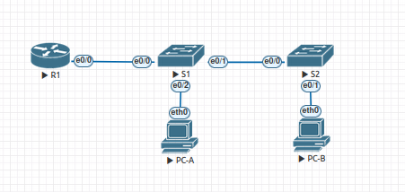

## Configure Router-on-a-Stick Inter-VLAN Routing

#### Топология



### Таблица адресации

| Устройство  | Интерфейс   | IP  -адрес          | Маска подсети  | Шлюз по умолчанию |
|-------------|-------------|---------------------|----------------|-------------------|
| R1          | e0/0.3      | 192.168.3.1         | 255.255.255.0  | -                 | 
| R1          | e0/0.4      | 192.168.4.1         | 255.255.255.0  | -                 | 
| R1          | e0/0.8      | -                   | -              | -                 | 
| S1          | VLAN 3      | 192.168.3.11        | 255.255.255.0  | 192.168.3.1       | 
| S2          | VLAN 3      | 192.168.3.12        | 255.255.255.0  | 192.168.3.1       | 
|PC-A         | NIC         | 192.168.3.3         | 255.255.255.0  | 192.168.3.1       |
|PC-B         | NIC         | 192.168.4.3         | 255.255.255.0  | 192.168.4.1       |

#### Таблица VLAN

| VLAN        |    Имя       | Назначенный интерфейс                 | 
|-------------|--------------|---------------------------------------|
| 3           | Management   | S1: VLAN 3 , S2: VLAN 3, S1: e0/2     | 
| 4           | Operations   | S2: e0/1                              |  
| 7           | Parking_Lot  | S1: e0/3, S1: e0/2-3                  |
| 8           | Native       | -                                     | 

---

#### Настройка основных параметров устройств


#### Шаг 1. Базовая настройка коммутаторов.

* Выполним базовую настройку коммутатора S1:

```
Switch#conf t
Switch(config)#hostname S1
S1(config)#no ip domain-lookup 
S1(config)#username admin privilege 15 secret cisco
S1(config)#line con 0
S1(config-line)#login local
S1(config)#ip domain name alex.com
S1(config)#crypto key generate rsa modulus 204 
S1(config)#ip ssh version 2
S1(config)#ip ssh authentication-retries 3
S1(config)#line vty 0 4
S1(config-line)#login local 
S1(config-line)#transport input ssh 
S1(config-line)#exec-timeout 20 0
S1(config)#banner motd "Attention"
Switch#clock set 18:20:00 09 march 2025
S1#wr

```

R1,S2 - аналогичная настройка

#### Шаг 2. Настройка ПК.

* Назначим ip адреса PC-A и PC-B:

PC-A

```
VPCS> show ip
NAME        : VPCS[1]
IP/MASK     : 192.168.3.3/24
GATEWAY     : 192.168.3.1
 
```

PC-B

```
VPCS> sh ip
NAME        : VPCS[1]
IP/MASK     : 192.168.4.3/24
GATEWAY     : 192.168.4.1

```

#### Создание сетей VLAN и назначение портов коммутатора.

* Создадим VLAN, как указано в таблице выше, на обоих коммутаторах. Затем назначим VLAN соответствующему интерфейсу и проверим настройки конфигурации.

#### Шаг 1. Создание сети VLAN на коммутаторах.

* Создаим VLAN на каждом коммутаторе из таблицы выше.

```
S1(config)#vlan 3
S1(config-vlan)#name MANAGEMENT
S1(config-vlan)#vlan 4 
S1(config-vlan)#name OPERATIONS
S1(config-vlan)#vlan 7
S1(config-vlan)#name PARKINGLOT
S1(config-vlan)#vlan 8
S1(config-vlan)#name NATIVE

```

* Настроим интерфейс управления и шлюз по умолчанию на каждом коммутаторе, используя информацию об IP-адресе в таблице адресации.

```
S1(config)#int vlan 3                
S1(config-if)#ip address 192.168.3.11 255.255.255.0
S1(config)#ip default-gateway 192.168.3.1
```

#### Шаг 2. Назначим сети VLAN соответствующим интерфейсам коммутатора. Так же, все неиспользуемые порты коммутатора назначим в VLAN Parking_Lot.

```
S1(config)#int e 0/2
S1(config-if)#switchport mode access 
S1(config-if)#switchport acc vla 3
S1(config-if)#int e 0/3
S1(config-if)#switchport mode access
S1(config-if)#switchport access vlan 7
S1(config-if)#shutdown 
 
```

* Убедимся, что VLAN назначены на правильные интерфейсы.

```
S1(config)#do sh vlan br

VLAN Name                             Status    Ports
---- -------------------------------- --------- -------------------------------
1    default                          active    Et0/0, Et0/1
3    MANAGEMENT                       active    Et0/2
4    OPERATIONS                       active    
7    PARKINGLOT                       active    Et0/3
8    NATIVE                           active    
1002 fddi-default                     act/unsup 
1003 token-ring-default               act/unsup 
1004 fddinet-default                  act/unsup 
1005 trnet-default                    act/unsup 
S1(config)#

S1#sh ip int brief 
Interface              IP-Address      OK? Method Status                Protocol
Ethernet0/0            unassigned      YES unset  up                    up      
Ethernet0/1            unassigned      YES unset  up                    up      
Ethernet0/2            unassigned      YES unset  up                    up      
Ethernet0/3            unassigned      YES unset  administratively down down    
Vlan3                  192.168.3.11    YES manual up                    up      
S1#
```

Настройка для S2:

```
S2#sh ip redirects 
Default gateway is 192.168.3.1

S2#sh vlan brief 

VLAN Name                             Status    Ports
---- -------------------------------- --------- -------------------------------
1    default                          active    Et0/0
3    MANAGEMENT                       active    
4    OPERATIONS                       active    Et0/1
7    PARKINGLOT                       active    Et0/2, Et0/3
8    NATIVE                           active    
1002 fddi-default                     act/unsup 
1003 token-ring-default               act/unsup 
1004 fddinet-default                  act/unsup 
1005 trnet-default                    act/unsup 
S2#

S2#sh ip int brief 
Interface              IP-Address      OK? Method Status                Protocol
Ethernet0/0            unassigned      YES unset  up                    up      
Ethernet0/1            unassigned      YES unset  up                    up      
Ethernet0/2            unassigned      YES unset  administratively down down    
Ethernet0/3            unassigned      YES unset  administratively down down    
Vlan3                  192.168.3.12    YES manual down                  down    
S2#
```

Все настроено верно.


#### Конфигурация магистрального канала стандарта 802.1Q между коммутаторами.

#### Шаг 1. Настроим магистральный интерфейс на коммутаторах S1 и S2.

* Настроим статический транкинг на интерфейсе F0/1 для обоих коммутаторов.

```
S1(config)#int e 0/1
S1(config-if)# switchport trunk encapsulation dot1q
S1(config-if)# switchport mode trunk
```

Установим native VLAN 8 на обоих коммутаторах.

```
S1(config-if)# switchport trunk native vlan 8
```

Укажим, что VLAN 3, 4, 8 могут проходить по транку.

```
S1(config-if)# switchport trunk allowed vlan 3,4,8
```

Аналогичная настройка будет на S2. 


* Далее проверим транки, native VLAN и разрешенные VLAN через транк.

S1:

```
S1#sh interfaces trunk 

Port        Mode             Encapsulation  Status        Native vlan
Et0/1       on               802.1q         trunking      8

Port        Vlans allowed on trunk
Et0/1       3-4,8

Port        Vlans allowed and active in management domain
Et0/1       3-4,8

Port        Vlans in spanning tree forwarding state and not pruned
Et0/1       3-4,8
S1#
```

S2:

```
S2#sh interfaces trunk 

Port        Mode             Encapsulation  Status        Native vlan
Et0/0       on               802.1q         trunking      8

Port        Vlans allowed on trunk
Et0/0       3-4,8

Port        Vlans allowed and active in management domain
Et0/0       3-4,8

Port        Vlans in spanning tree forwarding state and not pruned
Et0/0       3-4,8
S2#

```

#### Шаг 2. Настроим магистральный интерфейс e0/0 на коммутаторе S1 в сторону R1.

* Настроим транк до маршрутизатора:

```
S1(config)#int e 0/0
S1(config-if)#switchport trunk encapsulation dot1q 
S1(config-if)#swi mode tr
S1(config-if)#swit trun allowed vlan 3,4,8
S1(config-if)#swit trun native vlan 8
S1(config-if)#
```

Проверка транкинга.

```
S1#sh int trunk 

Port        Mode             Encapsulation  Status        Native vlan
Et0/0       on               802.1q         trunking      8
Et0/1       on               802.1q         trunking      8

Port        Vlans allowed on trunk
Et0/0       3-4,8
Et0/1       3-4,8

Port        Vlans allowed and active in management domain
Et0/0       3-4,8
Et0/1       3-4,8

Port        Vlans in spanning tree forwarding state and not pruned
Et0/0       3-4,8
Et0/1       3-4,8
S1#
```

#### Настройка маршрутизации между сетями VLAN.

Настроим подинтерфейсы для каждой VLAN, как указано в таблице IP-адресации. Все сабинтерфейсы используют инкапсуляцию 802.1Q. Включим описание для каждого подинтерфейса.

```
R1(config)#int e 0/0.3            
R1(config-subif)#description MANAGEMENT
R1(config-subif)#encapsulation dot1Q 3
R1(config-subif)#ip add 192.168.3.1 255.255.255.0
R1(config-subif)#int e 0/0.4                     
R1(config-subif)#description OPERATIONS          
R1(config-subif)#encapsulation dot1Q 4           
R1(config-subif)#ip add 192.168.4.1 255.255.255.0
R1(config-subif)#int e 0/0.8                     
R1(config-subif)#description NATIVE                    
R1(config-subif)#encapsulation dot1Q 8 native 
R1(config-subif)#int e 0/0
R1(config-if)#no sh
```

Проверим настройки саб интерфейсов:

```
R1#sh ip int brief 
Interface                  IP-Address      OK? Method Status                Protocol
Ethernet0/0                unassigned      YES unset  up                    up      
Ethernet0/0.3              192.168.3.1     YES manual up                    up      
Ethernet0/0.4              192.168.4.1     YES manual up                    up      
Ethernet0/0.8              unassigned      YES unset  up                    up      
Ethernet0/1                unassigned      YES unset  administratively down down    
Ethernet0/2                unassigned      YES unset  administratively down down    
Ethernet0/3                unassigned      YES unset  administratively down down    
R1#

```

#### Проверим работу маршрутизация между VLAN

* Отправим эхо-запрос с PC-A на шлюз по умолчанию.

```
VPCS> ping 192.168.3.1 

84 bytes from 192.168.3.1 icmp_seq=1 ttl=255 time=3.448 ms
84 bytes from 192.168.3.1 icmp_seq=2 ttl=255 time=2.346 ms
84 bytes from 192.168.3.1 icmp_seq=3 ttl=255 time=2.786 ms
84 bytes from 192.168.3.1 icmp_seq=4 ttl=255 time=1.651 ms
84 bytes from 192.168.3.1 icmp_seq=5 ttl=255 time=2.755 ms

VPCS> 
```

* Отправим эхо-запрос с PC-A на PC-B.

```
VPCS> ping 192.168.4.3

84 bytes from 192.168.4.3 icmp_seq=1 ttl=63 time=7.691 ms
84 bytes from 192.168.4.3 icmp_seq=2 ttl=63 time=6.180 ms
84 bytes from 192.168.4.3 icmp_seq=3 ttl=63 time=2.026 ms
84 bytes from 192.168.4.3 icmp_seq=4 ttl=63 time=5.885 ms
84 bytes from 192.168.4.3 icmp_seq=5 ttl=63 time=6.027 ms

VPCS>
```

* Отправим команду ping с компьютера PC-A на коммутатор S2.

```
VPCS> ping 192.168.3.12

84 bytes from 192.168.3.12 icmp_seq=1 ttl=255 time=3.015 ms
84 bytes from 192.168.3.12 icmp_seq=2 ttl=255 time=2.516 ms
84 bytes from 192.168.3.12 icmp_seq=3 ttl=255 time=2.693 ms
84 bytes from 192.168.3.12 icmp_seq=4 ttl=255 time=1.585 ms
84 bytes from 192.168.3.12 icmp_seq=5 ttl=255 time=1.598 ms

VPCS>
```

* На PC-B выполним команду tracert на адрес PC-A.

```
VPCS> trace 192.168.3.3 -P 1
trace to 192.168.3.3, 8 hops max (ICMP), press Ctrl+C to stop
 1   192.168.4.1   2.951 ms  3.163 ms  3.510 ms
 2   192.168.3.3   8.403 ms  4.791 ms  4.644 ms

VPCS>
```
Схема отрабатывает корректно.
