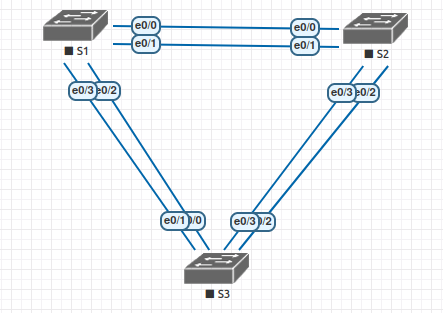

## Развертывание коммутируемой сети с резервными каналами 

Изучение работы STP проводилось в рамках базового курса. Ссылка на работу: (https://github.com/AlexeyKislitsyn/AlexeyKislitsyn/tree/main/Basic/lab07).Здесь же я хочу рассмотреть работу протокола MST.


#### Топология



#### Таблица адресации

| Устройство  | Интерфейс   | IP  -адрес   | Маска подсети  | 
|-------------|-------------|--------------|----------------|
| S1          | VLAN 1      | 192.168.1.1  | 255.255.255.0  | 
| S2          | VLAN 1      | 192.168.1.2  | 255.255.255.0  |  
| S3          | VLAN 1      | 192.168.1.3  | 255.255.255.0  |

#### Таблица VLAN

| VLAN        |    Имя       |
|-------------|--------------|
| 100         | Management   | 
| 20          | USER_20      | 
| 30          | USER_30      | 
| 40          | USER_40      | 
| 50          | USER_50      | 
| 999         | Native       |

#### Шаг 1. Базовая настройка коммутаторов.

S1

```
Switch#conf t
Switch#erase startup-config 
Switch#delete vlan.dat
Switch#reload

Switch#conf t
Switch(config)#hostname S1
S1(config)#no ip domain-lookup 
S1(config)#username admin privilege 15 secret cisco
S1(config)#line con 0
S1(config-line)#login local
S1(config-line)#logging synchronous
S1(config)#ip domain name alex.com
S1(config)#crypto key generate rsa 
The name for the keys will be: S1.alex.com
Choose the size of the key modulus in the range of 360 to 4096 for your
  General Purpose Keys. Choosing a key modulus greater than 512 may take
  a few minutes.

How many bits in the modulus [512]: 2048
% Generating 2048 bit RSA keys, keys will be non-exportable...[OK]
S1(config)#ip ssh version 2
S1(config)#ip ssh authentication-retries 3
S1(config)#line vty 0 4
S1(config-line)#login local 
S1(config-line)#transport input ssh 
S1(config-line)#exec-timeout 20 0
S1(config)#banner motd "Attention"
S1(config)#int vlan 1
S1(config-if)#ip address 192.168.1.1 255.255.255.0
S1(config-if)#no shutdown 
S1#copy run start

```

S2, S3 - Аналогичная настройка, исключением является настройка ip адреса vlan 1 согласно таблицы адресации.

#### Шаг 2: Создадим vlan на всех 3-х коммутаторах:

```
VLAN Name                             Status    Ports
---- -------------------------------- --------- -------------------------------
1    default                          active    
20   USER_20                          active    
30   USER_30                          active    
40   USER_40                          active    
50   USER_50                          active    
100  MANAGEMENT                       active    
999  NATIVE                           active    
```

#### Шаг 3: Линки между коммутаторами переведем в транк:

S2:

```
interface Ethernet0/0
 switchport trunk encapsulation dot1q
 switchport trunk native vlan 999
 switchport mode trunk
!
interface Ethernet0/1
 switchport trunk encapsulation dot1q
 switchport trunk native vlan 999
 switchport mode trunk
!
interface Ethernet0/2
 switchport trunk encapsulation dot1q
 switchport trunk native vlan 999
 switchport mode trunk
!
interface Ethernet0/3
 switchport trunk encapsulation dot1q
 switchport trunk native vlan 999
 switchport mode trunk
```


#### Шаг 4: Настроим регион: имя, ревизия, маппинг.

```
S2(config)#spanning-tree mode mst 
S2(config)#spanning-tree mst configuration 
S2(config-mst)#name REGION_1
S2(config-mst)#revision 1
S2(config-mst)#instance 1 vlan 20,30,100,999 
S2(config-mst)#instance 2 vlan 40,50
```

Аналогичные настройки выполним на S1 и S3

Введем команду show spanning-tree mst на всех трех коммутаторах. Приоритет идентификатора моста рассчитывается путем сложения значений приоритета и расширенного идентификатора системы. Расширенным идентификатором системы всегда является номер сети VLAN. В примере ниже все три коммутатора имеют равные значения приоритета идентификатора моста (приоритет по умолчанию = 32768,+ номер VLAN); следовательно, коммутатор с самым низким значением MAC-адреса становится корневым мостом, в данном случае S1.

```
S1#sh spanning-tree mst 

##### MST0    vlans mapped:   1-19,21-29,31-39,41-49,51-99,101-998,1000-4094
Bridge        address aabb.cc00.1000  priority      32768 (32768 sysid 0)
Root          this switch for the CIST
Operational   hello time 2 , forward delay 15, max age 20, txholdcount 6 
Configured    hello time 2 , forward delay 15, max age 20, max hops    20

Interface        Role Sts Cost      Prio.Nbr Type
---------------- ---- --- --------- -------- --------------------------------
Et0/0            Desg FWD 2000000   128.1    P2p 
Et0/1            Desg FWD 2000000   128.2    P2p 
Et0/2            Desg FWD 2000000   128.3    P2p 
Et0/3            Desg FWD 2000000   128.4    P2p 

##### MST1    vlans mapped:   20,30,100,999
Bridge        address aabb.cc00.1000  priority      32769 (32768 sysid 1)
Root          this switch for MST1

Interface        Role Sts Cost      Prio.Nbr Type
---------------- ---- --- --------- -------- --------------------------------
Et0/0            Desg FWD 2000000   128.1    P2p 
Et0/1            Desg FWD 2000000   128.2    P2p 
Et0/2            Desg FWD 2000000   128.3    P2p 
Et0/3            Desg FWD 2000000   128.4    P2p 

##### MST2    vlans mapped:   40,50
Bridge        address aabb.cc00.1000  priority      32770 (32768 sysid 2)
Root          this switch for MST2

Interface        Role Sts Cost      Prio.Nbr Type
---------------- ---- --- --------- -------- --------------------------------
Et0/0            Desg FWD 2000000   128.1    P2p 
Et0/1            Desg FWD 2000000   128.2    P2p 
Et0/2            Desg FWD 2000000   128.3    P2p 
Et0/3            Desg FWD 2000000   128.4    P2p 

S1#

```

#### Шаг 5: Настройка корневого моста.

Очень желательно указывать рутовый свич руками. Без такого указания взял и рутом выбрался коммутатор доступа, чего быть не должно. Пока один рут, а он один и тот же для всех VLANs, топология всех VLANs в нашем конкретном случае получилась одинаковая. И то что мы распихали их по двум инстансам результата не даст. Рутовые, назначенные и альтернативные порты одни и те же. Поэтому и нужно определять VLANs с одинаковой топологией в один инстанс.

Корневой мост настраивается как в классическом STP, только вместо VLAN указывается инстанс.

Пусть для vlan 20,30,100,999 (MST1) корневым мостом будет S1, а для vlan 40,50 (MST2) корневым мостом будет S2.

S1: 

```
S1(config)#spanning-tree mst 1 root primary 
S1(config)#spanning-tree mst 2 root second  
```

S2: 

```
S2(config)#spanning-tree mst 1 root sec
S2(config)#spanning-tree mst 2 root prim

```

Получается следующая картина:

```
S3#sh spanning-tree mst 1-2

##### MST1    vlans mapped:   20,30,100,999
Bridge        address aabb.cc00.3000  priority      32769 (32768 sysid 1)
Root          address aabb.cc00.1000  priority      24577 (24576 sysid 1)
              port    Et0/0           cost          2000000   rem hops 19

Interface        Role Sts Cost      Prio.Nbr Type
---------------- ---- --- --------- -------- --------------------------------
Et0/0            Root FWD 2000000   128.1    P2p 
Et0/1            Altn BLK 2000000   128.2    P2p 
Et0/2            Altn BLK 2000000   128.3    P2p 
Et0/3            Altn BLK 2000000   128.4    P2p 

##### MST2    vlans mapped:   40,50
Bridge        address aabb.cc00.3000  priority      32770 (32768 sysid 2)
Root          address aabb.cc00.2000  priority      24578 (24576 sysid 2)
              port    Et0/2           cost          2000000   rem hops 19

Interface        Role Sts Cost      Prio.Nbr Type
---------------- ---- --- --------- -------- --------------------------------
Et0/0            Altn BLK 2000000   128.1    P2p 
Et0/1            Altn BLK 2000000   128.2    P2p 
Et0/2            Root FWD 2000000   128.3    P2p 
Et0/3            Altn BLK 2000000   128.4    P2p 

S3#
```

Таким образом, мы получили разную топологию VLANs 20,30,100,999 и VLANs 40,50, а значит искомую балансировку по линкам.

#### Шаг 6 :	Тюнинг MST корневой порт

Кроме этого можно влиять на выбор корневого порта. Добавим на всех коммутаторах VLAN 60,70 и сделаем настройки:

```
S1(config)#spanning-tree mst configuration 
S1(config-mst)#revision 2
S1(config-mst)#instance 3 vlan 60,70
```

На других коммутаторах аналогично + сделаем S1 рутовым для MST3:

```
S1(config)#spanning-tree mst 3 root primary 

S2(config)#spanning-tree mst 3 root second
```

Что мы получаем:

```
S3#sh spanning-tree mst 1,3

##### MST1    vlans mapped:   20,30,100,999
Bridge        address aabb.cc00.3000  priority      32769 (32768 sysid 1)
Root          address aabb.cc00.1000  priority      24577 (24576 sysid 1)
              port    Et0/0           cost          2000000   rem hops 19

Interface        Role Sts Cost      Prio.Nbr Type
---------------- ---- --- --------- -------- --------------------------------
Et0/0            Root FWD 2000000   128.1    P2p 
Et0/1            Altn BLK 2000000   128.2    P2p 
Et0/2            Altn BLK 2000000   128.3    P2p 
Et0/3            Altn BLK 2000000   128.4    P2p 

##### MST3    vlans mapped:   60,70
Bridge        address aabb.cc00.3000  priority      32771 (32768 sysid 3)
Root          address aabb.cc00.1000  priority      24579 (24576 sysid 3)
              port    Et0/0           cost          2000000   rem hops 19

Interface        Role Sts Cost      Prio.Nbr Type
---------------- ---- --- --------- -------- --------------------------------
Et0/0            Root FWD 2000000   128.1    P2p 
Et0/1            Altn BLK 2000000   128.2    P2p 
Et0/2            Altn BLK 2000000   128.3    P2p 
Et0/3            Altn BLK 2000000   128.4    P2p 

S3#
```

У нас от S3 до S1 два линка: e 0/0 и e 0/1. А инстансы 1 и 3 утилизируют только линк e 0/0, а e 0/1 - простаивает. Нам нужно разблокировать порт е 0/1 для инстанса 3 (vlan 60,70). Это можно сделать спомощью стоимости порта (port cost) или приоритета порта (port priority).

Уменьшим стоимость порта e 0/1:

```
S3(config)#int e 0/1
S3(config-if)#spanning-tree mst 3 cost 1000
S3(config-if)#
```

Смотрим:

```
S3#sh spanning-tree mst 1,3

##### MST1    vlans mapped:   20,30,100,999
Bridge        address aabb.cc00.3000  priority      32769 (32768 sysid 1)
Root          address aabb.cc00.1000  priority      24577 (24576 sysid 1)
              port    Et0/0           cost          2000000   rem hops 19

Interface        Role Sts Cost      Prio.Nbr Type
---------------- ---- --- --------- -------- --------------------------------
Et0/0            Root FWD 2000000   128.1    P2p 
Et0/1            Altn BLK 2000000   128.2    P2p 
Et0/2            Altn BLK 2000000   128.3    P2p 
Et0/3            Altn BLK 2000000   128.4    P2p 

##### MST3    vlans mapped:   60,70
Bridge        address aabb.cc00.3000  priority      32771 (32768 sysid 3)
Root          address aabb.cc00.1000  priority      24579 (24576 sysid 3)
              port    Et0/1           cost          1000      rem hops 19

Interface        Role Sts Cost      Prio.Nbr Type
---------------- ---- --- --------- -------- --------------------------------
Et0/0            Altn BLK 2000000   128.1    P2p 
Et0/1            Root FWD 1000      128.2    P2p 
Et0/2            Desg FWD 2000000   128.3    P2p 
Et0/3            Desg FWD 2000000   128.4    P2p 

S3#
```

Теперь vlan 20,30,100,999 ходят через e 0/0, а vlan 60,70 - через e 0/1.

Но может сложиться ситуация, что коммутатор S1 выйдет из строя или отвалятся линки от S3 к S1, тогда получается что у нас опять утилизирован один линк e 0/2:

```
S3#sh spanning-tree mst 1-3

##### MST1    vlans mapped:   20,30,100,999
Bridge        address aabb.cc00.3000  priority      32769 (32768 sysid 1)
Root          address aabb.cc00.1000  priority      24577 (24576 sysid 1)
              port    Et0/2           cost          4000000   rem hops 18

Interface        Role Sts Cost      Prio.Nbr Type
---------------- ---- --- --------- -------- --------------------------------
Et0/2            Root FWD 2000000   128.3    P2p 
Et0/3            Altn BLK 2000000   128.4    P2p 

##### MST2    vlans mapped:   40,50
Bridge        address aabb.cc00.3000  priority      32770 (32768 sysid 2)
Root          address aabb.cc00.2000  priority      24578 (24576 sysid 2)
              port    Et0/2           cost          2000000   rem hops 19

Interface        Role Sts Cost      Prio.Nbr Type
---------------- ---- --- --------- -------- --------------------------------
Et0/2            Root FWD 2000000   128.3    P2p 
Et0/3            Altn BLK 2000000   128.4    P2p 

##### MST3    vlans mapped:   60,70
Bridge        address aabb.cc00.3000  priority      32771 (32768 sysid 3)
Root          address aabb.cc00.1000  priority      24579 (24576 sysid 3)
              port    Et0/2           cost          4000000   rem hops 18

Interface        Role Sts Cost      Prio.Nbr Type
---------------- ---- --- --------- -------- --------------------------------
Et0/2            Root FWD 2000000   128.3    P2p 
Et0/3            Altn BLK 2000000   128.4    P2p 

S3#
```

* Тут для примера воспользуемся настройкой приоритета. Чтобы порт стал корневым приоритет нужно уменьшать не на нём самом, а на порту с другой стороны линка. Разблокируем порт e 0/3 для инстанса 3. 

```
S2(config)#int e 0/3
S2(config-if)#spanning-tree mst 3 port-priority 64
```

```
S3#sh spanning-tree mst 1-3

##### MST1    vlans mapped:   20,30,100,999
Bridge        address aabb.cc00.3000  priority      32769 (32768 sysid 1)
Root          address aabb.cc00.1000  priority      24577 (24576 sysid 1)
              port    Et0/2           cost          4000000   rem hops 18

Interface        Role Sts Cost      Prio.Nbr Type
---------------- ---- --- --------- -------- --------------------------------
Et0/2            Root FWD 2000000   128.3    P2p 
Et0/3            Altn BLK 2000000   128.4    P2p 

##### MST2    vlans mapped:   40,50
Bridge        address aabb.cc00.3000  priority      32770 (32768 sysid 2)
Root          address aabb.cc00.2000  priority      24578 (24576 sysid 2)
              port    Et0/2           cost          2000000   rem hops 19

Interface        Role Sts Cost      Prio.Nbr Type
---------------- ---- --- --------- -------- --------------------------------
Et0/2            Root FWD 2000000   128.3    P2p 
Et0/3            Altn BLK 2000000   128.4    P2p 

##### MST3    vlans mapped:   60,70
Bridge        address aabb.cc00.3000  priority      32771 (32768 sysid 3)
Root          address aabb.cc00.1000  priority      24579 (24576 sysid 3)
              port    Et0/3           cost          4000000   rem hops 18

Interface        Role Sts Cost      Prio.Nbr Type
---------------- ---- --- --------- -------- --------------------------------
Et0/2            Altn BLK 2000000   128.3    P2p 
Et0/3            Root FWD 2000000   128.4    P2p 

S3#
```

Таким образом для MST1,2 - активный порт e 0/2, для MST3 - e 0/3.


