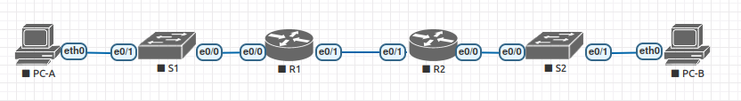

## Реализация DHCPv4  

#### Топология




#### 1. Создание схемы адресации.

Разделим на подсети сеть 192.168.1.0/24 в соответствии со следующими требованиями:

a.	Одна подсеть «Подсеть A», поддерживающая 58 хостов (клиентская VLAN на R1).
Подсеть A - 192.168.1.0 255.255.255.192
Запишем первый IP-адрес в таблице адресации для R1 G0/0/1.100 - 192.168.1.1 . 

b.	Одна подсеть «Подсеть B», поддерживающая 28 хостов (управляющая VLAN на R1). 
Подсеть B: 192.168.1.64 255.255.255.224
Запишем первый IP-адрес в таблице адресации для R1 G0/0/1.200 - 192.168.1.65. Запишем второй IP-адрес в таблице адресов для S1 VLAN 200 - 192.168.1.66 и шлюз по умолчанию - 192.168.1.65.

c.	Одна подсеть «Подсеть C», поддерживающая 12 узлов (клиентская сеть на R2).
Подсеть C: 192.168.1.96 255.255.255.240
Запишем первый IP-адрес в таблице адресации для R2 G0/0/1 - 192.168.1.97.

Занесем все данные в талицу.


#### Таблица адресации

| Устройство  | Интерфейс   | IP  -адрес          | Маска подсети  | Шлюз по умолчанию |
|-------------|-------------|---------------------|----------------|-------------------|
| R1          | e 0/1       | 10.0.0.1            | 255.255.255.252| -                 | 
| R1          | e 0/0.100   | 192.168.1.1         | 255.255.255.192| -                 | 
| R1          | e 0/0.200   | 192.168.1.65        | 255.255.255.224| -                 | 
| R1          | e 0/0.1000  | -                   | -              | -                 | 
| R2          | e 0/1       | 10.0.0.2            | 255.255.255.252| -                 | 
| R2          | e 0/0       | 192.168.1.97        | 255.255.255.240| -                 | 
| S1          | VLAN 200    | 192.168.1.66        | 255.255.255.224| 192.168.1.65      | 
| S2          | VLAN 1      | 192.168.1.98        | 255.255.255.240| 192.168.1.97      | 
|PC-A         | NIC         | DHCP                |  DHCP          |  DHCP             |
|PC-B         | NIC         | DHCP                |  DHCP          |  DHCP             |


#### Таблица VLAN

| VLAN        |    Имя       | Назначенный интерфейс         | 
|-------------|--------------|-------------------------------|
| 1           | -            | S2: e 0/1                     |  
| 100         | users        | S1: e 0/1                     |  
| 200         | management   | S1: VLAN 200                  |
| 999         | Parking_Lot  | S1: e0/2-3                    |  
| 1000        | native       | -                             | 

#### 2. Настройка маршрутизаторов R1 и R2:

* Согласно схемы адресации, настроим на интрерфейсе e 0/0 маршрутизатора R1 подинтерфейсы для каждой VLAN:

```
interface Ethernet0/0.100
 description USERS
 encapsulation dot1Q 100
 ip address 192.168.1.1 255.255.255.192
!
interface Ethernet0/0.200
 description MANAGEMENT
 encapsulation dot1Q 200
 ip address 192.168.1.65 255.255.255.224
!
interface Ethernet0/0.1000
 description NATIVE
 encapsulation dot1Q 1000 native

```

#### 3. Настройка интерфейса e 0/1 маршрутизатора R1 согласно таблицы адресации и статической маршрутизации в сеть 192.168.1.96, находящуюся за R2.

```
interface Ethernet0/1
 ip address 10.0.0.1 255.255.255.252
 duplex auto
!
ip route 192.168.1.96 255.255.255.240 10.0.0.2
```

#### 4. Настройка адресации на интерфейсах e 0/0 и e 0/1 маршрутизатора R2 согласно таблицы адресации и статической маршрутизации в сети 192.168.1.0 и 192.168.1.64, находящихся за R1. 

```
interface Ethernet0/0
 ip address 192.168.1.97 255.255.255.240
 duplex auto
!
interface Ethernet0/1
 ip address 10.0.0.2 255.255.255.252
 duplex auto
!
ip route 192.168.1.0 255.255.255.192 10.0.0.1
ip route 192.168.1.64 255.255.255.224 10.0.0.1
```

* проверим ip связанность между маршрутизаторами:

```
R1#ping 10.0.0.1
Type escape sequence to abort.
Sending 5, 100-byte ICMP Echos to 10.0.0.1, timeout is 2 seconds:
!!!!!
Success rate is 100 percent (5/5), round-trip min/avg/max = 1/4/5 ms
R1#
```

#### 5. Настройка коммутатора S1.

* Создадим vlan:

```
S1#sh vlan brief 

VLAN Name                             Status    Ports
---- -------------------------------- --------- -------------------------------
1    default                          active    Et0/0, Et0/1, Et0/2, Et0/3
100  USERS                            active    
200  MANAGEMENT                       active    
999  PARKING_LOT                      active    
1000 NATIVE                           active 
```

* настроим svi управления и шлюз по умолчанию:

```
interface Vlan200
 ip address 192.168.1.66 255.255.255.224
!
ip default-gateway 192.168.1.65

```

* настроим транковый порт в сторону маршрутизатора R1:

```
interface Ethernet0/0
 switchport trunk allowed vlan 100,200,1000
 switchport trunk encapsulation dot1q
 switchport trunk native vlan 1000
 switchport mode trunk
!

```

* Назначим все неиспользуемые порты S1 в VLAN Parking_Lot и административно деактивируем их.

```
S1(config)#int range e 0/2-3
S1(config-if-range)#switchport mode access 
S1(config-if-range)#switchport access vlan 999
S1(config-if-range)#switchport nonegotiate 
S1(config-if-range)#shutdown 
```

* назначим порт коммутатора e 0/1 в vlan 100 (users vlan) 

```
interface Ethernet0/1
 switchport access vlan 100
 switchport mode access

```

#### 6. Настройка коммутатора S2.

```
!
interface Ethernet0/1
 switchport mode access
!
interface Vlan1
 ip address 192.168.1.98 255.255.255.240
 shutdown
!
ip default-gateway 192.168.1.97
```

#### 6. Настройка и проверка двух серверов DHCPv4 на R1.

Необходимо настроить и проверить сервер DHCPv4 на R1. Сервер DHCPv4 будет обслуживать две подсети, Подсеть A - 192.168.1.0 255.255.255.192 и Подсеть C: 192.168.1.96 255.255.255.240.

Исключим первые пять используемых адресов из каждого пула адресов, создадим пул DHCP, укажим сеть, поддерживающую этот DHCP-сервер, в качестве имени домена укажим test.ru, настроим соответствующий шлюз по умолчанию для каждого пула DHCP, настроим время аренды на 2 дня 12 часов и 30 минут

```
!
ip dhcp excluded-address 192.168.1.1 192.168.1.5
ip dhcp excluded-address 192.168.1.97 192.168.1.101
!
ip dhcp pool R1_DHCP_CLIENT
 network 192.168.1.0 255.255.255.192
 domain-name test.ru
 default-router 192.168.1.1 
 lease 2 12 30
!
ip dhcp pool R2_DHCP_CLIENT
 network 192.168.1.96 255.255.255.240
 domain-name test.ru
 default-router 192.168.1.97 
 lease 2 12 30
!

```

#### 7. Настройка и проверка DHCP-ретрансляции на R2

* Выполним настройку R2 в качестве агента DHCP-ретрансляции для локальной сети на G0/0/1

```
R2(config)#int e 0/0
R2(config-if)#ip helper-address 10.0.0.1
```

#### 8.	Проверка выдачи ip адресов для двух сетей.

* установим в настройках PC-A и PC-B автоматическое получение ip адреса

PC-A:

```
VPCS> ip dhcp
DORA IP 192.168.1.6/26 GW 192.168.1.1

VPCS> show ip

NAME        : VPCS[1]
IP/MASK     : 192.168.1.6/26
GATEWAY     : 192.168.1.1
DNS         : 
DHCP SERVER : 192.168.1.1
DHCP LEASE  : 217795, 217800/108900/190575
DOMAIN NAME : test.ru
MAC         : 00:50:79:66:68:03
LPORT       : 20000
RHOST:PORT  : 127.0.0.1:30000
MTU         : 1500

VPCS>
```

PC-B:

```
VPCS> ip dhcp
DORA IP 192.168.1.102/28 GW 192.168.1.97

VPCS> show ip

NAME        : VPCS[1]
IP/MASK     : 192.168.1.102/28
GATEWAY     : 192.168.1.97
DNS         : 
DHCP SERVER : 10.0.0.1
DHCP LEASE  : 217796, 217800/108900/190575
DOMAIN NAME : test.ru
MAC         : 00:50:79:66:68:04
LPORT       : 20000
RHOST:PORT  : 127.0.0.1:30000
MTU         : 1500

VPCS> 

```
* проверим ip связанность:

```
VPCS> ping 192.168.1.6

84 bytes from 192.168.1.6 icmp_seq=1 ttl=62 time=2.721 ms
84 bytes from 192.168.1.6 icmp_seq=2 ttl=62 time=1.481 ms
84 bytes from 192.168.1.6 icmp_seq=3 ttl=62 time=2.100 ms
84 bytes from 192.168.1.6 icmp_seq=4 ttl=62 time=5.526 ms
84 bytes from 192.168.1.6 icmp_seq=5 ttl=62 time=1.876 ms

VPCS>
```

* посмотрим сведения о пулах:

```
R1#sh ip dhcp pool 

Pool R1_DHCP_CLIENT :
 Utilization mark (high/low)    : 100 / 0
 Subnet size (first/next)       : 0 / 0 
 Total addresses                : 62
 Leased addresses               : 1
 Pending event                  : none
 1 subnet is currently in the pool :
 Current index        IP address range                    Leased addresses
 192.168.1.7          192.168.1.1      - 192.168.1.62      1

Pool R2_DHCP_CLIENT :
 Utilization mark (high/low)    : 100 / 0
 Subnet size (first/next)       : 0 / 0 
 Total addresses                : 14
 Leased addresses               : 1
 Pending event                  : none
 1 subnet is currently in the pool :
 Current index        IP address range                    Leased addresses
 192.168.1.103        192.168.1.97     - 192.168.1.110     1
R1#

```

* посмотрим назначенные ip адреса:

```
R1#sh ip dhcp binding 
Bindings from all pools not associated with VRF:
IP address          Client-ID/	 	    Lease expiration        Type
		    Hardware address/
		    User name
192.168.1.6         0100.5079.6668.03       Mar 26 2025 07:05 AM    Automatic
192.168.1.102       0100.5079.6668.04       Mar 26 2025 07:07 AM    Automatic
R1#

```
