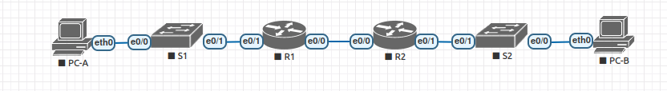

## Реализация DHCPv6 

#### Топология



#### Таблица адресации

| Устройство  | Интерфейс   | IPv6  -адрес          |
|-------------|-------------|-----------------------|
| R1          | e 0/0       | 2001:db8:acad:2::1/64 | 
| R1          | e 0/0       | fe80::1               | 
| R1          | e 0/1       | 2001:db8:acad:1::1/64 | 
| R1          | e 0/1       | fe80::1               | 
| R2          | e 0/0       | 2001:db8:acad:2::2/64 | 
| R2          | e 0/0       | fe80::2               | 
| R2          | e 0/1       | 2001:db8:acad:3::1/64 | 
| R2          | e 0/1       | fe80::1               | 
|PC-A         | NIC         | DHCP                  | 
|PC-B         | NIC         | DHCP                  | 


### Часть 1. Создание сети и настройка основных параметров устройства

Динамическое назначение глобальных индивидуальных IPv6-адресов можно настроить тремя способами:
•	Автоматическая конфигурация адреса без сохранения состояния (Stateless Address Autoconfiguration, SLAAC)
•	DHCPv6 без отслеживания состояния
•	Адресация DHCPv6 с учетом состояний

### Шаг 1. Настройка интерфейсов и маршрутизации для обоих маршрутизаторов.

Настроим интерфейсы маршрутизатора R1 и R2 согласно таблицы адресации:

```
R1:

R1(config)#int g0/0/0
R1(config-if)#ipv6 address 2001:db8:acad:2::1/64
R1(config-if)#ipv6 address  fe80::1 link-local 

R1(config-if)#int g0/0/1
R1(config-if)#ipv6 address 2001:db8:acad:1::1/64
R1(config-if)#ipv6 address  fe80::1 link-local 

R2:

R2(config)#int g0/0/0
R2(config-if)#ipv6 address 2001:db8:acad:2::2/64
R2(config-if)#ipv6 address fe80::2 link-local 

R2(config-if)#int g0/0/1
R2(config-if)#ipv6 address 2001:db8:acad:3::1/64
R2(config-if)#ipv6 address fe80::1 link-local 
```

Настройка маршрутизации:

```
R1(config)#ipv6 unicast-routing 
R1(config)#ipv6 route 2001:db8:acad:3::/64 2001:db8:acad:2::2

R2(config)#ipv6 unicast-routing 
R2(config)#ipv6 route 2001:db8:acad:1::/64 2001:db8:acad:2::1

R1#ping 2001:db8:acad:3::1

Type escape sequence to abort.
Sending 5, 100-byte ICMP Echos to 2001:db8:acad:3::1, timeout is 2 seconds:
!!!!!
Success rate is 100 percent (5/5), round-trip min/avg/max = 0/0/0 ms
```

### Часть 2. Проверка назначения адреса SLAAC от R1.

```
PC-A получает адрес IPv6 с помощью метода SLAAC. Включим PC-A и убедимся, что сетевой адаптер настроен для автоматической настройки IPv6. В выводе команды ipconfig мы увидим, что PC-A присвоил себе адрес из сети 2001:DB8:ACAD:1:/64.

C:\>ipconfig /all

FastEthernet0 Connection:(default port)

   Connection-specific DNS Suffix..: test.ru
   Physical Address................: 0010.114A.B9B6
   Link-local IPv6 Address.........: FE80::210:11FF:FE4A:B9B6
   IPv6 Address....................: 2001:DB8:ACAD:1:210:11FF:FE4A:B9B6
   IPv4 Address....................: 0.0.0.0
   Subnet Mask.....................: 0.0.0.0
   Default Gateway.................: FE80::1
                                     0.0.0.0
   DHCP Servers....................: 0.0.0.0
   DHCPv6 IAID.....................: 
   DHCPv6 Client DUID..............: 00-01-00-01-6D-B0-28-E0-00-10-11-4A-B9-B6
   DNS Servers.....................: ::
                                     0.0.0.0
 ```
                                    
 ### Часть 3. Настройка и проверка сервера DHCPv6 на R1
 
 Выполним настройку и проверку состояния DHCP-сервера на R1. Цель состоит в том, чтобы предоставить PC-A информацию о DNS-сервере и домене.

 ### Шаг 2. Настройим R1 для предоставления DHCPv6 без состояния для PC-A.

Создим пул DHCP IPv6 на R1 с именем R1-STATELESS. В составе этого пула назначим адрес DNS-сервера как 2001:db8:acad::254, а имя домена — как stateless.com.

```
R1(config)#ipv6 dhcp pool STATELESS
R1(config-dhcpv6)#dns 2001:db8:acad::254
R1(config-dhcpv6)#domain-name stateless.com
```

Настроим интерфейс G0/0/1 на R1, чтобы предоставить флаг конфигурации OTHER для локальной сети R1 и укажим только что созданный пул DHCP в качестве ресурса DHCP для этого интерфейса.

```
R1(config)#int g 0/0/1
R1(config-subif)#ipv6 dhcp server STATELESS
R1(config-subif)#ipv6 nd other-config-flag 
```

Посмотрим вывод команды ipconfig

```
C:\>ipconfig /all

FastEthernet0 Connection:(default port)

   Connection-specific DNS Suffix..: stateless.com                          
   Physical Address................: 0010.114A.B9B6
   Link-local IPv6 Address.........: FE80::210:11FF:FE4A:B9B6
   IPv6 Address....................: 2001:DB8:ACAD:1:210:11FF:FE4A:B9B6
   IPv4 Address....................: 0.0.0.0
   Subnet Mask.....................: 0.0.0.0
   Default Gateway.................: FE80::1
                                     0.0.0.0
   DHCP Servers....................: 0.0.0.0
   DHCPv6 IAID.....................: 179632878
   DHCPv6 Client DUID..............: 00-01-00-01-6D-B0-28-E0-00-10-11-4A-B9-B6
   DNS Servers.....................: 2001:DB8:ACAD::254
```

Таким образом, мы получили dns и домен.

### Часть 3. Настройка сервера DHCPv6 с сохранением состояния на R1

PS!!!! т.к в CPT нет команды ipv6 dhcp relay для настройки ретрансляции DHCPv6 с R1 на R2, мною было принято решение настроить DHCPv6 c сохранением состояния на R2. 

Здесь настроим R2 в качестве DHCPv6 сервера .

Создадим пул DHCPv6 на R2 для сети 2001:db8:acad:3:aaa::/80. Пул предоставит адреса локальной сети, подключенной к интерфейсу G0/0/1 на R2. В составе пула зададим DNS-сервер 2001:db8:acad::254 и задайдим доменное имя STATEFUL.com.

```
R2(config)#ipv6 dhcp pool R2-STATEFUL
R2(config-dhcpv6)#address prefix 2001:db8:acad:3:aaa::/80
R2(config-dhcpv6)#dns-server 2001:db8:acad::254
R2(config-dhcpv6)#domain-name stateful.com
R2(config-dhcpv6)#int g0/0/1
R2(config-if)#ipv6 dhcp server R2-STATEFUL
```

посмотрим вывод команды ipconfig

```
C:\>ipconfig /all

FastEthernet0 Connection:(default port)

   Connection-specific DNS Suffix..: stateful.com                                    
   Physical Address................: 0000.0C93.96AA
   Link-local IPv6 Address.........: FE80::200:CFF:FE93:96AA
   IPv6 Address....................: 2001:DB8:ACAD:3:AAA:CEC:B7F1:B7F1
   IPv4 Address....................: 0.0.0.0
   Subnet Mask.....................: 0.0.0.0
   Default Gateway.................: FE80::1
                                     0.0.0.0
   DHCP Servers....................: 0.0.0.0
   DHCPv6 IAID.....................: 1149457664
   DHCPv6 Client DUID..............: 00-01-00-01-24-AA-C2-BC-00-00-0C-93-96-AA
   DNS Servers.....................: 2001:DB8:ACAD::254
                                     0.0.0.0
```

 Таким образом, мы получили ipv6 адрес из заданной нами сети, dns и домен.


Проверим связь PC-A c PC-B:

```
C:\> ping 2001:DB8:ACAD:3:AAA:CEC:B7F1:B7F1

Pinging 2001:DB8:ACAD:3:AAA:CEC:B7F1:B7F1 with 32 bytes of data:

Reply from 2001:DB8:ACAD:3:AAA:CEC:B7F1:B7F1: bytes=32 time<1ms TTL=126
Reply from 2001:DB8:ACAD:3:AAA:CEC:B7F1:B7F1: bytes=32 time<1ms TTL=126
Reply from 2001:DB8:ACAD:3:AAA:CEC:B7F1:B7F1: bytes=32 time<1ms TTL=126
Reply from 2001:DB8:ACAD:3:AAA:CEC:B7F1:B7F1: bytes=32 time=13ms TTL=126

Ping statistics for 2001:DB8:ACAD:3:AAA:CEC:B7F1:B7F1:
    Packets: Sent = 4, Received = 4, Lost = 0 (0% loss),
Approximate round trip times in milli-seconds:
    Minimum = 0ms, Maximum = 13ms, Average = 3ms

```
