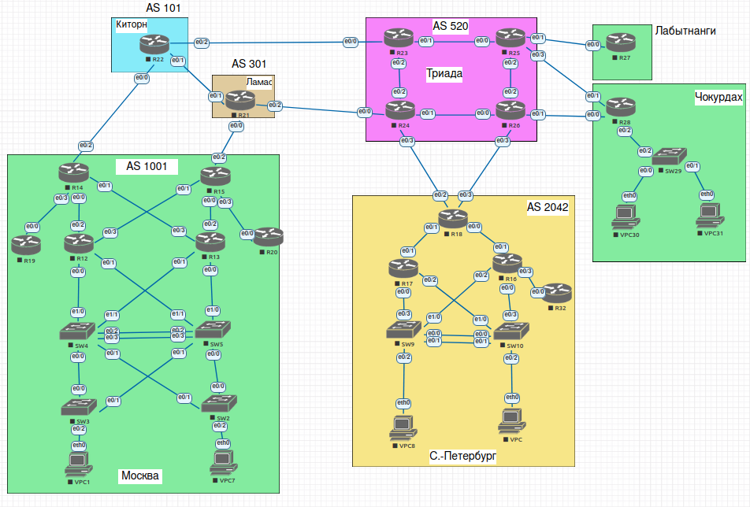

# Планирование адресного пространства.

#### Цель:
В данной самостоятельной работе необходимо распланировать адресное пространство. 
Настроить IP на всех активных портах для дальнейшей работы над проектом. 
Адресное пространство должно быть задокументировано. 

#### Описание/Пошаговая инструкция выполнения домашнего задания:

В этой работе необходимо:

1) Разработать и задокументируеть адресное пространство для лабораторного стенда.
2) Настроить IP адреса на каждом активном порту.
3) Настроить каждый VPC в каждом офисе в своем VLAN.
4) Настроить VLAN/Loopbackup interface управления для сетевых устройств. 
5) Настроить сети офисов так, чтобы не возникало broadcast штормов, а использование линков было максимально оптимизировано.

И так, у нас имеется лабораторный стенд:

Рассмотрим каждый офис по отдельности:

#### 1. Москва (AS 1001)

* Рассмотрим в офисе Москва Layer 2 - Loop Free Topology. Т.е Distribution SW4 и SW5 - L3 коммутаторы, между которыми организован L3 Port Channel, тем самым мы разрываем L2 кольцо. Сеть сегментирована на VLAN (в данном случае VPC1 - VLAN10, VPC2 - VLAN20). Абонентские VLANы на Access не пересекаются. В качестве FHRP используем HSRP, причем SW4 Active для VLAN10, SW5 Active для VLAN20. Так же для синхронизации с HSRP настроен rstp root primary и root secondary на Distribution. Аплинки на Access - trunk с разрешенными VLAN 10,100(management),1000 (native) в сторону SW4 и VLAN 20,100(management),1000 (native) в сторну SW5.

#### Таблица адресации

  
| Устройство  | Интерфейс    | IP  -адрес        |      Шлюз       | Примечание |
|-------------|--------------|-------------------|-----------------|------------|
| VPC1        | e 0          | 192.168.1.2/24    | 192.168.1.1/24  | |
| VPC2        | e 0          | 192.168.2.2/24    | 192.168.2.1/24  | |
| SW2         | VLAN 100     | 192.168.100.2/25  | 192.168.100.1/25| |
| SW3         | VLAN 100     | 192.168.100.3/25  | 192.168.100.1/25| |
| SW4         | VLAN 100     | 192.168.100.125/25|                 | HSRP Active |
|             | VLAN 10      | 192.168.1.253/24  |                 | HSRP Active |
|             | VLAN 20      | 192.168.2.253/24  |                 | HSRP Standby|
|             | e 0/2, e 0/3 | 10.0.1.1/30       |                 | PortChannel |
|             | e 1/1        | 10.0.1.5/30       |                 | |
|             | e 1/0        | 10.0.1.9/30       |                 | |
|             | loopback 0   | 10.10.10.1/32     |                 | |
| SW5         | VLAN 100     | 192.168.100.126/25|                 | HSRP Standby|
|             | VLAN 10      | 192.168.1.254/24  |                 | HSRP Standby|
|             | VLAN 20      | 192.168.2.254/24  |                 | HSRP Active |
|             | e 0/2, e 0/3 | 10.0.1.2/30       |                 | PortChannel |
|             | e 1/1        | 10.0.1.13/30      |                 | |
|             | e 1/0        | 10.0.1.17/30      |                 | |
|             | loopback 0   | 10.10.10.2/32     |                 | |
| R12         | e 0/0        | 10.0.1.10/30      |                 | |
|             | e 0/1        | 10.0.1.14/30      |                 | |
|             | e 0/2        | 10.0.0.1/30       |                 | |
|             | e 0/3        | 10.0.0.5/30       |                 | |
|             | loopback 0   | 10.10.10.3/32     |                 | |
| R13         | e 0/0        | 10.0.1.18/30      |                 | |
|             | e 0/1        | 10.0.1.6/30       |                 | |
|             | e 0/2        | 10.0.0.13/30      |                 | |
|             | e 0/3        | 10.0.0.9/30       |                 | |
|             | loopback 0   | 10.10.10.4/32     |                 | |
| R14         | e 0/0        | 10.0.0.2/30       |                 | |
|             | e 0/1        | 10.0.0.10/30      |                 | |
|             | e 0/3        | 10.0.2.1/30       |                 | |
|             | e 0/2        | 100.0.0.2/29      |                 | |
|             | loopback 0   | 10.10.11.1/32    |                 | |
| R15         | e 0/0        | 10.0.0.14/30      |                 | |
|             | e 0/1        | 10.0.0.6/30       |                 | |
|             | e 0/3        | 10.0.3.1/30       |                 | |
|             | e 0/2        | 30.1.1.2/29       |                 | |
|             | loopback 0   | 10.10.11.2/32    |                 | |
| R19         | e 0/0        | 10.0.2.2/30       |                 | |
|             | loopback 0   | 10.10.12.1 /32    |                 | |
| R20         | e 0/0        | 10.0.3.2/30       |                 | |
|             | loopback 0   | 10.10.13.1/32    |                 | |

#### Таблица VLAN

| VLAN          |    Имя       |
|---------------|--------------|
| 10            | USER_10      | 
| 20            | USER_20      | 
| 100           | Management   | 
| 1000          | Native       | 

#### 2. Санкт-Петербург (AS 2042)

* Рассмотрим в офисе Санкт_Петербург модель - Access - Layer 3. Более приоритетное решение.Сеть полностью маршрутизируемая. Шлюз по умолчанию и корневой мост перемещается на уровень доступа. Отсутствие FHRP, STP. Динамическая балансировка трафика. Минимальное время конвергенции.

SW9 и SW10 - L3 коммутаторы, между которыми организован L3 Port Channel. Сеть сегментирована на VLAN (в данном случае VPC9 - VLAN9, VPC10 - VLAN10). 

#### Таблица адресации

| Устройство  | Интерфейс    | IP  -адрес        |      Шлюз       | Примечание |
|-------------|--------------|-------------------|-----------------|------------|
| VPC9        | e 0          | 172.16.1.2/24     | 172.16.1.1/24   | |
| VPC10       | e 0          | 172.16.2.2/24     | 172.16.2.1/24   | |
| SW9         | VLAN 9       | 172.16.1.1/24     |                 | |
|             | e 0/0, e 0/1 | 10.1.0.17/30      |                 | PortChannel |
|             | e 0/3        | 10.1.0.9/30       |                 | |
|             | e 1/0        | 10.1.0.1/30       |                 | |
|             | loopback 0   | 10.2.1.1/32       |                 | |
| SW10        | VLAN 10      | 172.16.2.2/24     |                 | |
|             | e 0/0, e 0/1 | 10.1.0.18/30      |                 | PortChannel |
|             | e 0/3        | 10.1.0.13/30      |                 | |
|             | e 1/0        | 10.1.0.5/30       |                 | |
|             | loopback 0   | 10.2.1.2/32       |                 | |
| R17         | e 0/0        | 10.1.0.10/30      |                 | |
|             | e 0/1        | 10.1.1.2/30       |                 | |
|             | e 0/2        | 10.1.0.6/30       |                 | |
|             | loopback 0   | 10.2.1.3 /32      |                 | |
| R16         | e 0/0        | 10.1.0.14/30      |                 | |
|             | e 0/1        | 10.1.1.6/30       |                 | |
|             | e 0/2        | 10.1.0.2/30       |                 | |
|             | e 0/3        | 10.1.0.25/30      |                 | |
|             | loopback 0   | 10.2.1.4/32       |                 | |
| R18         | e 0/0        | 10.1.1.5/30       |                 | |
|             | e 0/1        | 10.1.1.1/30       |                 | |
|             | e 0/2        | 52.1.0.2/29       |                 | |
|             | e 0/3        | 52.1.0.10/29      |                 | |
|             | loopback 0   | 10.2.1.18/32      |                 | |
| R32         | e 0/0        | 10.1.0.26/30      |                 | |
|             | loopback 0   | 10.2.1.5/32      |                 | |

#### Таблица VLAN

|Устройство | VLAN          |    Имя       |
|-----------|---------------|--------------|
| SW9       | 9             | USER_9       | 
| SW10      | 10            | USER_10      | 

#### 3. Лабытнанги

#### Таблица адресации

| Устройство  | Интерфейс    | IP  -адрес        |      Шлюз       | Примечание |
|-------------|--------------|-------------------|-----------------|------------|
| R27         | e 0/0        | 52.1.1.2/29       |                 | |

#### 4. Чокурдах

#### Таблица адресации

| Устройство  | Интерфейс    | IP  -адрес        |      Шлюз       | Примечание |
|-------------|--------------|-------------------|-----------------|------------|
| VPC30       | e 0          | 172.16.30.2/24    | 172.16.30.1/24  | |
| VPC31       | e 0          | 172.16.31.2/24    | 172.16.31.1/24  | |
| R28         | e 0/2.30     | 172.16.30.1/24    |                 | |
|             | e 0/2.31     | 172.16.31.1/24    |                 | |
|             | e 0/2.100    | 172.16.100.2/24   |                 | |
|             | e 0/1        | 52.1.2.2/29       |                 | |
|             | e 0/0        | 52.1.2.10/29      |                 | |
| SW29        | VLAN100      | 172.16.100.2/24   | 172.16.100.1/24 | |

#### Таблица VLAN

|Устройство | VLAN          |    Имя       |
|-----------|---------------|--------------|
| SW29      | 30            | USER_30      | 
|           | 31            | USER_31      |
|           | 100           | Management   | 
|           | 1000          | Native       | 

#### 5. Триада

#### Таблица адресации

| Устройство  | Интерфейс    | IP  -адрес        |      Шлюз       | Примечание |
|-------------|--------------|-------------------|-----------------|------------|
| R23         | e 0/0        | 101.0.0.1/30      |                 | |
|             | e 0/1        | 10.0.0.1/30       |                 | |
|             | e 0/2        | 10.0.0.5/30       |                 | |
| R24         | e 0/0        | 30.0.0.1/30       |                 | |
|             | e 0/1        | 10.0.0.9/30       |                 | |
|             | e 0/2        | 10.0.0.6/30       |                 | |
|             | e 0/3        | 52.1.0.1/29       |                 | |
| R25         | e 0/0        | 10.0.0.2/30       |                 | |
|             | e 0/1        | 52.1.1.1/29       |                 | |
|             | e 0/2        | 10.0.0.14/30      |                 | |
|             | e 0/1        | 52.1.2.1/29       |                 | |
| R26         | e 0/0        | 10.0.0.10/30      |                 | |
|             | e 0/1        | 52.1.2.9/29       |                 | |
|             | e 0/2        | 10.0.0.13/30      |                 | |
|             | e 0/1        | 52.1.0.9/29       |                 | |

#### 5. Киторн (AS 101)

#### Таблица адресации

| Устройство  | Интерфейс    | IP  -адрес        |      Шлюз       | Примечание |
|-------------|--------------|-------------------|-----------------|------------|
| R22         | e 0/0        | 100.0.0.1/29      |                 | |
|             | e 0/1        | 101.0.0.5/30      |                 | |
|             | e 0/2        | 101.0.0.2/30      |                 | |

#### 5. Ламас (AS 101)

#### Таблица адресации

| Устройство  | Интерфейс    | IP  -адрес        |      Шлюз       | Примечание |
|-------------|--------------|-------------------|-----------------|------------|
| R21         | e 0/0        | 30.1.1.1/29       |                 | |
|             | e 0/1        | 101.0.0.6/30      |                 | |
|             | e 0/2        | 30.0.0.2/30       |                 | |

Схема адресации:

