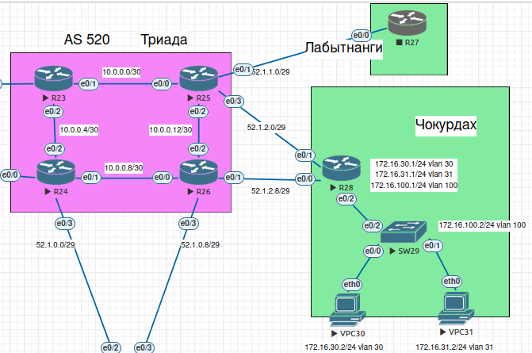

## Маршрутизация на основе политик (PBR)

#### PBR

Цель: Настроить политику маршрутизации в офисе Чокурдах Распределить трафик между 2 линками


1. Настроить политику маршрутизации для сетей офиса Чокурдах
2. Распределить трафик между двумя линками с провайдером в Чокурдах
3. Настроить отслеживание линка через технологию IP SLA в Чокурдах
4. Настройте для офиса Лабытнанги маршрут по-умолчанию
5. План работы и изменения зафиксированы в документации 



LAN сеть сегментирована на пользовательские VLAN (VLAN30 - 172.16.30.0/24  и VLAN31 - 172.16.31.0/24). Рассмотрим схему подключения к двум ISP, причем VLAN30 будет ходить через ISP1 - R26, VLAN31 - через ISP2 - R25. Если отказывает один из линков, то нам необходимо переключать все потоки на второго ISP и наоборот. 

* Настроим маршруты по умолчанию. Так-же настроим статику, для проверки доступности сервиса через определенного ISP (В ядре Триада настроен протокол ospf и хосты 8.8.8.8 и 4.2.2.2 для будущего отслеживаания).

```
ip route 0.0.0.0 0.0.0.0 52.1.2.9 name TO_R26 track 10
ip route 0.0.0.0 0.0.0.0 52.1.2.1 name TO_R25 track 20
ip route 4.2.2.2 255.255.255.255 52.1.2.1
ip route 8.8.8.8 255.255.255.255 52.1.2.9
```

* Отслеживание линков с помощью механизма IP SLA:
```
!
track 10 ip sla 10
!
track 20 ip sla 20
!
ip sla 10
 icmp-echo 8.8.8.8 source-interface Ethernet0/0
 threshold 1000
 timeout 1500
 frequency 3
ip sla schedule 10 life forever start-time now
ip sla 20
 icmp-echo 4.2.2.2 source-interface Ethernet0/1
 threshold 1000
 timeout 1500
 frequency 3
ip sla schedule 20 life forever start-time now
```

* Заготавливаем ACL для интересного трафика:

```
ip access-list extended ACL-FOR-VLAN30-ISP1
 permit ip 172.16.30.0 0.0.0.255 any
ip access-list extended ACL-FOR-VLAN31-ISP2
 permit ip 172.16.31.0 0.0.0.255 any
!
```

* Мониторинг достуности и автоматическое переключение при отказе

```
!         
route-map DUAL-ISP permit 10
 match ip address ACL-FOR-VLAN30-ISP1
 set ip next-hop verify-availability 52.1.2.9 10 track 10
 set ip next-hop 52.1.2.1
!         
route-map DUAL-ISP permit 20
 match ip address ACL-FOR-VLAN31-ISP2
 set ip next-hop verify-availability 52.1.2.1 20 track 20
 set ip next-hop 52.1.2.9
!
```

* Ну и собственно NAT, точнее PAT:

```
ip nat inside source route-map ISP1 interface Ethernet0/0 overload
ip nat inside source route-map ISP2 interface Ethernet0/1 overload 

и route-map для NAT с учетом исходящего интерфейса:

!         
route-map ISP1 permit 10
 match interface Ethernet0/0
!         
route-map ISP2 permit 20
 match interface Ethernet0/1
```

```
interface Ethernet0/0
 ip address 52.1.2.10 255.255.255.248
 ip nat outside
 ip virtual-reassembly in
 duplex auto
!
interface Ethernet0/2.30
 encapsulation dot1Q 30
 ip address 172.16.30.1 255.255.255.0
 ip nat inside
 ip virtual-reassembly in
 ip policy route-map DUAL-ISP
!
interface Ethernet0/2.31
 encapsulation dot1Q 31
 ip address 172.16.31.1 255.255.255.0
 ip nat inside
 ip virtual-reassembly in
 ip policy route-map DUAL-ISP
!
```
