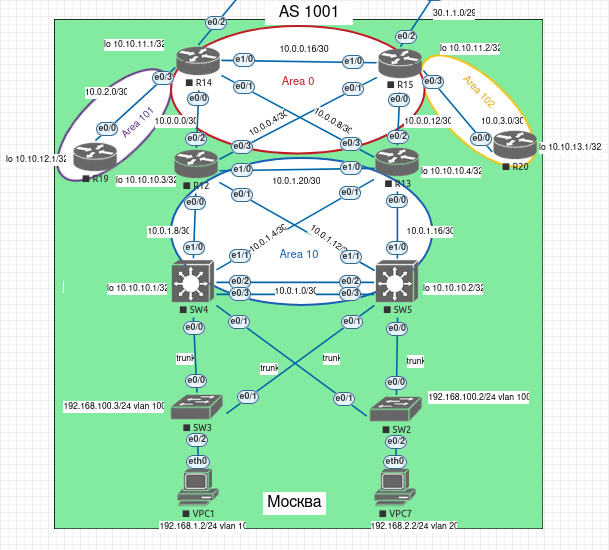

## OSPF. Фильтрация

#### Цель:

Настроить OSPF офисе Москва. Разделить сеть на зоны. Настроить фильтрацию между зонами

1. Маршрутизаторы R14-R15 находятся в зоне 0 - backbone
2. Маршрутизаторы R12-R13 находятся в зоне 10. Дополнительно к маршрутам должны получать маршрут по-умолчанию
3. Маршрутизатор R19 находится в зоне 101 и получает только маршрут по умолчанию
4. Маршрутизатор R20 находится в зоне 102 и получает все маршруты, кроме маршрутов до сетей зоны 101
5. План работы и изменения зафиксированы в документации



#### Выполнение.

* В Московском офисе у нас 3-х уровневая модель, поэтому:

-  area 0 – будет Core layer
-  area 10 – будет реализован Distribution layer

Дополнительно, для построения отказоустойчивой сети, добавим линки между R14-R15 и R12-R13 (L3 коммутаторы). Запустим процесс OSPF на всех маршрутизаторах.

* Типичная настройка представлена для R15:

```
!
interface Loopback0
 ip address 10.10.11.2 255.255.255.255
 ip ospf 1 area 0
!         
interface Ethernet0/0
 description TO_R13
 ip address 10.0.0.14 255.255.255.252
 ip ospf network point-to-point
 ip ospf dead-interval 12
 ip ospf hello-interval 3
 ip ospf 1 area 0
!
interface Ethernet0/1
 description TO_R12
 ip address 10.0.0.6 255.255.255.252
 ip ospf network point-to-point
 ip ospf dead-interval 12
 ip ospf hello-interval 3
 ip ospf 1 area 0
!
interface Ethernet0/2
 description TO_R21_LAMAS
 ip address 30.1.1.2 255.255.255.248
!
interface Ethernet0/3
 description TO_R20
 ip address 10.0.3.1 255.255.255.252
 ip ospf network point-to-point
 ip ospf dead-interval 12
 ip ospf hello-interval 3
 ip ospf 1 area 102
!
interface Ethernet1/0
 description TO_R14
 ip address 10.0.0.18 255.255.255.252
 ip ospf network point-to-point
 ip ospf dead-interval 12
 ip ospf hello-interval 3
 ip ospf 1 area 0
!
interface Ethernet1/1
 no ip address
 shutdown
!
interface Ethernet1/2
 no ip address
 shutdown
!
interface Ethernet1/3
 no ip address
 shutdown
!
router ospf 1
 router-id 15.15.15.15
 passive-interface default
 no passive-interface Ethernet0/0
 no passive-interface Ethernet0/1
 no passive-interface Ethernet0/3
 no passive-interface Ethernet1/0
!
```
* Настройка для L3 коммутатора на примере SW5:

```
!
interface Loopback0
 ip address 10.10.10.2 255.255.255.255
 ip ospf 1 area 10
!
interface Port-channel1
 description TO_SW4
 no switchport
 ip address 10.0.1.2 255.255.255.252
 ip ospf network point-to-point
 ip ospf dead-interval 12
 ip ospf hello-interval 3
 ip ospf 1 area 10
!
interface Ethernet0/0
 description TRUNK_TO_SW2
 switchport trunk allowed vlan 10,20,100,1000
 switchport trunk encapsulation dot1q
 switchport trunk native vlan 1000
 switchport mode trunk
!
interface Ethernet0/1
 description TRUNK_TO_SW3
 switchport trunk allowed vlan 10,20,100,1000
 switchport trunk encapsulation dot1q
 switchport trunk native vlan 1000
 switchport mode trunk
!
interface Ethernet0/2
 no switchport
 no ip address
 channel-group 1 mode active
!
interface Ethernet0/3
 no switchport
 no ip address
 channel-group 1 mode active
!
interface Ethernet1/0
 description TO_R13
 no switchport
 ip address 10.0.1.17 255.255.255.252
 ip ospf network point-to-point
 ip ospf dead-interval 12
 ip ospf hello-interval 3
 ip ospf 1 area 10
!
interface Ethernet1/1
 description TO_R12
 no switchport
 ip address 10.0.1.13 255.255.255.252
 ip ospf network point-to-point
 ip ospf dead-interval 12
 ip ospf hello-interval 3
 ip ospf 1 area 10
!
interface Ethernet1/2
!
interface Ethernet1/3
!
interface Vlan10
 description VL10_USER
 ip address 192.168.1.254 255.255.255.0
 standby version 2
 standby 10 ip 192.168.1.1
 ip ospf 1 area 10
!
interface Vlan20
 description VL20_USER
 ip address 192.168.2.254 255.255.255.0
 standby version 2
 standby 20 ip 192.168.2.1
 standby 20 priority 150
 standby 20 preempt
 ip ospf 1 area 10
!
interface Vlan100
 description MNG
 ip address 192.168.100.126 255.255.255.128
 standby version 2
 standby 100 ip 192.168.100.1
 ip ospf 1 area 10
!
router ospf 1
 router-id 5.5.5.5
 passive-interface default
 no passive-interface Ethernet1/0
 no passive-interface Ethernet1/1
 no passive-interface Port-channel1
!
```

* Таким образом, талица маршрутизации будет иметь следующий вид (на примере R14):

```
R14#sh ip route 

Gateway of last resort is not set

      10.0.0.0/8 is variably subnetted, 25 subnets, 2 masks
C        10.0.0.0/30 is directly connected, Ethernet0/0
L        10.0.0.2/32 is directly connected, Ethernet0/0
O        10.0.0.4/30 [110/20] via 10.0.0.18, 00:28:10, Ethernet1/0
                     [110/20] via 10.0.0.1, 00:21:50, Ethernet0/0
C        10.0.0.8/30 is directly connected, Ethernet0/1
L        10.0.0.10/32 is directly connected, Ethernet0/1
O        10.0.0.12/30 [110/20] via 10.0.0.18, 00:28:10, Ethernet1/0
                      [110/20] via 10.0.0.9, 00:22:25, Ethernet0/1
C        10.0.0.16/30 is directly connected, Ethernet1/0
L        10.0.0.17/32 is directly connected, Ethernet1/0
O IA     10.0.1.0/30 [110/25] via 10.0.0.9, 00:02:28, Ethernet0/1
                     [110/25] via 10.0.0.1, 00:02:28, Ethernet0/0
O IA     10.0.1.4/30 [110/20] via 10.0.0.9, 00:22:25, Ethernet0/1
O IA     10.0.1.8/30 [110/20] via 10.0.0.1, 00:21:50, Ethernet0/0
O IA     10.0.1.12/30 [110/20] via 10.0.0.1, 00:21:50, Ethernet0/0
O IA     10.0.1.16/30 [110/20] via 10.0.0.9, 00:22:25, Ethernet0/1
O IA     10.0.1.20/30 [110/20] via 10.0.0.9, 00:22:25, Ethernet0/1
                      [110/20] via 10.0.0.1, 00:21:50, Ethernet0/0
C        10.0.2.0/30 is directly connected, Ethernet0/3
L        10.0.2.1/32 is directly connected, Ethernet0/3
O IA     10.0.3.0/30 [110/20] via 10.0.0.18, 00:27:52, Ethernet1/0
O IA     10.10.10.1/32 [110/21] via 10.0.0.9, 00:22:25, Ethernet0/1
                       [110/21] via 10.0.0.1, 00:21:50, Ethernet0/0
O IA     10.10.10.2/32 [110/21] via 10.0.0.9, 00:02:28, Ethernet0/1
                       [110/21] via 10.0.0.1, 00:02:28, Ethernet0/0
O IA     10.10.10.3/32 [110/11] via 10.0.0.1, 00:21:50, Ethernet0/0
O IA     10.10.10.4/32 [110/11] via 10.0.0.9, 00:22:25, Ethernet0/1
C        10.10.11.1/32 is directly connected, Loopback0
O        10.10.11.2/32 [110/11] via 10.0.0.18, 00:28:10, Ethernet1/0
O        10.10.12.1/32 [110/11] via 10.0.2.2, 00:23:51, Ethernet0/3
O IA     10.10.13.1/32 [110/21] via 10.0.0.18, 00:23:19, Ethernet1/0
      100.0.0.0/8 is variably subnetted, 2 subnets, 2 masks
C        100.0.0.0/29 is directly connected, Ethernet0/2
L        100.0.0.2/32 is directly connected, Ethernet0/2
O IA  192.168.1.0/24 [110/21] via 10.0.0.9, 00:22:25, Ethernet0/1
                     [110/21] via 10.0.0.1, 00:21:50, Ethernet0/0
O IA  192.168.2.0/24 [110/21] via 10.0.0.9, 00:22:25, Ethernet0/1
                     [110/21] via 10.0.0.1, 00:21:50, Ethernet0/0
      192.168.100.0/25 is subnetted, 1 subnets
O IA     192.168.100.0 [110/21] via 10.0.0.9, 00:22:25, Ethernet0/1
                       [110/21] via 10.0.0.1, 00:21:50, Ethernet0/0
R14#
```

Маршруты внутри зоны маркируются меткой "O", межзонные маршруты помечаются "IA".

* На R14 и R15 добавим маршруты по умлчанию в сторону R22 (Киторн) и R21 (Ламас) соответственно:

R14:

```
ip route 0.0.0.0 0.0.0.0 100.0.0.1 name DEFAULT_TO_KITRON
```

R15:

```
ip route 0.0.0.0 0.0.0.0 30.1.1.1 name DEFAULT_TO_LAMAS
```

и анонсируем маршрут по умолчанию в другие зоны (R14 и R15 становятся ASBR LSA Type 4,5)

```
default-information originate
```

Маршрут по умлчанию на R12:

```
R12#sh ip route 

Gateway of last resort is 10.0.0.6 to network 0.0.0.0

O*E2  0.0.0.0/0 [110/1] via 10.0.0.6, 00:19:21, Ethernet0/3
                [110/1] via 10.0.0.2, 00:20:21, Ethernet0/2
```


##### Маршрутизатор R19 находится в зоне 101 и получает только маршрут по умолчанию:

На  (R14, R19) area 101 обозначим как total stub, чтобы внутрь проходил только маршрут по умолчанию: 

```
router ospf 1
 router-id 14.14.14.14
 area 101 stub no-summary
```
В итоге, таблица маршрутизации на R19 будет выглядеть следующим образом:

```
Gateway of last resort is 10.0.2.1 to network 0.0.0.0

O*IA  0.0.0.0/0 [110/11] via 10.0.2.1, 00:02:06, Ethernet0/0
      10.0.0.0/8 is variably subnetted, 3 subnets, 2 masks
C        10.0.2.0/30 is directly connected, Ethernet0/0
L        10.0.2.2/32 is directly connected, Ethernet0/0
C        10.10.12.1/32 is directly connected, Loopback0
R19#
```

##### Маршрутизатор R20 находится в зоне 102 и получает все маршруты, кроме маршрутов до сетей зоны 101:

Будем фильтровать маршрут loopback int R19 10.10.12.1/32. Добавляем фильтры на R15:

```
ip prefix-list DENY_AREA101_LOOP seq 10 deny 10.10.12.1/32
ip prefix-list DENY_AREA101_LOOP seq 50 permit 0.0.0.0/0 le 32

router ospf 1
 router-id 15.15.15.15
 area 102 filter-list prefix DENY_AREA101_LOOP in
```

Таким образом запись в таблице маршрутизации к сети 10.10.12.1/32 исчезла:

```
R20#sh ip route 

Gateway of last resort is 10.0.3.1 to network 0.0.0.0

O*E2  0.0.0.0/0 [110/1] via 10.0.3.1, 01:27:40, Ethernet0/0
      10.0.0.0/8 is variably subnetted, 21 subnets, 2 masks
O IA     10.0.0.0/30 [110/30] via 10.0.3.1, 00:03:51, Ethernet0/0
O IA     10.0.0.4/30 [110/20] via 10.0.3.1, 00:03:51, Ethernet0/0
O IA     10.0.0.8/30 [110/30] via 10.0.3.1, 00:03:51, Ethernet0/0
O IA     10.0.0.12/30 [110/20] via 10.0.3.1, 00:03:51, Ethernet0/0
O IA     10.0.0.16/30 [110/20] via 10.0.3.1, 00:03:51, Ethernet0/0
O IA     10.0.1.0/30 [110/35] via 10.0.3.1, 00:03:51, Ethernet0/0
O IA     10.0.1.4/30 [110/30] via 10.0.3.1, 00:03:51, Ethernet0/0
O IA     10.0.1.8/30 [110/30] via 10.0.3.1, 00:03:51, Ethernet0/0
O IA     10.0.1.12/30 [110/30] via 10.0.3.1, 00:03:51, Ethernet0/0
O IA     10.0.1.16/30 [110/30] via 10.0.3.1, 00:03:51, Ethernet0/0
O IA     10.0.1.20/30 [110/30] via 10.0.3.1, 00:03:51, Ethernet0/0
O IA     10.0.2.0/30 [110/30] via 10.0.3.1, 00:03:51, Ethernet0/0
C        10.0.3.0/30 is directly connected, Ethernet0/0
L        10.0.3.2/32 is directly connected, Ethernet0/0
O IA     10.10.10.1/32 [110/31] via 10.0.3.1, 00:03:51, Ethernet0/0
O IA     10.10.10.2/32 [110/31] via 10.0.3.1, 00:03:51, Ethernet0/0
O IA     10.10.10.3/32 [110/21] via 10.0.3.1, 00:03:51, Ethernet0/0
O IA     10.10.10.4/32 [110/21] via 10.0.3.1, 00:03:51, Ethernet0/0
O IA     10.10.11.1/32 [110/21] via 10.0.3.1, 00:03:51, Ethernet0/0
O IA     10.10.11.2/32 [110/11] via 10.0.3.1, 00:03:51, Ethernet0/0
C        10.10.13.1/32 is directly connected, Loopback0
O IA  192.168.1.0/24 [110/31] via 10.0.3.1, 00:03:51, Ethernet0/0
O IA  192.168.2.0/24 [110/31] via 10.0.3.1, 00:03:51, Ethernet0/0
      192.168.100.0/25 is subnetted, 1 subnets
O IA     192.168.100.0 [110/31] via 10.0.3.1, 00:03:51, Ethernet0/0
R20#
```

Хотя сеть будет доступна, т.к у нас есть маршрут по умолчанию.

#### Суммирование маршрутов

* Так же для уменьшения таблиц маршрутизации можно исппользовать суммирование маршрутов на ABR:

Как пример, в area 10 выполним суммирование абонентских сетей 192.168.0.0/17 на R12, R13.

В таблице маршрутизации появится запись вида (R14):

```
O IA  192.168.0.0/17 [110/21] via 10.0.0.9, 00:03:39, Ethernet0/1
                     [110/21] via 10.0.0.1, 00:04:06, Ethernet0/0
```
