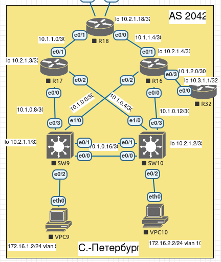

## EIGRP

#### Настроить EIGRP в С.-Петербург; Использовать named EIGRP

В офисе С.-Петербург настроить EIGRP.

1. R32 получает только маршрут по умолчанию.
2. R16-17 анонсируют только суммарные префиксы.
3. Использовать EIGRP named-mode для настройки сети.

##  Схема стенда 



#### Выполнение.

* Выполним настройку протокола EIGRP на маршрутизаторах R16,R17,R18,R32 и l3 коммутаторах SW9,SW10 согласно тоологии сети:

Рассмотрим базовую настройку на примере R16:

* R16:

```
R16#sh run | s r e
router eigrp Piter
 !
 address-family ipv4 unicast autonomous-system 100
  !
  af-interface Ethernet0/1
   summary-address 10.1.0.0 255.255.255.224
  exit-af-interface
  !
  topology base
  exit-af-topology
  network 10.1.0.0 0.0.0.255
  network 10.1.1.4 0.0.0.3
  network 10.1.2.0 0.0.0.3
  network 10.2.1.4 0.0.0.0
 exit-address-family
R16#

Соседи :

R16#sh ip eigrp neighbors 
EIGRP-IPv4 VR(Piter) Address-Family Neighbors for AS(100)
H   Address                 Interface              Hold Uptime   SRTT   RTO  Q  Seq
                                                   (sec)         (ms)       Cnt Num
3   10.1.2.1                Et0/3                    13 00:01:59    8   100  0  4
2   10.1.0.13               Et0/0                    10 00:02:01    1   100  0  24
1   10.1.0.1                Et0/2                    11 00:02:01    2   100  0  19
0   10.1.1.6                Et0/1                    10 00:02:02    3   100  0  16
R16#

И таблица маршрутизации:

R16#sh ip route eigrp 

Gateway of last resort is 10.1.1.6 to network 0.0.0.0

D*EX  0.0.0.0/0 [170/1536000] via 10.1.1.6, 00:03:13, Ethernet0/1
      10.0.0.0/8 is variably subnetted, 19 subnets, 3 masks
D        10.1.0.4/30 [90/1536000] via 10.1.0.13, 00:03:15, Ethernet0/0
D        10.1.0.8/30 [90/1536000] via 10.1.0.1, 00:03:15, Ethernet0/2
D        10.1.0.16/30 [90/1536000] via 10.1.0.13, 00:03:15, Ethernet0/0
                      [90/1536000] via 10.1.0.1, 00:03:15, Ethernet0/2
D        10.1.1.0/30 [90/1536000] via 10.1.1.6, 00:03:13, Ethernet0/1
D        10.2.1.1/32 [90/1024640] via 10.1.0.1, 00:03:15, Ethernet0/2
D        10.2.1.2/32 [90/1024640] via 10.1.0.13, 00:03:15, Ethernet0/0
D        10.2.1.3/32 [90/1536640] via 10.1.1.6, 00:03:08, Ethernet0/1
                     [90/1536640] via 10.1.0.13, 00:03:08, Ethernet0/0
                     [90/1536640] via 10.1.0.1, 00:03:08, Ethernet0/2
D        10.2.1.18/32 [90/1024640] via 10.1.1.6, 00:03:13, Ethernet0/1
D        10.3.1.1/32 [90/1024640] via 10.1.2.1, 00:03:14, Ethernet0/3
      172.16.0.0/24 is subnetted, 2 subnets
D        172.16.1.0 [90/1029120] via 10.1.0.1, 00:02:59, Ethernet0/2
D        172.16.2.0 [90/1029120] via 10.1.0.13, 00:02:58, Ethernet0/0
R16# 
```

#### R32 получает только маршрут по умолчанию:

* 1. На R18 пропишем статику во внешние сети, и перераспределим эти маршруты на все маршрутизаторы внутри одной AS:

```
ip route 0.0.0.0 0.0.0.0 52.1.0.1
ip route 0.0.0.0 0.0.0.0 52.1.0.9

router eigrp Piter
 !
 address-family ipv4 unicast autonomous-system 100
  !
  topology base
   redistribute static
  exit-af-topology
  network 10.1.1.0 0.0.0.7
  network 10.2.1.18 0.0.0.0
 exit-address-family
!
``` 

* 2. На R16 создадим prefix-list и пропустим только маршрут по умолчанию в сторону R32:

```
ip prefix-list PL-EIGRP-ONLY-GATE seq 10 permit 0.0.0.0/0


R16#sh run | s r e
router eigrp Piter
 !
 address-family ipv4 unicast autonomous-system 100
  !
  af-interface Ethernet0/1
   summary-address 10.1.0.0 255.255.255.224
  exit-af-interface
  !
  topology base
   distribute-list prefix PL-EIGRP-ONLY-GATE out Ethernet0/3
  exit-af-topology
  network 10.1.0.0 0.0.0.255
  network 10.1.1.4 0.0.0.3
  network 10.1.2.0 0.0.0.3
  network 10.2.1.4 0.0.0.0
 exit-address-family
R16#
```  

Таким образом, таблица маршрутизации на R32 будет иметь вид:

``` 
R32#sh ip route 
Gateway of last resort is 10.1.2.2 to network 0.0.0.0

D*EX  0.0.0.0/0 [170/2048000] via 10.1.2.2, 00:21:39, Ethernet0/0
      10.0.0.0/8 is variably subnetted, 3 subnets, 2 masks
C        10.1.2.0/30 is directly connected, Ethernet0/0
L        10.1.2.1/32 is directly connected, Ethernet0/0
C        10.3.1.1/32 is directly connected, Loopback0
R32#
```

#### R16-17 анонсируют только суммарные префиксы.

* На R17 и R16 в сторону R18 выполним суммирование транспортных сетей 10.1.0.0-10.1.0.16 в 10.1.0.0/27: 
```
!
  af-interface Ethernet0/1
   summary-address 10.1.0.0 255.255.255.224
  exit-af-interface
  !
```

На R18 появляется запись: 

```
D        10.1.0.0/27 [90/1536000] via 10.1.1.5, 00:38:19, Ethernet0/0
                     [90/1536000] via 10.1.1.1, 00:38:19, Ethernet0/1
```
