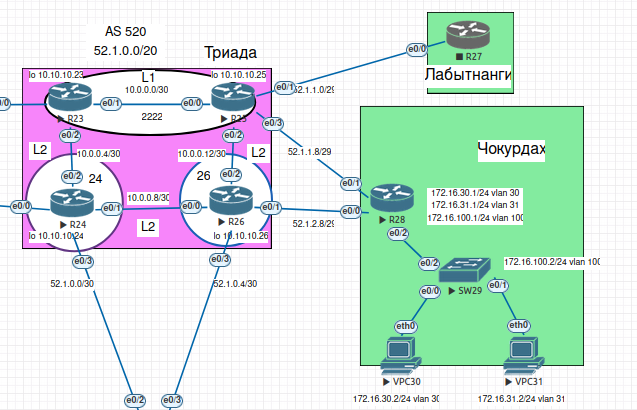

## Основные протоколы сети интернет. NAT. DHCP. NTP

#### Цель:

1. Настроить NAT в офисе Москва, C.-Перетбруг и Чокурдах
2. Настроить синхронизацию времени в офисе Москва
3. Настроить DHCP в офисе Москва

#### План раоты

1. Настроить NAT(PAT) на R14 и R15. Трансляция должна осуществляться в адрес автономной системы AS1001.
2. Настроить NAT(PAT) на R18. Трансляция должна осуществляться в пул из 5 адресов автономной системы AS2042.
3. Настроить статический NAT для R20.
4. Настроить NAT так, чтобы R19 был доступен с любого узла для удаленного управления.
5. *Настроить статический NAT(PAT) для офиса Чокурдах.
6. Настроить для IPv4 DHCP сервер в офисе Москва на маршрутизаторах R12 и R13. VPC1 и VPC7 должны получать сетевые настройки по DHCP.
7. Настроить NTP сервер на R12 и R13. Все устройства в офисе Москва должны синхронизировать время с R12 и R13.
8. Все офисы в лабораторной работе должны иметь IP связность.


##  Схема стенда 


#### Выполнение.

#### Настройка NAT(PAT) на R14 и R15. Трансляция должна осуществляться в адрес автономной системы AS1001.

Номер AS AS1001 Москва и блок адресов: 140.100.0.0/23. Настроим NAT на R14 и R15. По условию трансляция должна осуществляться в один адрес AS. На R14 и R15 выполним настройки PAT:

```
ip nat pool NAT-MSK 140.100.0.1 140.100.0.1 netmask 255.255.255.252
ip nat inside source list NAT-LAN pool NAT-MSK overload
ip route 140.100.0.0 255.255.254.0 Null0
!
ip access-list extended NAT-LAN
 permit ip 192.168.1.0 0.0.0.255 any
 permit ip 192.168.2.0 0.0.0.255 any
 deny   ip any any
!

### R15:

ip nat pool NAT-MSK 140.100.0.1 140.100.0.1 netmask 255.255.255.252
ip nat inside source list NAT-LAN pool NAT-MSK overload

ip access-list extended NAT-LAN
 permit ip 192.168.1.0 0.0.0.255 any
 permit ip 192.168.2.0 0.0.0.255 any
 deny   ip any any

```

```
int Ethernet0/2
 ip nat outside
 exit
int range Ethernet0/0-1
 ip nat inside
 exit 
int Ethernet0/3
 ip nat inside
 exit
```

На R23 сэмулируем внешний сервис с ip 8.8.8.8, зальем его в BGP и будем проверять доступность из наших офисов.

Проверим работу NAT в офисе Москва. С VPC1 пропингуем 8.8.8.8:

```
VPCS> ping 8.8.8.8

84 bytes from 8.8.8.8 icmp_seq=1 ttl=250 time=11.003 ms
84 bytes from 8.8.8.8 icmp_seq=2 ttl=250 time=10.327 ms
84 bytes from 8.8.8.8 icmp_seq=3 ttl=250 time=10.766 ms
84 bytes from 8.8.8.8 icmp_seq=4 ttl=250 time=9.961 ms
84 bytes from 8.8.8.8 icmp_seq=5 ttl=250 time=10.105 ms

VPCS> trace 8.8.8.8
trace to 8.8.8.8, 8 hops max, press Ctrl+C to stop
 1   192.168.1.253   3.400 ms  2.749 ms  3.213 ms
 2   10.0.1.6   3.951 ms  3.852 ms  3.457 ms
 3   10.0.0.14   5.351 ms  6.049 ms  5.569 ms
 4   30.1.0.1   6.381 ms  6.405 ms  5.850 ms
 5   52.1.0.9   5.874 ms  3.097 ms  6.839 ms
 6   *10.0.0.5   10.542 ms (ICMP type:3, code:3, Destination port unreachable)  *
VPCS>
```

* NAT на R15

```
R15#sh ip nat translations    
Pro Inside global      Inside local       Outside local      Outside global
udp 140.100.0.1:39824  192.168.1.2:39824  8.8.8.8:39825      8.8.8.8:39825
icmp 140.100.0.1:48725 192.168.1.2:48725  8.8.8.8:48725      8.8.8.8:48725
icmp 140.100.0.1:48981 192.168.1.2:48981  8.8.8.8:48981      8.8.8.8:48981
icmp 140.100.0.1:49237 192.168.1.2:49237  8.8.8.8:49237      8.8.8.8:49237
icmp 140.100.0.1:49493 192.168.1.2:49493  8.8.8.8:49493      8.8.8.8:49493
icmp 140.100.0.1:49749 192.168.1.2:49749  8.8.8.8:49749      8.8.8.8:49749
R15#
```

* Допустим по какой-то причине у нас отказал R15. В этом случае R14 становится шлюзом для выхода во внешние сети и весь трафик идет через Киторн:

```
VPCS> trace 8.8.8.8
trace to 8.8.8.8, 8 hops max, press Ctrl+C to stop
 1   192.168.1.253   1.034 ms  2.270 ms  2.527 ms
 2   10.0.1.6   3.410 ms  2.494 ms  1.434 ms
 3   10.0.0.10   3.841 ms  4.239 ms  4.387 ms
 4   101.0.0.1   6.507 ms  5.827 ms  6.590 ms
 5   *52.1.0.14   6.854 ms (ICMP type:3, code:3, Destination port unreachable)  *
VPCS>
```

* NAT на R15

```
R14#sh ip nat translations 
Pro Inside global      Inside local       Outside local      Outside global
udp 140.100.0.1:25473  192.168.1.2:25473  8.8.8.8:25474      8.8.8.8:25474
R14#
```

#### Настроить NAT(PAT) на R18. Трансляция должна осуществляться в пул из 5 адресов автономной системы AS2042.

В данном случае настройка будет аналогичная, только будем использовать пул из 5 адресов нашей AS:

```
ip nat pool NAT-SPB 20.0.0.1 20.0.0.5 netmask 255.255.255.248
ip nat inside source list NAT-LAN pool NAT-SPB overload
!         
ip access-list extended NAT-LAN
 permit ip 172.16.1.0 0.0.0.255 any
 permit ip 172.16.2.0 0.0.0.255 any
 deny   ip any any

!
interface Ethernet0/0
 ip nat inside
!
interface Ethernet0/1
 ip nat inside
!
interface Ethernet0/2
 ip nat outside
!
interface Ethernet0/3
 ip nat outside
!
```

* Проверим работу NAT в офисе СПБ. С VPC9 запустим трассировку 8.8.8.8:

```
VPCS> trace 8.8.8.8
trace to 8.8.8.8, 8 hops max, press Ctrl+C to stop
 1   172.16.1.1   1.358 ms  1.242 ms  1.027 ms
 2   10.1.0.10   2.710 ms  2.912 ms  1.594 ms
 3   10.1.1.2   2.820 ms  2.473 ms  3.173 ms
 4   52.1.0.5   4.215 ms  4.184 ms  3.506 ms
 5   10.0.0.14   5.383 ms  4.921 ms  5.086 ms
 6   *10.0.0.1   6.748 ms (ICMP type:3, code:3, Destination port unreachable)  *
VPCS> 
```

* NAT на R18:

```
R18#sh ip nat translations 
Pro Inside global      Inside local       Outside local      Outside global
udp 20.0.0.1:26896     172.16.1.2:26896   8.8.8.8:26897      8.8.8.8:26897
R18#
```

Схема отрабатывает корректно.

#### Настроить статический NAT для R20.

* На R15 настроим статический NAT для loopback интерфейса R20:

```
ip nat inside source static 10.10.13.1 140.100.0.2

```

* С R20 запустим пинг до 8.8.8.8:

```
R20#ping 8.8.8.8 source loopback 0
Type escape sequence to abort.
Sending 5, 100-byte ICMP Echos to 8.8.8.8, timeout is 2 seconds:
Packet sent with a source address of 10.10.13.1 
!!!!!
Success rate is 100 percent (5/5), round-trip min/avg/max = 3/4/7 ms
R20
```

* NAT на R15:

```
R15#sh ip nat translations    
Pro Inside global      Inside local       Outside local      Outside global
icmp 140.100.0.2:13    10.10.13.1:13      8.8.8.8:13         8.8.8.8:13
--- 140.100.0.2        10.10.13.1         ---                ---
R15#
```

#### Настроить NAT так, чтобы R19 был доступен с любого узла для удаленного управления.

* Для начал настроим ssh на R19:

```
R19(config)#username Admin privilege 15 secret 123SxxAwqqwe
R19(config)#ip ssh ver 2
R19(config)#ip domain-name MSK
R19(config)#crypto key generate rsa modulus 2048
R19(config)#line vty 0 4
R19(config-line)#transport input ssh
R19(config-line)#login local
```

* На R14 и R15 настроим NAT для loopback R19:

```
ip nat inside source static 10.10.12.1 140.100.0.3
```

Проверим удаленное подключение к R19, например, из сетей СПБ (R18):

```
R18#ssh -l Admin 140.100.0.3
Password: 
R19#
```

Подключение выполняется корректно.

#### *Настроить статический NAT(PAT) для офиса Чокурдах.




LAN сеть сегментирована на пользовательские VLAN (VLAN30 - 172.16.30.0/24  и VLAN31 - 172.16.31.0/24). Рассмотрим схему подключения к двум линкам ISP, причем VLAN30 будет ходить через - R26, VLAN31 - через - R25. Если отказывает один из линков, то нам необходимо переключать все потоки на второй линк и наоборот. 

* Настроим маршруты по умолчанию. Так-же настроим статику, для проверки доступности сервиса через определенного ISP (В првайдере Триада настроены сети 8.8.8.8 и 4.2.2.2 для будущего отслеживаания). Через R26 отслеживаем доступность 8.8.8.8, через R25 - 4.2.2.2.

```
R28#sh run | s ip route
ip route 0.0.0.0 0.0.0.0 52.1.2.9 name TO_R26 track 10
ip route 0.0.0.0 0.0.0.0 52.1.1.9 name TO_R25 track 20
ip route 4.2.2.2 255.255.255.255 52.1.1.9
ip route 8.8.8.8 255.255.255.255 52.1.2.9
R28#.9
```

* Отслеживание доступности сервиса с помощью механизма IP SLA:
```
!
track 10 ip sla 10
!
track 20 ip sla 20
!
ip sla 10
 icmp-echo 8.8.8.8 source-interface Ethernet0/0
 threshold 1000
 timeout 1500
 frequency 3
ip sla schedule 10 life forever start-time now
ip sla 20
 icmp-echo 4.2.2.2 source-interface Ethernet0/1
 threshold 1000
 timeout 1500
 frequency 3
ip sla schedule 20 life forever start-time now
```

* Заготавливаем ACL для интересного трафика:

```
ip access-list extended acl-VLAN30
 permit ip 172.16.30.0 0.0.0.255 any
ip access-list extended acl-VLAN31
 permit ip 172.16.31.0 0.0.0.255 any
!
```

* Мониторинг доступности и автоматическое переключение при отказе

```
route-map rm-DUAL-ISP permit 10
 match ip address acl-VLAN30
 set ip next-hop verify-availability 52.1.2.9 10 track 10
 set ip next-hop 52.1.1.9
!
route-map rm-DUAL-ISP permit 20
 match ip address acl-VLAN31
 set ip next-hop verify-availability 52.1.1.9 20 track 20
 set ip next-hop 52.1.2.9
!
```

* Ну и собственно NAT, точнее PAT:

```
ip nat inside source route-map rm-R25-ISP interface Ethernet0/1 overload
ip nat inside source route-map rm-R26-ISP interface Ethernet0/0 overload
``` 

и route-map для NAT с учетом исходящего интерфейса:

```
!         
route-map ISP1 permit 10
 match interface Ethernet0/0
!         
route-map ISP2 permit 20
 match interface Ethernet0/1
```

```
interface Ethernet0/2
 no ip address
 ip nat inside
 ip virtual-reassembly in
 ip policy route-map rm-DUAL-ISP
 duplex auto
!
interface Ethernet0/2.30
 encapsulation dot1Q 30
 ip address 172.16.30.1 255.255.255.0
 ip nat inside
 ip virtual-reassembly in
 ip policy route-map rm-DUAL-ISP
!
interface Ethernet0/2.31
 encapsulation dot1Q 31
 ip address 172.16.31.1 255.255.255.0
 ip nat inside
 ip virtual-reassembly in
 ip policy route-map rm-DUAL-ISP

```

* Проведем проверку корректности работы нашей схемы:

Нормальное состояние (балансировка по VLAN):

```
VPC30

VPCS> trace 8.8.8.8
trace to 8.8.8.8, 8 hops max, press Ctrl+C to stop
 1   172.16.30.1   1.116 ms  0.941 ms  0.871 ms
 2   52.1.2.9   1.508 ms  2.206 ms  1.395 ms
 3   10.0.0.14   2.144 ms  1.998 ms  2.480 ms
 4   *10.0.0.1   2.498 ms (ICMP type:3, code:3, Destination port unreachable)  *

VPCS>

VPC31
VPCS> trace 8.8.8.8
trace to 8.8.8.8, 8 hops max, press Ctrl+C to stop
 1   172.16.31.1   2.715 ms  2.718 ms  2.555 ms
 2   52.1.1.9   4.485 ms  3.712 ms  4.156 ms
 3   *10.0.0.1   4.779 ms (ICMP type:3, code:3, Destination port unreachable)  *

VPCS 
```

* Авария в сторону R26 (отказ аплинка или недоступность сервиса). Весь трафик идет через R25:

```
VPC30

VPCS> trace 8.8.8.8
trace to 8.8.8.8, 8 hops max, press Ctrl+C to stop
 1   172.16.30.1   3.110 ms  2.612 ms  3.404 ms
 2   52.1.1.9   4.896 ms  3.957 ms  4.881 ms
 3   *10.0.0.1   7.435 ms (ICMP type:3, code:3, Destination port unreachable)  *

VPCS> 

VPC31

VPCS> trace 8.8.8.8
trace to 8.8.8.8, 8 hops max, press Ctrl+C to stop
 1   172.16.31.1   3.241 ms  3.014 ms  2.784 ms
 2   52.1.1.9   4.427 ms  3.181 ms  1.409 ms
 3   *10.0.0.1   3.402 ms (ICMP type:3, code:3, Destination port unreachable)  *

VPCS> 
```
Тоже самое происходит при отказе линка в сторону R25 или деградации сервиса. Таким образом, cхема отрабатывает корректно.


####  Настроить DHCPv4 сервера на R12 и R13, VPC1 и VPC7 должны получать адреса по DHCP.

* Пусть R12 будет dhcp сервером для vlan 10 (192.168.1.0/24), а R13 будет dhcp сервером для vlan 20 (192.168.2.0/24). Выполним настройки:

```
R12#sh run | s dhcp
ip dhcp excluded-address 192.168.1.1
ip dhcp excluded-address 192.168.1.253 192.168.1.255
ip dhcp pool LAN1
 network 192.168.1.0 255.255.255.0
 default-router 192.168.1.1 
 domain-name MSK
R12#
```
 
```
R13#sh run | s dhcp
ip dhcp excluded-address 192.168.2.1
ip dhcp excluded-address 192.168.2.253 192.168.2.255
ip dhcp pool LAN2
 network 192.168.2.0 255.255.255.0
 default-router 192.168.2.1 
 domain-name MSK
R13#
```

На L3 коммутаторах SW4 и SW5 настроим хелпер адрес:


```
SW4:

interface Vlan10
 description VL10_USER
 ip address 192.168.1.253 255.255.255.0
 ip helper-address 10.10.10.3 
 standby version 2
 standby 10 ip 192.168.1.1
 standby 10 priority 150
 standby 10 preempt
 ip ospf 1 area 10
!
interface Vlan20
 description VL20_USER
 ip address 192.168.2.253 255.255.255.0
 ip helper-address 10.10.10.4 
 standby version 2
 standby 20 ip 192.168.2.1
 ip ospf 1 area 10
!
```
```
SW5
interface Vlan10
 description VL10_USER
 ip address 192.168.1.254 255.255.255.0
 ip helper-address 10.10.10.3 
 standby version 2
 standby 10 ip 192.168.1.1
 ip ospf 1 area 10
!
interface Vlan20
 description VL20_USER
 ip address 192.168.2.254 255.255.255.0
 ip helper-address 10.10.10.4 
 standby version 2
 standby 20 ip 192.168.2.1
 standby 20 priority 150
 standby 20 preempt
 ip ospf 1 area 10
!        
```
Проверим на хостах получение по dhcp сетевых настроек:

```
VPCS> ip dhcp
DDORA IP 192.168.1.3/24 GW 192.168.1.1

VPCS> show ip

NAME        : VPCS[1]
IP/MASK     : 192.168.1.3/24
GATEWAY     : 192.168.1.1
DNS         : 
DHCP SERVER : 10.0.1.10
DHCP LEASE  : 86392, 86400/43200/75600
DOMAIN NAME : MSK
MAC         : 00:50:79:66:68:01
LPORT       : 20000
RHOST:PORT  : 127.0.0.1:30000
MTU         : 1500

VPCS> 
```

```
VPCS> ip dhcp -r
DORA IP 192.168.2.3/24 GW 192.168.2.1

VPCS> show ip

NAME        : VPCS[1]
IP/MASK     : 192.168.2.3/24
GATEWAY     : 192.168.2.1
DNS         : 
DHCP SERVER : 10.0.1.6
DHCP LEASE  : 86394, 86400/43200/75600
DOMAIN NAME : MSK
MAC         : 00:50:79:66:68:07
LPORT       : 20000
RHOST:PORT  : 127.0.0.1:30000
MTU         : 1500

VPCS>

```
