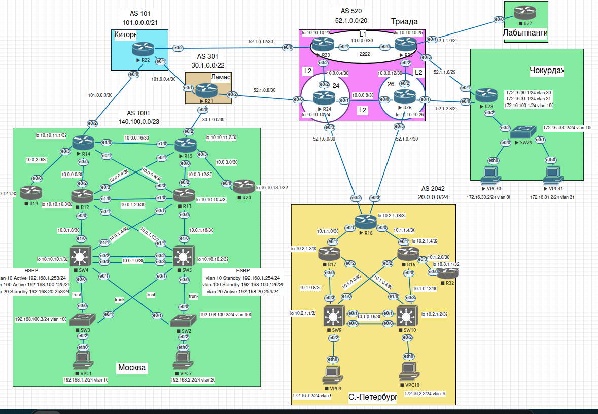

## Настройка VPN. GRE. DmVPN

#### Цель:

1. Настроить GRE между офисами Москва и С.-Петербург
2. Настроить DMVPN между офисами Москва и Чокурдах, Лабытнанги

#### План работы

1. Настроите GRE между офисами Москва и С.-Петербург.
2. Настроите DMVMN между Москва и Чокурдах, Лабытнанги.
3. Все узлы в офисах в лабораторной работе должны иметь IP связность.


##  Схема стенда 



#### Выполнение.

#### GRE между офисами Москва и С.-Петербург

* Основной туннель будет проходить через R15-R18, резервный R14-R18. Настроим маршрутизаторы R14 и R15 в Москве. 

Москва: В качестве destination будем использовать публичный адрес AS2042 20.0.0.254 (Санкт-Петербург), специально выделенный для этих целей.

```
R15:

interface Tunnel1
 description TUNNEL-GRE-TO-SPB
 ip address 172.31.0.1 255.255.255.252
 ip mtu 1400
 ip tcp adjust-mss 1360
 keepalive 10 1
 tunnel source Ethernet0/2
 tunnel destination 20.0.0.254
end

ip route 172.16.0.0 255.255.252.0 Tunnel1


R14:

interface Tunnel1
 description TUNNEL-GRE-TO-SPB-REZERV
 ip address 172.31.0.5 255.255.255.252
 ip mtu 1400
 ip tcp adjust-mss 1360
 keepalive 10 1
 tunnel source Ethernet0/2
 tunnel destination 20.0.0.254
end

ip route 172.16.0.0 255.255.252.0 Tunnel1

```

Натройка R18 в СПБ:

```

interface Loopback100
 ip address 20.0.0.254 255.255.255.255
!
interface Tunnel0
 description TUNNEL-GRE-TO-MSK
 ip address 172.31.0.2 255.255.255.252
 ip mtu 1400
 ip tcp adjust-mss 1360
 keepalive 10 1
 tunnel source 20.0.0.254
 tunnel destination 30.1.0.2
!
interface Tunnel1
 description TUNNEL-GRE-TO-MSK-REZERV
 ip address 172.31.0.6 255.255.255.252
 ip mtu 1400
 ip tcp adjust-mss 1360
 keepalive 10 1
 tunnel source 20.0.0.254
 tunnel destination 101.0.0.2
!

ip route 192.168.0.0 255.255.252.0 Tunnel0
ip route 192.168.0.0 255.255.252.0 Tunnel1 250

```
* C Москвы пустим trace до СПБ: основно туннель

```
VPCS> trace 172.16.1.2  
trace to 172.16.1.2, 8 hops max, press Ctrl+C to stop
 1   192.168.2.254   3.642 ms  2.671 ms  2.730 ms
 2   10.0.1.18   4.536 ms  3.712 ms  3.709 ms
 3   10.0.0.14   5.239 ms  5.889 ms  5.288 ms
 4   172.31.0.2   9.010 ms  8.586 ms  9.455 ms
 5   10.1.1.1   10.224 ms  10.698 ms  8.000 ms
 6   10.1.0.9   8.401 ms  10.068 ms  10.037 ms
 7   *172.16.1.2   11.401 ms (ICMP type:3, code:3, Destination port unreachable)

VPCS>
```

* При отказе R15 трафик идет через резервный туннель на R14:

```
VPCS> trace 172.16.1.2 
trace to 172.16.1.2, 8 hops max, press Ctrl+C to stop
 1   192.168.2.254   2.048 ms  2.065 ms  1.672 ms
 2   10.0.1.18   2.570 ms  2.299 ms  2.574 ms
 3   10.0.0.10   3.299 ms  2.987 ms  3.093 ms
 4   172.31.0.6   7.739 ms  6.196 ms  5.468 ms
 5   10.1.1.1   6.317 ms  6.341 ms  5.664 ms
 6   10.1.0.9   5.097 ms  5.221 ms  5.498 ms
 7   *172.16.1.2   6.636 ms (ICMP type:3, code:3, Destination port unreachable)

VPCS>
```

Таким образом схема отрабатывает корректно.
 
#### DMVPN между офисами Москва и Чокурдах, Лабытнанги
