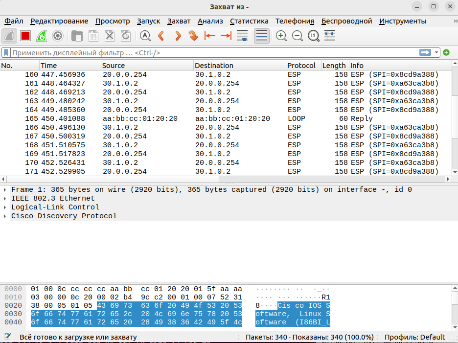

# IPSec over GRE, DmVPN

#### Цель:

1. Настроить GRE поверх IPSec между офисами Москва и С.-Петербург
2. Настроить DMVPN поверх IPSec между офисами Москва и Чокурдах, Лабытнанги


#### План работы

1. Настроите GRE поверх IPSec между офисами Москва и С.-Петербург.
2. Настроите DMVPN поверх IPSec между Москва и Чокурдах, Лабытнанги.
3. Все узлы в офисах в лабораторной работе должны иметь IP связность.

#### Выполнение.

#### Настроить GRE поверх IPSec между офисами Москва и С.-Петербург

* Основной туннель будит через R15-R18, резервный R14-R18. Настроим маршрутизаторы R14 и R15 в Москве. 

```
R15:

crypto isakmp policy 1
 encr 3des
 hash md5 
 authentication pre-share
 group 2
crypto isakmp key ipsec-gre-MSK-HUB address 20.0.0.254     
!
!
crypto ipsec transform-set GRE-IPSEC esp-3des esp-sha-hmac 
 mode transport
!
crypto ipsec profile PROTECT-GRE
 set transform-set GRE-IPSEC

interface Tunnel0
 description TUNNEL-GRE-TO-SPB
 ip address 172.31.0.1 255.255.255.252
 ip mtu 1400
 ip tcp adjust-mss 1360
 tunnel source Ethernet0/2
 tunnel destination 20.0.0.254
 tunnel protection ipsec profile PROTECT-GRE
end


R14:

crypto isakmp policy 1
 encr 3des
 hash md5 
 authentication pre-share
 group 2
crypto isakmp key ipsec-gre-MSK-HUB address 20.0.0.254     
!
!
crypto ipsec transform-set GRE-IPSEC esp-3des esp-sha-hmac 
 mode transport
!
crypto ipsec profile PROTECT-GRE
 set transform-set GRE-IPSEC 

interface Tunnel1
 description TUNNEL-GRE-TO-SPB-REZERV
 ip address 172.31.0.5 255.255.255.252
 ip mtu 1400
 ip tcp adjust-mss 1360
 keepalive 10 1
 tunnel source Ethernet0/2
 tunnel destination 20.0.0.254
 tunnel protection ipsec profile PROTECT-GRE
end

```

* Выполним настройку R18 в СПБ:

```
crypto isakmp policy 1
 encr 3des
 hash md5 
 authentication pre-share
 group 2
crypto isakmp key ipsec-gre-MSK-HUB address 30.1.0.2       
crypto isakmp key ipsec-gre-MSK-HUB address 101.0.0.2      
!
!
crypto ipsec transform-set GRE-IPSEC esp-3des esp-sha-hmac 
 mode transport
!
crypto ipsec profile PROTECT-GRE
 set transform-set GRE-IPSEC

interface Tunnel0
 description TUNNEL-GRE-TO-MSK
 ip address 172.31.0.2 255.255.255.252
 ip mtu 1400
 ip tcp adjust-mss 1360
 tunnel source 20.0.0.254
 tunnel destination 30.1.0.2
 tunnel protection ipsec profile PROTECT-GRE
!
interface Tunnel1
 description TUNNEL-GRE-TO-MSK-REZERV
 ip address 172.31.0.6 255.255.255.252
 ip mtu 1400
 ip tcp adjust-mss 1360
 tunnel source 20.0.0.254
 tunnel destination 101.0.0.2
 tunnel protection ipsec profile PROTECT-GRE
```

Таким образом у нас установился шифрованный канал:

```
18#sh crypto session 
Crypto session current status

Interface: Tunnel0
Session status: UP-ACTIVE     
Peer: 30.1.0.2 port 500 
  Session ID: 0  
  IKEv1 SA: local 20.0.0.254/500 remote 30.1.0.2/500 Active 
  IPSEC FLOW: permit 47 host 20.0.0.254 host 30.1.0.2 
        Active SAs: 2, origin: crypto map

Interface: Tunnel1
Session status: UP-ACTIVE     
Peer: 101.0.0.2 port 500 
  Session ID: 0  
  IKEv1 SA: local 20.0.0.254/500 remote 101.0.0.2/500 Active 
  IPSEC FLOW: permit 47 host 20.0.0.254 host 101.0.0.2 
        Active SAs: 2, origin: crypto map

R18#
```
Пустим пинг с ПК Москвы до ПК в СПБ и на R18 посмотрим как шифруются данные:



